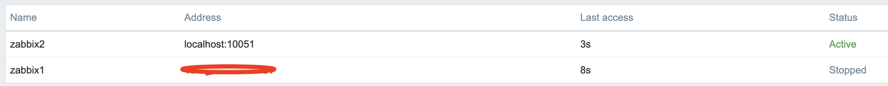

# HA Setup

In this section, we will set up Zabbix in a High Availability (HA) configuration.
This feature, introduced in Zabbix 6, is a crucial enhancement that ensures continued
monitoring even if a Zabbix server fails. With HA, when one Zabbix server goes down,
another can take over seamlessly.

For this guide, we will use two Zabbix servers and one database, but the setup allows
for adding more zabbix servers if necessary.


It's important to note that Zabbix HA setup is straightforward, providing redundancy
without complex features like load balancing.

Just as in our basic configuration, we will document key details for the servers
in this HA setup. Below is the list of servers and some place to add their
respective IP addresses for your convenience :

|Server           | IP Address      |
|:----            |:-----           |
| Zabbix Server 1 |                 |
| Zabbix Server 2 |                 |
| Database        |                 |
| Virtual IP      |                 |

???+ note
    Our database (DB) in this setup is not configured for HA. Since it's not a
    Zabbix component, you will need to implement your own solution for database
    HA, such as a HA SAN or a database cluster setup. A DB cluster configuration
    is out of the scope of this guide and unrelated to Zabbix, so it will not be
    covered here.

## Installing the Database

Refer to the [*Basic Installation*](basic-installation.md) chapter for detailed
instructions on setting up the database. That chapter provides step-by-step guidance
on installing either a PostgreSQL or MariaDB database on a dedicated node running
Ubuntu or Rocky Linux. The same installation steps apply when configuring the
database for this setup.

## Installing the Zabbix cluster

Setting up a Zabbix cluster involves configuring multiple Zabbix servers to work
together, providing high availability. While the process is similar to setting up
a single Zabbix server, there are additional configuration steps required to
enable HA (High Availability).

Add the Zabbix Repositories to your servers.

First, add the Zabbix repository to both of your Zabbix servers:

Redhat

```bash
# rpm -Uvh https://repo.zabbix.com/zabbix/7.2/release/rocky/9/noarch/zabbix-release-latest-7.2.el9.noarch.rpm
# dnf clean all
```

Ubuntu

```bash
# sudo wget https://repo.zabbix.com/zabbix/7.2/release/ubuntu/pool/main/z/zabbix-release/zabbix-release_latest_7.2+ubuntu24.04_all.deb
# sudo dpkg -i zabbix-release_latest_7.2+ubuntu24.04_all.deb
# sudo apt update
```

Once this is done we can install the zabbix server packages.

Redhat

```bash
# dnf install zabbix-server-pgsql -y
or if your database is MariaDB
# dnf install zabbix-server-mysql -y
```

Ubuntu

```bash
# sudo apt install zabbix-server-pgsql -y
or if your databqse is MariaDB
# sudo apt install zabbix-server-mysql -y
```

### Configuring Zabbix Server 1

Edit the Zabbix server configuration file,

```bash
# sudo vi /etc/zabbix/zabbix_server.conf
```

Update the following lines to connect to the database:

```bash
DBHost=<zabbix db ip>
DBName=<name of the zabbix DB>
DBUser=<name of the db user>
DBSchema=<db schema for the PostgreSQL DB>
DBPassword=<your secret password>
```

Configure the HA parameters for this server:

```bash
HANodeName=zabbix1 (or choose a name you prefer)
```

Specify the frontend node address for failover scenarios:

```bash
NodeAddress=<Zabbix server 1 ip>:10051
```

### Configuring Zabbix Server 2

Repeat the configuration steps for the second Zabbix server. Adjust the `HANodeName`
and `NodeAddress` as necessary for this server.

### Starting Zabbix Server

After configuring both servers, enable and start the zabbix-server service on each:

```bash
# sudo systemctl enable zabbix-server --now
```

???+ note
    The `NodeAddress` must match the IP or FQDN name of the Zabbix server node.
    Without this parameter the Zabbix front-end is unable to connect to the active
    node. The result will be that the frontend is unable to display the status
    the queue and other information.

### Verifying the Configuration

Check the log files on both servers to ensure they have started correctly and
are operating in their respective HA modes.

On the first server:

```bash
# sudo grep HA /var/log/zabbix/zabbix_server.log
```

You should see:

```bash
22597:20240309:155230.353 starting HA manager
22597:20240309:155230.362 HA manager started in active mode
```

On the second server (and any additional nodes):

```bash
# grep HA /var/log/zabbix/zabbix_server.log
```

You should see:

```bash
22304:20240309:155331.163 starting HA manager
22304:20240309:155331.174 HA manager started in standby mode
```

Your Zabbix cluster should now be set up with high availability, ensuring continuous
monitoring even if one of the servers fails.

## Installing the frontend

Before proceeding with the installation and configuration of the web server, it
is essential to install Keepalived. Keepalived enables the use of a Virtual IP
(VIP) for frontend services, ensuring seamless failover and service continuity.
It provides a robust framework for both load balancing and high availability,
making it a critical component in maintaining a resilient infrastructure.

### Setting up keepalived

So let's get started. On both our servers we have to install keepalived.

Redhat

```bash
# dnf install keepalived -y
```

Ubuntu

```bash
# sudo apt install keepalived -y
```

Next, we need to modify the Keepalived configuration on both servers. While the
configurations will be similar, each server requires slight adjustments. We will
begin with Server 1. To edit the Keepalived configuration file, use the following
command:

Redhat and Ubuntu

```bash
# sudo vi /etc/keepalived/keepalived.conf
```

Delete all content in the file and replace it with the following lines:

```bash
vrrp_track_process track_nginx {
    process nginx
    weight 10
}

vrrp_instance VI_1 {
    state MASTER
    interface enp0s1
    virtual_router_id 51
    priority 244
    advert_int 1
    authentication {
        auth_type PASS
        auth_pass 12345
    }
    virtual_ipaddress {
        192.168.0.135
    }
    track_process {
         track_nginx
      }
}
```

???+ warning
    Replace `enp0s1` with the interface name of your machine and replace the `password`
    with something secure. For the virual_ipaddress use a free IP from your network.
    This will be used as our VIP.

We can now do the same modification on our `second` Zabbix server. Delete everything
again in the same file like we did before and replace it with the following lines:

```bash
vrrp_track_process track_nginx {
      process nginx
      weight 10
}

vrrp_instance VI_1 {
    state BACKUP
    interface enp0s1
    virtual_router_id 51
    priority 243
    advert_int 1
    authentication {
        auth_type PASS
        auth_pass 12345
    }
    virtual_ipaddress {
        192.168.0.135
    }
    track_process {
         track_nginx
      }
}
```

Just as with our 1st Zabbix server, replace `enp0s1` with the interface name of
your machine and replace the `password` with your password and fill in the
virual_ipaddress as used before.

This ends the configuration of keepalived. We can now continue adapting the frontend.

### Install and configure the frontend

On both servers we can run the following commands to install our web server and the
zabbix frontend packages:

RedHat

```bash
# dnf install nginx zabbix-web-pgsql zabbix-nginx-conf
```

Ubuntu

```bash
sudo apt install nginx zabbix-frontend-php php8.3-pgsql zabbix-nginx-conf
```

Additionally, it is crucial to configure the firewall. Proper firewall rules ensure
seamless communication between the servers and prevent unexpected failures.
Before proceeding, verify that the necessary ports are open and apply the required
firewall rules accordingly.

RedHat

```bash
# firewall-cmd --add-service=http --permanent
# firewall-cmd --add-service=zabbix-server --permanent
# firewall-cmd --reload
```

Ubuntu

```bash
sudo ufw allow 10051/tcp
sudo ufw allow 80/tcp
```

With the configuration in place and the firewall properly configured, we can now
start the Keepalived service. Additionally, we should enable it to ensure it
automatically starts on reboot. Use the following commands to achieve this:

RedHat and Ubuntu

```bash
# sudo systemctl enable keepalived nginx --now
```

### Configure the web server

The setup process for the frontend follows the same steps outlined in the
`Basic Installation` section under [Installing the Frontend](basic-installation.md/#installing-the-frontend). By adhering to these
established procedures, we ensure consistency and reliability in the deployment.

???+ warning
    Ubuntu users need to use the VIP in the setup of Nginx, together with the local
    IP in the listen directive of the config.

???+ note
    Don't forget to configure both front-ends. Also this is a new setup. Keep in
    mind that with an existing setup we need to comment out the lines  `$ZBX_SERVER`
    and `$ZBX_SERVER_PORT`. Our frontend will check what node is active by reading
    the node table in the database.

```SQL
zabbix=# select * from ha_node;
         ha_nodeid         |  name   |   address       | port  | lastaccess | status |       ha_sessionid
---------------------------+---------+-----------------+-------+------------+--------+---------------------------
 cm8agwr2b0001h6kzzsv19ng6 | zabbix1 | xxx.xxx.xxx.xxx | 10051 | 1742133911 |      0 | cm8apvb0c0000jkkzx1ojuhst
 cm8agyv830001ell0m2nq5o6n | zabbix2 | localhost       | 10051 | 1742133911 |      3 | cm8ap7b8u0000jil0845p0w51
(2 rows)
```

In this instance, the node `zabbix2` is identified as the active node, as indicated by its status value of `3`, which designates an active state. The possible status values are as follows:  

- `0` – Multiple nodes can remain in standby mode.  
- `1` – A previously detected node has been shut down.  
- `2` – A node was previously detected but became unavailable without a proper shutdown.  
- `3` – The node is currently active.  

This classification allows for effective monitoring and state management within the cluster.

### Verify the correct working

To verify that the setup is functioning correctly, access your `Zabbix server`
using the Virtual IP (VIP). Navigate to Reports → System Information in the menu.
At the bottom of the page, you should see a list of servers, with at least one
marked as active. The number of servers displayed will depend on the total configured
in your HA setup.


Shut down or reboot the active frontend server and observe that the `Zabbix frontend`
remains accessible. Upon reloading the page, you will notice that the other `frontend server`
has taken over as the active instance, ensuring an almost seamless failover and
high availability.



In addition to monitoring the status of HA nodes, Zabbix provides several runtime
commands that allow administrators to manage failover settings and remove inactive
nodes dynamically.

One such command is:

```bash
zabbix_server -R ha_set_failover_delay=10m
```

This command adjusts the failover delay, which defines how long Zabbix waits before
promoting a standby node to active status. The delay can be set within a range of
**10 seconds** to **15 minutes**.

To remove a node that is either **stopped** or **unreachable**, the following
runtime command must be used:

```bash
zabbix_server -R ha_remove_node=`zabbix1`
```

Executing this command removes the node from the HA cluster. Upon successful
removal, the output confirms the action:

```bash
Removed node "zabbix1" with ID "cm8agwr2b0001h6kzzsv19ng6"
```

If the removed node becomes available again, it can be added back automatically
when it reconnects to the cluster. These runtime commands provide flexibility for
managing high availability in Zabbix without requiring a full restart of the
`zabbix_server` process.

## Conclusion

In this chapter, we have successfully set up a high-availability (HA) Zabbix
environment by configuring both the Zabbix server and frontend for redundancy.
We first established HA for the Zabbix server, ensuring that monitoring services
remain available even in the event of a failure. Next, we focused on the frontend,
implementing a Virtual IP (VIP) with Keepalived to provide seamless failover and
continuous accessibility.  

Additionally, we configured the firewall to allow Keepalived traffic and ensured
that the service starts automatically after a reboot. With this setup, the Zabbix
frontend can dynamically switch between servers, minimizing downtime and improving
reliability.  

While database HA is an important consideration, it falls outside the scope of
this setup. However, this foundation provides a robust starting point for building
a resilient monitoring infrastructure that can be further enhanced as needed.

## Questions

1. What is Zabbix High Availability (HA), and why is it important?
2. How does Zabbix determine which node is active in an HA setup?
3. Can multiple Zabbix nodes be active simultaneously in an HA cluster? Why or why not?
4. What configuration file(s) are required to enable HA in Zabbix?

## Useful URLs

- <https://www.redhat.com/sysadmin/advanced-keepalived>
- <https://keepalived.readthedocs.io/en/latest/introduction.html>
- <https://www.zabbix.com/documentation/7.2/en/manual/concepts/server/ha>
