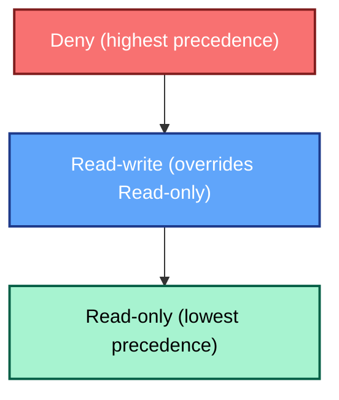

# User Groups: The Foundation of Zabbix Access Control

In any enterprise monitoring platform, establishing **role-based access control
(RBAC)** is critical for maintaining both security and clarity of operational
responsibility. For Zabbix, this control is built upon the fundamental concept
of **User Groups**.

In Zabbix 8.0, user groups serve as the primary mechanism for assigning permissions
and structuring access to the monitored data and configuration entities. This
chapter details the function of user groups, guides you through their configuration,
and outlines best practices for applying them in a robust, real world deployment.

## The Role of a User Group

A **User Group** in Zabbix is a logical collection of individual user accounts.
Rather than managing permissions for hundreds of users individually, Zabbix requires
that users be assigned to one or more groups. Access rights, such as the ability
to view host groups, configure templates, or see specific problem tags are then
granted at the **group level**.

This group centric architecture provides several major benefits:

* **Simplified Management:** Access rights are managed by **role** (e.g., "Network Engineers,"
  "Database Administrators") instead of by individual user.
* **Consistency:** Ensures that all users within the same role possess a consistent,
  standardized set of permissions.
* **Segregation of Duties:** Enables clear separation between viewing (read-only)
  and configuration (read-write) access.

> **Technical Definition:**
> User groups allow grouping users for both organizational purposes and for assigning
  permissions to data. Permissions to viewing and configuring data of host groups
  and template groups are assigned to user groups, not individual users. A user
  can belong to any number of groups.

---

## Configuring a User Group

User groups are configured exclusively through the Zabbix frontend. This process
remains consistent across Zabbix 8.0 and previous versions.

### Group Creation and General Attributes

1. Navigate to **Administration** →  **User groups**.
2. Click **Create user group** (or select an existing group to modify).
3. The configuration form is divided into four critical tabs: **User group**,
   **Template permissions**, **Host permissions**, and **Problem tag filter**.

_2.20 user group menu_

#### The `User group` Tab

This initial tab defines the group's general properties and its membership:

* **Group name:** A unique, descriptive identifier (e.g., `NOC-RO`, `System-Admins-RW`).
* **Users:** Add existing users to this group. A user can be a member of multiple
  groups.
* **Frontend access:** Controls the authentication method for group members. Options
  include `System default`, `Internal`, `LDAP`, or `Disabled` (useful for API-only
  accounts or for temporarily locking frontend access for a role).
* **LDAP server:** If `LDAP` access is chosen, select the specific LDAP server
  configuration to be used for members of this group.
* **Multi-factor authentication (MFA):** Select the method to be enforced for the
  group. If a user is a member of multiple groups, the most secure MFA setting
  will typically apply.
* **Enabled:** The master switch to activate or deactivate the group and its members.
* **Debug mode:** A powerful, optional setting that enables detailed debug logging
  for all group members in the Zabbix frontend.

???+ tip "The Debug User Group"
    Zabbix includes a dedicated `Debug` user group out-of-the-box. Instead of activating
    the debug option for an existing production group, it is cleaner practice to
    simply add the required user to the pre-existing `Debug` group.

---

### Permission Tabs: Host Groups and Template Groups

Permissions are configured by assigning access levels to **Host Groups** and
**Template Groups**. These entities act as containers, meaning the permissions
assigned to the group apply to all nested groups and all entities within them.

#### Template Permissions Tab

This section controls access to the configuration elements of templates (items,
triggers, graphs, etc.) via their Template Groups.

For each assigned Template Group, one of the following permissions must be selected:

* **Read-only:** Users can view the template configuration and see data derived
  from it, but they **cannot** modify or link the template.
* **Read-write:** Users can view, modify, and link/unlink the template and its
  entities (items, triggers, etc.).
* **Deny:** Explicitly blocks all access.

#### Host Permissions Tab

This tab works identically to the Template Permissions tab but applies the access
levels to **Host Groups** and the hosts contained within them.

#### Problem Tag Filters: Granular Alert Access

The final configuration tab, **Problem tag filter**, allows for fine-grained control
over which problems (alerts) a user group can see.

This is invaluable for enterprise environments where users should only be alerted
to issues relevant to their domain. For instance, a Database Administrator should
not be distracted by network switch problems.

Filters are applied to specific host groups and can be configured to display:

* All tags for the specified hosts.
* Only problems matching specific tag name/value pairs.

When a user is a member of multiple groups, the tag filters apply with **OR logic**.
If any of the user's groups allows visibility of a specific problem based on its
tags, the user will see it.

???+ info "Example: Database Administrator Filter"
    To ensure a Database Administrator group only sees relevant issues, the problem
    tag filter would be configured to specify:
    * **Tag name:** `service`
    * **Value:** `mysql`
    
    This ensures the user only sees problems tagged with `service:mysql` on the
    host groups they have permission to view.
---

### Frontend Behavior and Editing Limitations

Granting `Read-only` or `Read-write` access has distinct consequences for a user's
interaction with the frontend. A `Read-only` permission on a template is a view-only
mode, all configuration fields will be locked.

| Action or Screen Element | **Read-only** | **Read-write** | Description / Impact |
| :--- | :---: | :---: | :--- |
| Open template configuration | ✅ | ✅ | View mode for Read-only; full edit mode for Read-write. |
| Edit items / triggers / macros | ❌ | ✅ | Read-only users see data but cannot modify fields. |
| Update inherited trigger from host | ❌ | ✅ | Editable only with write permission at the template level. |
| Clone / delete template entities | ❌ | ✅ | Available only with write permission. |
| Enable / disable items or triggers | ❌ | ✅ | Buttons are greyed out for read-only users. |
| Link / unlink templates to hosts | ❌ | ✅ | Requires write access on both the template and the host. |
| Items from denied templates | ❌ (hidden) | ❌ (hidden) | Displayed as *Inaccessible template* if the template group is denied. |
## The Rule of Precedence: Deny Always Wins

A user's effective permission is the result of combining the rights from **all**
groups they belong to. Zabbix resolves these overlapping permissions by applying
a simple, strict hierarchy based on the most restrictive level, unless a `Deny`
is present.

### Hierarchy of Precedence

The order of precedence is absolute: **Deny** is the highest, followed by
**Read-write**, and finally **Read-only**.

This precedence can be summarized by two core rules:

1.  **Deny Always Overrides:** If any group grants **Deny** access to a host or
    template group, that user **will not** have access, regardless of any other
    `Read-only` or `Read-write` permissions.
2.  **Most Permissive Wins (Otherwise):** If no `Deny` is present, the most permissive
    right applies. **Read-write** always overrides **Read-only**.

| Scenario | Group A | Group B | Effective Permission | Rationale |
| :--- | :--- | :--- | :--- | :--- |
| **RW Over RO** | Read-only | Read-write | **Read-write** | The most permissive right wins when **Deny** is absent. |
| **Deny Over RO** | Read-only | Deny | **Deny** | **Deny** always takes precedence and blocks all access. |
| **Deny Over RW** | Read-write | Deny | **Deny** | The most restrictive right (Deny) overrides the most permissive. |

### Permissions in the "Update Problem" Dialog

In Zabbix 8.0, the actions available in the **Monitoring** → **Problems**
view (via the *Update problem* dialog) are controlled by two distinct mechanisms
working in tandem:

1. **Host/Template Permissions:** Governs basic access to the problem and whether
   configuration-level changes can be made.
2. **User Role Capabilities:** Governs which specific administrative actions (like
   acknowledging, changing severity, or closing) are enabled.

The table below clarifies the minimum required permissions to perform actions on
an active problem:

| Action in “Update problem” dialog | Required Host Permission | Required Template Permission | Required Role Capability / Notes |
| :--- | :--- | :--- | :--- |
| **Message** (add comment) | Read-only or Read-write | Same level as host | Requires the role capability **Acknowledge problems**. |
| **Acknowledge** | Read-only or Read-write | Same level as host | Requires **Acknowledge problems**. Read-only access is sufficient. |
| **Change severity** | **Read-write** required | **Read-write** if template trigger | Requires the **Change problem severity** capability. |
| **Suppress** / **Unsuppress** | **Read-write** required | **Read-write** if template trigger | Requires the **Suppress problems** capability. |
| **Convert to cause** | **Read-write** required | **Read-write** if template trigger | Requires **Manage problem correlations** capability. |
| **Close problem** | **Read-write** required | **Read-write** if template trigger | Requires **Close problems manually** capability. |

---

## Best Practices for Enterprise Access Control

Building a maintainable, secure Zabbix environment requires discipline in defining
groups and permissions.

1. **Adopt Role-Based Naming:** Use clear, standardized names that reflect the
   user's role and their access level, such as `Ops-RW` (Operations Read/Write)
   or `NOC-RO` (NOC Read-Only).
2. **Grant Access via Groups Only:** Never assign permissions directly to an individual
   user; always rely on **group membership**. This ensures auditability and maintainability.
3. **Principle of Least Privilege:** Start with the most restrictive access (**Read-only**)
   and only escalate to **Read-write** when configuration-level changes are an
   absolute requirement of the user's role.
4. **Align with Organizational Structure:** Ensure your Host Groups and Template
   Groups mirror your organization's teams or asset categories (e.g., `EU-Network`,
   `US-Database`, `Finance-Templates`). This makes permission assignment intuitive.
5. **Regular Review and Audit:** Periodically review group memberships and permissions.
   A user's role may change, and their access in Zabbix must be adjusted accordingly.
6. **Test Restricted Views:** After creating a group, always log in as a test user
   belonging to that group to verify that dashboards, widgets, and configuration
   pages display the correct restricted view.

---

## Conclusion

User groups form the essential foundation of access control in Zabbix 8.0. They
define *what* each user can see and configure (via host/template permissions),
while User Roles govern *which actions* are permitted (via capabilities). Combining
structured user groups, deliberate template/host permissions, and well defined
roles ensures a secure, predictable, and maintainable monitoring environment, minimizing
the risk of unauthorized configuration changes or viewing sensitive data.

