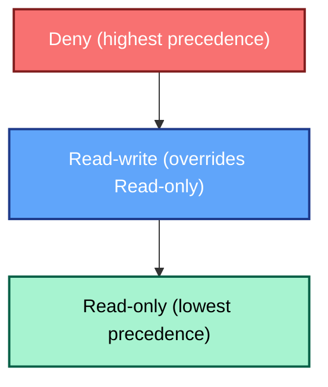

# User groups

In any monitoring system, controlling who sees what is key to maintaining both
security and clarity of responsibility. In Zabbix 7.4, user access management is
built around the concept of user groups, which serve as the foundation for assigning
permissions and structuring access to the monitoring data. This chapter explains
how user groups work, how to configure them, and how to apply best practices
in a real-world enterprise monitoring deployment.

## What Is a User Group?

I think the first question we have to ask us is, what is a user group exactly in
Zabbix.
A “user group” in Zabbix is a logical grouping of individual user accounts. Instead
of assigning permissions individually to each user, you assign users into groups
and then grant access rights (to host groups, template groups, problem tags, etc)
at the group level. From the documentation:

``` bash
“User groups allow to group users both for organisational purposes and for assigning
permissions to data. Permissions to viewing and configuring data of host groups and
template groups are assigned to user groups, not individual users.”
“A user can belong to any number of groups.”
```

This structure enables:

- Easier management of access rights by role rather than individual user.
- Consistency of permissions for users in the same role (for example, “Network
  Engineers”, “Database Administrators”, “Service Desk”).
- Segregation of view and configuration access (e.g., read-only vs read-write
  rights).

## How to Configure a User Group

In Zabbix 8.0 and older versions the configuration of a user group happens via the
web frontend:

- Navigate to Users → User groups. (This can be different in older versions.)
- Click `Create user group` in the top right corner (or edit an existing group).
- The form is divided into four tabs:
    - User group (general attributes)
    - Template permissions
    - Host permissions
    - Problem tag filter


_2.20 User Group menu_

### General Attributes

On the `User group` tab you set:

- **Group name:** A unique, descriptive name for the group.
- **Users:** Add existing users by typing the names, or use the “Select” button
  to pick from a list.
- **Frontend access:** Determines how users in the group authenticate. Options
  include System default, Internal, LDAP, Disabled (if the group should not have
  frontend access).
- **LDAP server:** If you selected LDAP access, you choose the LDAP server to use,
  for the users in this group.
- **Multi-factor authentication (MFA):** Choose the method for the group: Default
  (use the global default), a specific method, or Disabled. Note: if a user is
  in multiple groups and any group has MFA enabled, MFA may apply.
- **Enabled:** Whether the group (and thus its members) are enabled.
- **Debug mode:** Optionally enable debug mode for members of the group.

???+ tip

    ```
    There is a dedicated `Debug` user group. There is no need to activate the
    debug option. You can just easy add a user to this group who needs to have
    debug anabled.
    ```

## Template Permissions Tab

This tab lets you assign permissions to `template groups` (and thereby to the templates
within them). For each row you specify:

- Template group (or nested group)
- **Permission:** `Read-only`, `Read-write`, or `Deny`.

If overlap in the permissions on groups happens then following rules apply:

- **Read-only:** users can view but not modify templates.
- **Read-write:** users can edit or link templates.
- **Deny:** no access.

### Front-end Behavior and Editing Limitations

There are certain Limitations that we have to keep in mind when we give read or
read-write permissions to user. Below is a table with an easy overview of all
the permissions.

| Action or Screen Element           | **Read-only** | **Read-write** | **Description / Impact**                                         |
| ---------------------------------- | ------------- | -------------- | ---------------------------------------------------------------- |
| Open template configuration        | ✅             | ✅              | View mode for read-only; full edit mode for read-write.          |
| Edit items / triggers / macros     | ❌             | ✅              | Read-only users see data but cannot modify fields.               |
| Update inherited trigger from host | ❌             | ✅              | Locked for read-only; editable at template level for read-write. |
| Clone / delete template entities   | ❌             | ✅              | Available only with write permission.                            |
| Enable / disable items or triggers | ❌             | ✅              | Buttons greyed out for read-only.                                |
| Link / unlink templates to hosts   | ❌             | ✅              | Requires write access on both template and host.                 |
| View inherited items on host       | ✅             | ✅              | Shown for both; read-only cannot modify.                         |
| Items from denied templates        | ❌ (hidden)    | ❌ (hidden)     | Displayed as *Inaccessible template* if template is denied.      |


## Host Permissions Tab

Analogous to the above, but applies to `host groups` and the hosts within them.

If a host belongs to multiple groups with differing access levels, permissions
combine according to precedence rules (see below).

## Permission Precedence in Zabbix 8.0

Zabbix determines effective permissions based on the most permissive level, unless
a Deny is present. If Deny exists anywhere, it always overrides all other rights.

Hierarchy of Precedence



Meaning the following:

**Deny:** always takes precedence and blocks all access.
**Read-write:** overrides Read-only when both are assigned.
**Read-only:** lowest level; view-only access to data.

Let us have a look at the following example where a user is in multiple groups:

| Scenario                                  | Effective Permission |
| ----------------------------------------- | -------------------- |
| Group A = Read-only, Group B = Read-write | **Read-write**       |
| Group A = Read-only, Group B = Deny       | **Deny**             |
| Group A = Read-write, Group B = Deny      | **Deny**             |


Let's see another example :

| Group A    | Group B    | Result         | Why                                |
| ---------- | ---------- | -------------- | ---------------------------------- |
| Read-only  | Read-write | **Read-write** | The *most permissive* one wins     |
| Read-write | Deny       | **Deny**       | *Deny* always overrides everything |
| Read-only  | Deny       | **Deny**       | Same – Deny wins                   |
| Read-only  | Read-only  | **Read-only**  | Same level                         |


## Problem Tag Filters

Problem tag filters allow fine grained control over which problems (alerts) users in the group can see.
You can:

- Apply filters to specific host groups.
- Choose to display all tags or only specific tag name/value pairs.

If a user is in multiple groups, tag filters apply with OR logic. If any group
allows the problem, the user can see it.

???+ info

    ```
    A database administrator should only see problems tagged service:mysql.
    The group’s problem tag filter would specify:
    - Tag name: service
    - Value: mysql
    ```

### Understanding Permissions in the Update Problem Dialog

The `Update problem` window in Zabbix 8.0 provides operators and administrators with
tools to manage ongoing issues directly from the Monitoring → Problems view.
However, not every user sees the same set of available actions — visibility and
editability of each field depend on a combination of host/template permissions
(Read-only or Read-write) and the user’s role capabilities.

The table below outlines which permissions are required to perform each action
within the Update problem dialog.
It clarifies when host-level access alone is sufficient, when template permissions
apply (for template-based triggers), and when a specific role capability must also
be enabled (such as `Acknowledge problems,` `Change problem severity,` or `Close problems manually`).

| **Action in “Update problem” dialog**        | **Required Host Permission**  | **Required Template Permission**           | **Role Capability / Notes**                                                                                               |
| -------------------------------------------- | ----------------------------- | ------------------------------------------ | ------------------------------------------------------------------------------------------------------------------------- |
| **Message** *(add a comment / note)*         |  **Read-only or Read-write** | Same level as host                         | Requires the role capability **“Acknowledge problems”**. Template permission only matters if problem originates from a template trigger. |
| **Scope** *(public / private)*               |  **Read-only or Read-write** | Same                                       | Controlled by **“Acknowledge problems”** role right. Determines who sees the comment (public = all users with access).                   |
| **Change severity**                          |  **Read-write** required    |  **Read-write** if template trigger      | Requires the **“Change problem severity”** capability in the user role. Read-only users cannot modify severity.               |
| **Suppress**                                 |  **Read-write** required    |  **Read-write** if trigger from template | Requires the **“Suppress problems”** capability. This hides the problem from normal views.                                    |
| **Unsuppress**                               |  **Read-write** required    |  **Read-write** if template trigger      | Same as above — only users with **“Suppress problems”** right can unsuppress.                                                            |
| **Acknowledge**                              |  **Read-only or Read-write** | Same                                       | Requires **“Acknowledge problems”** right. Even read-only host access allows acknowledging, as long as the role permits it.              |
| **Convert to cause** *(problem correlation)* |  **Read-write**               |  **Read-write** if template trigger      | Requires **“Manage problem correlations”** capability in the role.                                                                       |
| **Close problem**                            |  **Read-write**               |  **Read-write** if template trigger      | Requires **“Close problems manually”** capability. Read-only users can't manually close problems.                                        |


???+ note

    ```
    - Host/template permissions govern access to the problem; the role governs
      which actions appear enabled.
    - Read-only access allows acknowledging and commenting (if permitted by role)
      but not suppression, closing, or severity change.
    - Even with Read-write host access, the user still needs the corresponding
      role rights for each action
    ```


## Some Best Practices

- Use role-based naming (e.g., Ops-RW, NOC-RO).
- Grant permissions only via groups, not individuals.
- Apply least privilege: start with Read-only and expand only when needed.
- Align host / template groups with organisational structure.
- Review permissions regularly.
- Test restricted views to verify widgets and dashboards behave correctly.


## Conclusion

User groups form the backbone of access control in Zabbix 8.0.
They define what each user can see or configure, while roles govern which actions
are allowed. Combining structured user groups, proper template permissions, and
well defined roles ensures a secure, predictable, and maintainable monitoring
environment.


