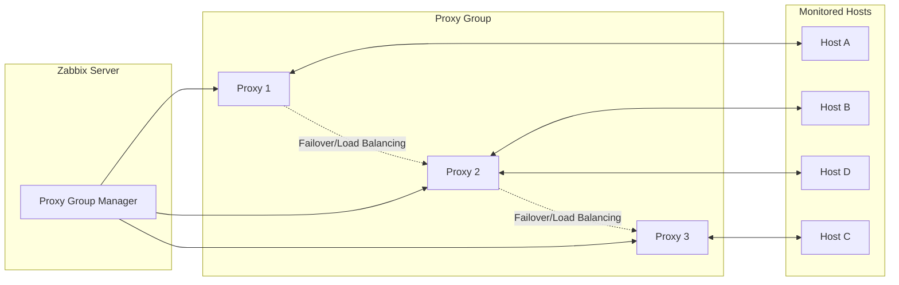

# Proxy groups

## Zabbix Proxy Groups: High Availability and Load Balancing

Zabbix Proxy Groups provide a robust foundation for **enterprise-grade distributed
monitoring**, enabling automatic **High Availability (HA)** and **Load Balancing
(LB)** across multiple proxies. Instead of binding a monitored host to a single
proxy, the host is assigned to a **Proxy Group**. The Zabbix server then determines
dynamically and continuously which proxy within the group is responsible for monitoring
that host.

This approach ensures uninterrupted monitoring during proxy failures and maintains
an even workload across the proxy infrastructure.

---

## Overview and Core Concepts

Proxy groups operate under the control of the **Zabbix Server’s Proxy Group Manager**, which continuously evaluates proxy status, host assignments, and overall group health. Two major capabilities define this feature: **automatic failover** and **workload balancing**.

### 1. High Availability (HA) Through Automatic Failover

**Failover Mechanism:**
If a proxy stops communicating with the Zabbix server and exceeds the configured
**Failover period**, it is marked *Offline*. The Proxy Group Manager then
**immediately reassigns** all hosts monitored by that proxy to the remaining
online proxies in the group.

**Outcome:**
Monitoring continues with minimal disruption and without manual intervention.

### 2. Load Balancing Through Host Redistribution

**Balancing Mechanism:**
The Zabbix server evaluates the number of hosts assigned to each proxy. # Proxy groups

## Zabbix Proxy Groups: High Availability and Load Balancing

Zabbix Proxy Groups provide a robust foundation for **enterprise-grade distributed
monitoring**, enabling automatic **High Availability (HA)** and **Load Balancing
(LB)** across multiple proxies. Instead of binding a monitored host to a single
proxy, the host is assigned to a **Proxy Group**. The Zabbix server then determines
dynamically and continuously which proxy within the group is responsible for monitoring
that host.
                                                                                                                                                             
This approach ensures uninterrupted monitoring during proxy failures and maintains
an even workload across the proxy infrastructure.

---

## Overview and Core Concepts

Proxy groups operate under the control of the **Zabbix Server’s Proxy Group Manager**,Load balancing is triggered if an imbalance is detected, defined by **two simultaneous conditions**:

1.  A difference of **greater than 10 hosts**, **and**
2.  The number of hosts assigned to a proxy is **double the group average or more**.

**Redistribution Logic:**

1. Compute the **average hosts per proxy**.
2. Proxies with excess hosts move them into an **unassigned pool**.
3. Proxies with a deficit receive hosts from this pool.

Example:

| Proxy Host Count | Group Average | Triggered? | Explanation |
| :---: | :---: | :---: | :--- |
| **100** | 50 | **Yes** | Host count is double the average (2×) and difference is 50 (>10). |
| 60 | 50 | No | Difference is 10 (not >10); not sufficient to trigger rebalancing. |
| 40 | 50 | No | Deficit of 10; insufficient to trigger balancing. |
| **25** | 5 | **Yes** | Proxy has 5× the average (≥2×) and difference is 20 (>10). |

---

## Advanced Operational Detail

The following technical details govern the behavior of the Proxy Group Manager and agents.

### Internal Management and Communication

| Mechanism | Description |
| :--- | :--- |
| **Communication Flow** | Proxies communicate **only with the Proxy Group Manager** on the Zabbix server. Proxies **do not communicate with each other**. |
| **Group Membership** | Each proxy can belong **only to a single proxy group**. |
| **State Change Trigger** | Proxy and proxy group states change only **after the configured failover period** has expired. |
| **Shared Knowledge** | All proxies in the group are informed by the server about the status and addresses of other proxies in the same group. |

### Load Balancing Time Window

* If a proxy group is flagged as unbalanced, the Proxy Group Manager will **wait until the grace period of $10 \times$ the failover delay has expired**.
* This grace period prevents redistribution based on temporary spikes. If the imbalance persists, host redistribution is performed.

### Agent Configuration Rules

#### Passive Agents (`Server=`)
A Zabbix agent in passive mode **must accept connections from all members of its proxy group**.
* Configure the `Server` parameter with a comma-separated list of all node IP addresses or DNS names.
* It is also possible to specify entire network segments if appropriate.

#### Active Agents (`ServerActive=`)
The active agent (v7.0+) will dynamically learn the optimal proxy. It is configured in one of two ways:

1.  **Specify Multiple Proxies:** Specify multiple proxy addresses using **semicolons**. Any proxy group member the agent connects to can redirect the agent to the currently assigned proxy.
2.  **Specify Zabbix Server:** Specify the **Zabbix server address** instead of the proxy addresses. The Proxy Group Manager will redirect the agent to the assigned proxy. The active agent will then add all known proxies to its runtime `ServerActive` parameter.

### Handling Proxy Network Loss

* If a proxy loses its network connection to the Zabbix server, the Proxy Group Manager will automatically reassign the proxy's hosts to other online proxies.
* The disconnected proxy will mark itself as offline and will **redirect any active agents** attempting to connect to it toward the other proxies in the group.

---

## Configuration Workflow

Deploying proxy groups effectively involves three main steps.

### Step 1: Create the Proxy Group

In the Zabbix frontend:

1.  Navigate to **Administration → Proxy groups**.
2.  Click **Create proxy group**.

| Parameter | Description | Recommendation |
| :--- | :--- | :--- |
| **Name** | Descriptive group name (e.g., `EMEA_Prod_Proxies`). | Use consistent naming tied to region, function, or environment. |
| **Failover period** | Maximum downtime allowed before proxy becomes *Offline* and failover is triggered. | Default: **1m**. Supports `s`, `m`, `h`. |
| **Minimum number of proxies** | Minimum required online proxies for the group to be considered *Online*. | Use $N-1$ if you want one proxy failure tolerance. |
| **Proxies** | Members participating in load sharing and HA. | Add all intended proxies. |

### Step 2: Assign Hosts to the Proxy Group

Hosts must be explicitly assigned to the proxy group:

1.  Select hosts in **Hosts**.
2.  Use **Mass Update**.
3.  Set **Monitored by proxy = \<Proxy Group Name\>**.

Only hosts assigned to the group are eligible for automated failover and load balancing.

---

## Architecture Diagram (Mermaid)

## Important Considerations and Limitations

* **Version Requirements:** All proxies must run Zabbix **7.0 or later** and match the server version.
* **Firewall Requirements:** Agents must be able to communicate with **every proxy** in the group.
* **SNMP Traps Not Supported:** Proxy groups **cannot process SNMP traps**. Traps must be routed to a dedicated, non-grouped proxy.
* **External Dependencies Must Be Identical:** If proxies use external check scripts, ODBC configuration, or third-party integrations, ensure **all proxies have identical configurations**.
* **VMware Monitoring Impact:** VMware hypervisors may be distributed across proxies, and each proxy will retrieve cached data from vCenter, increasing load.

---

## Some Good Practices

* Use at least three proxies for stable HA and load balancing.
* Ensure **symmetric configuration** across all proxies (scripts, credentials, ODBC drivers, time sync).
* Monitor proxy performance using built-in templates to understand load and redistribution frequency.
* Keep failover periods short for high-criticality environments.
* Test failover events regularly in non-production environments.

---

## Troubleshooting Tips

| Symptom | Possible Cause | Resolution |
| :--- | :--- | :--- |
| **Hosts remain on a failed proxy** | Proxy is still within the **Failover period** OR proxy group is *Offline*. | **Reduce `Failover period`** in the group configuration. Ensure `Minimum number of proxies` is set correctly (e.g., $N-1$). |
| **Load balancing does not occur** | Host difference is below the imbalance threshold (less than 10 hosts difference **or** less than $2\times$ average). | This is **expected behavior**. The imbalance must exceed the $10$ host and $2\times$ factor rules. |
| **Proxy not receiving new configuration** | Proxy is running a version older than the Zabbix server. | **Upgrade the proxy** to match the Zabbix server's major version. |
| **Active agents fail to report after failover** | Incorrect **`ServerActive`** setting OR firewall blocks the redirected proxy. | Ensure the agent can connect to *every* proxy IP address. Verify `ServerActive` includes all proxies or the Zabbix server IP. |
| **SNMP devices not monitored** | Proxy group is being used for SNMP Traps. | Proxy groups **do not support SNMP traps**. Use a dedicated SNMP trap proxy. |

---

## Questions

1.  **What is the minimum Zabbix version required** for both the proxy and agent to fully support Proxy Groups, including Active checks?
2.  Describe the difference between the **High Availability (HA) mechanism** and the **Load Balancing (LB) mechanism** in Zabbix Proxy Groups. When does each occur?
3.  What are the two specific conditions that must be met to trigger **automatic host redistribution** (Load Balancing) within a proxy group?
4.  When configuring a Zabbix Agent for a host assigned to a proxy group, why must the `ServerActive` parameter list **multiple proxy IPs** or the Zabbix server IP?
5.  What is the function of the **`Minimum number of proxies`** setting, and what happens when the number of online proxies drops below this value?
6.  Why is it critical that external dependencies (like custom scripts or ODBC configurations) are **identical** across all proxies within the group?

---

## Conclusion

Zabbix Proxy Groups significantly enhance the resilience and scalability of distributed monitoring environments. Through seamless failover and intelligent workload balancing, they allow enterprises to maintain consistent monitoring coverage even during proxy outages or uneven load distribution. When combined with proper agent configuration, firewall rules, and aligned proxy setups, proxy groups form a foundational component of modern Zabbix deployments.

---

## Useful URLs

| Description | URL |
| :--- | :--- |
| **Zabbix Distributed Monitoring Manual** | `https://www.zabbix.com/documentation/current/en/manual/distributed_monitoring` |
| **Proxy Load Balancing and HA Official Documentation** | `https://www.zabbix.com/documentation/current/en/manual/distributed_monitoring/proxies/ha` |
| **Zabbix Proxy Configuration** | `https://www.zabbix.com/documentation/current/en/manual/concepts/proxy` |
| **Zabbix Agent Configuration (ServerActive)** | `https://www.zabbix.com/documentation/current/en/manual/config/items/zabbix_agent/config` |
