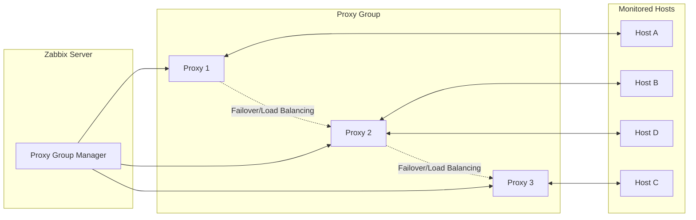

# Proxy groups

## Zabbix Proxy Groups: High Availability and Load Balancing

Zabbix Proxy Groups provide a robust foundation for **enterprise-grade distributed
monitoring**, enabling automatic **High Availability (HA)** and **Load Balancing
(LB)** across multiple proxies. Instead of binding a monitored host to a single
proxy, the host is assigned to a **Proxy Group**. The Zabbix server then determines
dynamically and continuously which proxy within the group is responsible for monitoring
that host.

This approach ensures uninterrupted monitoring during proxy failures and maintains
an even workload across the proxy infrastructure.

---

## Overview and Core Concepts

Proxy groups operate under the control of the **Zabbix Server’s Proxy Group Manager**, which continuously evaluates proxy status, host assignments, and overall group health.  
Two major capabilities define this feature: **automatic failover** and **workload balancing**.

---

### 1. High Availability (HA) Through Automatic Failover

**Failover Mechanism:**  
If a proxy stops communicating with the Zabbix server and exceeds the configured **Failover period**, it is marked *Offline*. The Proxy Group Manager then **immediately reassigns** all hosts monitored by that proxy to the remaining online proxies in the group.

**Outcome:**  
Monitoring continues with minimal disruption and without manual intervention.

---

### 2. Load Balancing Through Host Redistribution

**Balancing Mechanism:**  
The Zabbix server evaluates the number of hosts assigned to each proxy. If an imbalance is detected—defined as:

- A difference of **≥10 hosts**, **and**
- A difference by a factor of **2× or more** compared to the group average

—then load balancing is triggered automatically.

**Redistribution Logic:**  

1. Compute the **average hosts per proxy**.  
2. Proxies with excess hosts move them into an **unassigned pool**.  
3. Proxies with a deficit receive hosts from this pool.

This maintains long-term stability and evenly distributes monitoring tasks.

Example:

| Proxy Host Count | Group Average | Triggered? | Explanation |
|---:|---:|:---:|---|
| **100** | 50 | **Yes** | Host count is double the average; triggers rebalancing. |
| 60 | 50 | No | Difference is exactly 10; not ≥2× average. |
| 40 | 50 | No | Deficit of 10; insufficient to trigger balancing. |
| **25** | 5 | **Yes** | Proxy has 5× the average; triggers rebalancing. |

---

## Configuration Workflow

Deploying proxy groups effectively involves three main steps.

---

### Step 1: Create the Proxy Group

In the Zabbix frontend:

1. Navigate to **Administration → Proxy groups**.  
2. Click **Create proxy group**.  
3. Configure the parameters as described below.

| Parameter | Description | Recommendation |
|---|---|---|
| **Name** | Descriptive group name (e.g., `EMEA_Prod_Proxies`). | Use consistent naming tied to region, function, or environment. |
| **Failover period** | Maximum downtime allowed before proxy becomes *Offline*. | Default: **1m**. Supports `s`, `m`, `h`. |
| **Minimum number of proxies** | Minimum required online proxies for the group to be considered *Online*. | Use `N-1` if you want one proxy failure tolerance. |
| **Proxies** | Members participating in load sharing and HA. | Add all intended proxies. |

---

### Step 2: Assign Hosts to the Proxy Group

Hosts must be explicitly assigned to the proxy group:

1. Select hosts in **Hosts**.  
2. Use **Mass Update**.  
3. Set **Monitored by proxy = \<Proxy Group Name\>**.

Only hosts assigned to the group are eligible for automated failover and load balancing.

---

### Step 3: Configure Zabbix Agents (If Used)

Zabbix Agents require correct configuration to support proxy redundancy.

| Check Type | Agent Parameter | Required Setting | Notes |
|---|---|---|---|
| **Passive Checks** | `Server=` | List **all proxy IPs** in the group. | Any proxy may request passive checks after failover. |
| **Active Checks** | `ServerActive=` | List **all proxy IPs** *or* the Zabbix server. | Requires **Agent 7.0+**. The agent learns its correct proxy dynamically. |

---

## Architecture Diagram (Mermaid)

## Important Considerations and Limitations

- **Version Requirements:** All proxies must run Zabbix 7.0 or later and match the
  server version.
- **Firewall Requirements:** Agents must be able to communicate with every proxy
  in the group.
- **SNMP Traps Not Supported:** Proxy groups cannot process SNMP traps. Traps must
  be routed to a dedicated, non-grouped proxy.
- **External Dependencies Must Be Identical:**  If proxies use external check scripts,
  ODBC configs, or third-party integrations, ensure all proxies have identical configurations.
- **VMware Monitoring Impact:** VMware hypervisors may be distributed across proxies,
  and each proxy will retrieve cached data from vCenter, increasing load.

## Some good practices

- Use at least three proxies for stable HA and load balancing.
- Ensure symmetric configuration across all proxies (scripts, credentials, ODBC drivers, time sync).
- Monitor proxy performance using built-in templates to understand load and redistribution frequency.
- Keep failover periods short for high-criticality environments.
- Test failover events regularly in non-production environments.

## Troubleshooting tips

| Symptom                        | Possible Cause                          | Resolution                                               |
| ------------------------------ | --------------------------------------- | -------------------------------------------------------- |
| Hosts remain on a failed proxy | Failover period too long                | Reduce failover period; ensure proxy can reach server.   |
| Load balancing does not occur  | Host difference <10 or <2× average      | Add more hosts or reduce uneven assignments manually.    |
| SNMP devices not monitored     | Proxy group does not support SNMP traps | Use a dedicated SNMP trap proxy.                         |
| Active agents fail to report   | Incorrect `ServerActive` settings       | Add all proxy IPs or the server IP; ensure agent is v7+. |

## Conclusion

Zabbix Proxy Groups significantly enhance the resilience and scalability of distributed
monitoring environments. Through seamless failover and intelligent workload balancing,
they allow enterprises to maintain consistent monitoring coverage even during proxy
outages or uneven load distribution. When combined with proper agent configuration,
firewall rules, and aligned proxy setups, proxy groups form a foundational component
of modern Zabbix deployments.

## Questions

## Useful URLs
