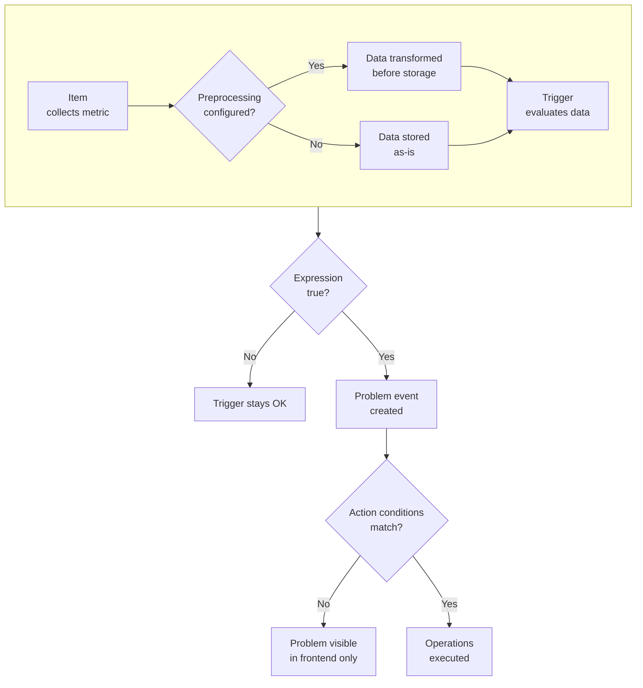

# Collecting data with your Zabbix environment

Everything in Zabbix starts with data. Dashboards, alerts, reports, and SLA
calculations are all downstream of a single fundamental operation: an item
collecting a metric from a monitored target. This chapter is about that operation.
What it looks like, how it works, and the different ways Zabbix can perform it.

The number of items you configure directly determines how much data your Zabbix
system must collect, process, and store. At scale, item design is one of the
primary factors influencing performance and database load.

Before any data can be collected, two things need to exist: a host and an item.
A host in Zabbix is not necessarily a physical or virtual machine. It is a
monitoring target, a logical container that holds items, triggers, graphs, discovery
rules, and web scenarios. A server, a network switch, a container, a website, or
a cloud API endpoint are all equally valid hosts. An item represents a single metric
attached to that host, defined by a key that tells Zabbix what to collect and how.

---

## The data flow

Understanding how data moves through Zabbix before diving into individual item
types makes every configuration decision easier to reason about. The flow is
linear and has four stages.

An item collects a metric and optionally passes it through preprocessing before
storing it in the database. A trigger evaluates the stored data against a logical
expression and changes state between `OK` and `PROBLEM`. A `problem event` is created
when a trigger transitions to the `PROBLEM` state. An action evaluates that event
against its conditions and, if they match, executes its operations. Sending a
notification, running a command, or both.

Not every item needs a trigger, and not every problem event needs to match an
action. Metrics can be collected purely for visualisation. Problems can appear in
the frontend without triggering any notification. A single event can match the
conditions of multiple actions simultaneously. Understanding where each element is
optional, and where it is required, is the foundation of building a clean and
maintainable monitoring configuration.

At scale, each stage of this flow can become a bottleneck. Data collection may be
limited by poller capacity, preprocessing by available workers, and storage by
database performance. Understanding this flow is not only important for
configuration, but also for troubleshooting and performance tuning.

---

## Item types covered in this chapter

Zabbix supports a large number of item types, each designed for a different
collection method or protocol. This chapter covers all of them in sequence,
starting from the simplest and progressing to the more specialised.

The following sections group item types by how they collect data and where the
execution takes place.

- **Simple checks**: Are built-in checks executed directly by the Zabbix server or
proxy without any agent. They include ICMP ping, TCP and UDP port checks, and
VMware monitoring. They require no software on the monitored target.

- **Zabbix agent (passive)**: Is the most common collection method for Linux and
Windows hosts. The server or proxy connects to the agent on port 10050 and
requests specific metric values. The agent executes the check and returns the
result.

- **Zabbix agent (active)**: Reverses the connection direction. The agent connects to
the server or proxy, retrieves a list of items it should collect, and sends the
results back on a schedule. This mode is preferred as active agents have a small
internal cache and as they offload some work form the Zabbis server (they push
the data to the server), and it is required for log file
monitoring.

- **SNMP polling**: Allows the Zabbix server or proxy to query any device that
exposes an SNMP interface. Network switches, routers, printers, storage arrays,
UPS devices, and many others. Zabbix supports SNMP versions 1, 2c, and 3.

- **SNMP trapping**: Is the reverse, the monitored device sends unsolicited SNMP trap
messages to Zabbix. This is used for devices that report state changes
asynchronously rather than waiting to be polled.

- **HTTP items**: Allow Zabbix to make HTTP and HTTPS requests to any URL and store
the response body, status code, or response time as a metric. This is the primary
method for monitoring REST APIs and web services without writing a custom script.

- **Preprocessing**: Is not an item type but a transformation step that can be
applied to any item before the collected value is stored. It supports operations
such as regular expression extraction, JSON and XML path queries, custom
multipliers, rate calculation, and conditional value mapping.

- **Dependent items**: Collect no data themselves. Instead, they extract a value
from the data already collected by a master item using preprocessing. This avoids
making multiple requests to a target when a single request returns all the data
needed. A common pattern with HTTP and SNMP bulk responses.

- **SSH and Telnet checks**: Allow Zabbix to log in to a remote host over SSH or
Telnet, execute a command, and store the output as a metric. These are useful for
targets that cannot run a Zabbix agent.

- **Script items**: Execute a JavaScript snippet directly inside the Zabbix server or
proxy process using the embedded Duktape engine. No external process is spawned.
This is the preferred method for lightweight custom collection logic that does not
require access to the monitored host's filesystem or network stack.

- **JMX monitoring**: Allows Zabbix to collect metrics from Java applications that
expose a JMX interface, such as Tomcat, Kafka, and many other JVM-based services.
It requires the Zabbix Java gateway, a separate component that handles the JMX
protocol on behalf of the server.

- **IPMI monitoring**: Allows Zabbix to query hardware sensors on servers that
support the Intelligent Platform Management Interface. Typically physical servers
with a baseboard management controller. Collectible metrics include temperature,
fan speed, voltage, and power consumption.

- **Database monitoring via ODBC**: Allows Zabbix to connect to any database that
exposes an ODBC interface, execute a SQL query, and store the result as a metric.
The connection is made through the unixODBC library installed on the Zabbix server
or proxy.

- **Database checks via Zabbix agent 2**: Extend database monitoring to a wider set
of database engines through dedicated plugins built into Zabbix agent 2, including
MySQL, PostgreSQL, Oracle, MongoDB, and others. Unlike ODBC, these plugins do not
require a separately configured ODBC data source.

- **Zabbix trapper**: Accepts values pushed to the Zabbix server or proxy over the
network using the `zabbix_sender` utility or any client that implements the
Zabbix sender protocol. This is used when the collection timing is controlled by
an external process rather than by Zabbix's own scheduler.

- **External checks**: Execute a script or binary located on the Zabbix server or
proxy and store the output as a metric. Unlike script items, external checks run
as a separate process on the operating system. This is useful for checks that
require system libraries, external tools, or network access from the server's
own network perspective.

- **Browser items**: Use a headless Chromium instance, managed through the Zabbix
web service, to interact with a web page and collect metrics from it. This is the
correct method for monitoring web applications that require JavaScript execution
or user interaction flows that cannot be replicated with a plain HTTP request.

- **Calculated items**: Do not collect data from an external source. Instead, they
compute a value from data already stored in Zabbix using a mathematical expression
that can reference other items on the same host or on different hosts.

---

## What this chapter does not cover

Custom scripts used as alert scripts for media types are covered in the alerting
chapter. Auto-registration of active agents and the mechanism that creates hosts
automatically when a new agent connects, is covered in a dedicated chapter later
in the book. Templates, which are the correct place to define items for reuse
across many hosts, are covered in the templates chapter.

Understanding items at the host level makes it easier to grasp how each collection
method works in isolation. In production environments, items are rarely created
directly on hosts. Instead, they are defined in templates and applied at scale.
