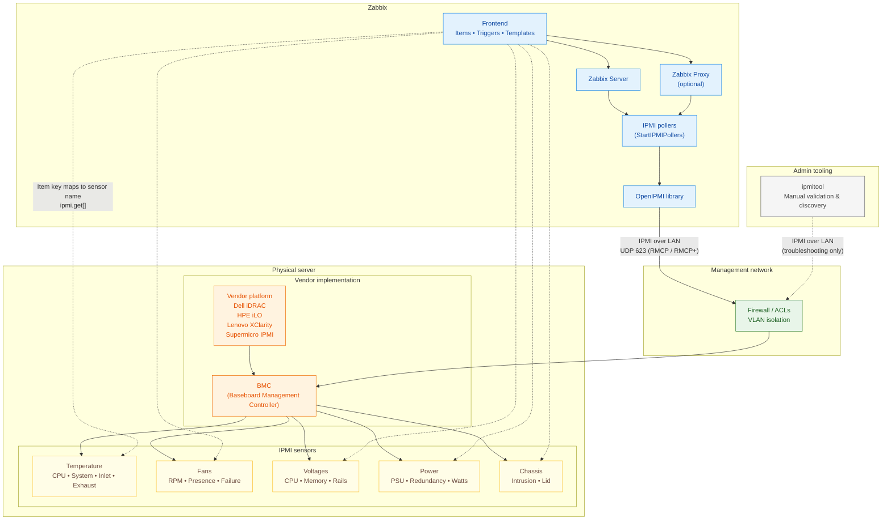

# IPMI Monitoring

## What is IPMI

Out-of-band management has been part of enterprise server administration for decades,
long before modern APIs and automation frameworks became common. One of the most widely
adopted standards in this space is the Intelligent Platform Management Interface
(IPMI). Despite its age and limitations, IPMI remains deeply embedded in data centers
and continues to play a role in hardware monitoring today.

This chapter introduces IPMI from a practical monitoring perspective and explains
how it integrates with Zabbix, while also setting realistic expectations about where
IPMI fits in modern environments.

### Understanding IPMI

IPMI allows administrators to monitor and manage physical server hardware independently
of the operating system. Even when a system is powered off, hung, or unable to
boot, IPMI usually remains accessible as long as the server has power.

At the center of IPMI is the Baseboard Management Controller (BMC). The BMC is
a small embedded controller with its own firmware, network interface, and access
to system sensors. Because it operates independently of the host operating system,
it can continue reporting hardware health even when the OS is unavailable.

Most server vendors implement IPMI through their own management platforms. While
they share a common IPMI foundation, each adds vendor-specific features and naming
conventions.

Common BMC implementations include:

- Dell – iDRAC
- HPE – iLO
- Lenovo – XClarity Controller
- Supermicro – IPMI
- Fujitsu – iRMC

From a monitoring perspective, these differences matter because sensor names,
availability, and behavior often vary by vendor and even by firmware version.



### IPMI Architecture and Sensors

IPMI monitoring is built around hardware sensors exposed by the BMC. These sensors
report real-time measurements and state information about the physical system.

Typical sensor categories include:

- Temperature sensors
  CPU temperature, system or motherboard temperature, inlet and exhaust air temperature
- Fan sensors
  Fan speed (RPM), fan presence, fan failure states
- Voltage sensors
  CPU voltage, memory voltage, standby voltage rails
- Power sensors
  Power supply status, redundancy state, power consumption
- Chassis sensors
  Chassis intrusion, lid open/closed state
- Miscellaneous sensors
  Battery status, watchdog timers, hardware fault indicators

Each sensor has a name, a type, and one or more thresholds that indicate warning
or critical conditions. Importantly, sensor names are vendor-defined and case-sensitive,
which has direct implications for monitoring tools such as Zabbix.

### Communication and Protocols

When accessed over the network, IPMI typically communicates using UDP port 623.
Older implementations rely on the Remote Management Control Protocol (RMCP), while
newer systems support RMCP+, which adds authentication and encryption.

Although RMCP+ improves security compared to earlier versions, its real world
effectiveness depends heavily on vendor configuration and firmware quality. As
a result, IPMI traffic still lacks many of the security and observability features
administrators expect from modern management interfaces.

### Security Caveats

IPMI’s design reflects the assumptions of an earlier era, and this has lasting
security implications. Many systems ship with IPMI enabled by default, sometimes
with weak or unchanged credentials. Legacy authentication methods and insecure
cipher suites may remain active unless explicitly disabled.

Unlike modern APIs, IPMI does not natively use HTTPS or certificates. Logging and
auditing capabilities are minimal, making it difficult to track access or investigate
incidents. Because the BMC operates below the operating system, a compromised
management controller can be extremely difficult to detect or remediate.

For these reasons, IPMI should always be treated as a high-privilege interface.
Best practice is to place it on a dedicated management network, restrict access
aggressively, and keep BMC firmware up to date. When used carefully, IPMI can be
safe enough for monitoring, but it should never be treated like a normal application
service.

### Verifying IPMI Access with ipmitool

Before configuring IPMI monitoring in Zabbix, it is often helpful to verify connectivity
manually. On most Linux distributions, this is done using the `ipmitool` utility.

A simple sensor query confirms that the BMC is reachable and that credentials are
correct. If sensor data can be retrieved successfully with `ipmitool`, the same
configuration will usually work in Zabbix as well.

These tools are primarily for validation and troubleshooting; they are not required
for day-to-day monitoring once Zabbix is configured.

### Native IPMI Monitoring in Zabbix

Zabbix includes native IPMI support, allowing it to poll BMCs directly without
agents or external scripts. This is done using the IPMI agent item type.

To enable IPMI monitoring, a host must be configured with an IPMI interface specifying
the BMC's management IP address and port. Credentials can be defined at the host
or template level, depending on how standardized the environment is.

Once configured, Zabbix queries individual sensors and stores their values just
like any other monitored metric.

### IPMI Items and Templates

Each IPMI item in Zabbix corresponds to a specific sensor name exposed by the BMC.
Because sensor naming is not standardized, templates often require customization.

Zabbix ships with generic IPMI templates that provide a useful starting point.
These templates usually include:

- Core temperature sensors
- Fan speed monitoring
- Power supply status
- Basic triggers for warning and critical states

In practice, these templates are rarely “plug and play.” Sensors may be missing,
renamed, or behave differently across vendors. As a result, IPMI templates are
best treated as baselines that are refined for specific hardware platforms.

### Practical Limitations

From a modern monitoring perspective, IPMI has clear limitations. Discovery
capabilities are weak, sensor models are inconsistent, and extending IPMI beyond
basic health checks is difficult. Automation and integration with external systems
are also limited compared to API-driven approaches.

These constraints do not make IPMI obsolete, but they do define its role. IPMI is
best suited for fundamental hardware health monitoring rather than deep observability
or automation.

### When IPMI Still Makes Sense

IPMI remains relevant in many environments, particularly where hardware fleets
are already deployed and newer management standards are unavailable. In controlled
networks with proper isolation and access controls, it provides reliable insight
into physical system health.

For many organizations, IPMI will continue to coexist with newer technologies
for years to come.

### Understanding How IPMI Tools Work

Before Zabbix enters the picture, it helps to understand how IPMI is typically
accessed from a system administrator’s point of view. The most common tool for
interacting with IPMI is `ipmitool`, a command-line utility that communicates directly
with the BMC.

ipmitool does not talk to the operating system. Instead, it connects straight to
the BMC using IPMI over LAN, authenticates using the configured credentials, and
requests sensor data or management actions. In many ways, Zabbix’s native IPMI
monitoring behaves very similarly, it simply automates and schedules the same
type of queries.

Using `ipmitool` manually is therefore an excellent way to validate connectivity,
credentials, and available sensors before attempting to monitor a system with Zabbix.

#### Installing ipmitool

The `ipmitool` package is widely available and easy to install on all major Linux
distributions.

On Red Hat Enterprise Linux, Rocky Linux, AlmaLinux, and other RHEL-based systems,
the package can be installed using:

```
dnf install -y ipmitool
```

On Debian and Ubuntu systems, installation is done with:

```
apt install -y ipmitool
```

Once installed, no additional services are required. The tool is invoked directly
from the command line and communicates with the BMC over the network.

#### Exploring IPMI Sensors with ipmitool

The most common starting point is to list available sensors. This provides immediate
insight into what the BMC exposes and what Zabbix will be able to monitor.

A typical command looks like this:

```
ipmitool -I lanplus -H <BMC_IP> -U <USER> sensor list
```

This command returns a list of sensors along with their current values and status.
While the exact output varies by vendor, readers will usually see entries for
temperatures, fans, voltages, and power supplies.

To focus on specific types of data, administrators often scan the output for
familiar patterns:

- Fan-related sensors usually include keywords like FAN, Fan1, or System Fan
- Temperature sensors often reference CPU, System, Inlet, or Exhaust
- Power supply sensors may indicate presence, redundancy, or failure states

This exploratory step is important because sensor names must be used exactly as
shown when configuring Zabbix IPMI items.

### How Zabbix Uses IPMI Internally

Zabbix does not invoke ipmitool or external commands when monitoring IPMI. Instead,
it integrates directly with the OpenIPMI library, a widely used, open-source implementation
of the IPMI specification.

OpenIPMI handles the low-level details of IPMI communication, including protocol
handling, authentication, and sensor access. Zabbix uses this library to communicate
with the BMC in a structured and efficient way, without relying on shell commands
or external processes.

From the user’s perspective, this distinction is mostly invisible. Whether IPMI
data is retrieved manually with ipmitool or automatically by Zabbix, the underlying
interaction with the BMC follows the same IPMI standards and exposes the same sensors.

#### Configuring IPMI Pollers

By default, Zabbix does not enable IPMI pollers. You could start with a low
number like 3 or 5. In environments with
only a few monitored servers, this is usually sufficient. However, in larger environments,
this configuration may quickly become a bottleneck.

The number of IPMI pollers is controlled by the following configuration parameter:

```
StartIPMIPollers
```

If IPMI checks begin to queue or time out, increasing this value is often necessary.
As with other Zabbix poller types, changes require a restart of the Zabbix server
or proxy to take effect.

Because IPMI pollers rely on network communication with management controllers, their performance is influenced not only by Zabbix itself, but also by:

- BMC responsiveness
- Network latency to the management network
- Firmware quality and load on the BMC

#### Relationship Between ipmitool and Zabbix

Although Zabbix does not use ipmitool internally, the two tools are closely related conceptually. Both rely on standard IPMI mechanisms and expose the same underlying sensor data.

For this reason, ipmitool remains the preferred tool for:

- Validating IPMI connectivity
- Discovering available sensors
- Verifying sensor names and behavior
- Troubleshooting authentication and firmware issues

If a sensor cannot be queried successfully with ipmitool, it will almost certainly fail in Zabbix as well.

#### Configuring an IPMI Item in Zabbix

Configuring an IPMI item in Zabbix is conceptually simple, but attention to detail is crucial.

An IPMI item requires:

- Item type set to IPMI agent
- A key that references the exact sensor name
- An update interval appropriate for hardware metrics

For example, to monitor a CPU temperature sensor, the item key might look like:

```
ipmi.get[CPU Temp]
```

If the sensor name does not match exactly, including case and spacing, the item
will fail. For this reason, copying sensor names directly from ipmitool output
is strongly recommended.

Triggers are typically defined on top of these items to detect warning and critical
thresholds, either using vendor recommendations or operational experience.

### Known Issues and Common Pitfalls

IPMI monitoring works reliably once configured correctly, but several recurring
issues are worth calling out explicitly.

One common problem is inconsistent sensor naming. The same server model may expose
different sensor names depending on firmware version, making templates fragile
across hardware revisions.

Another frequent issue is slow or unresponsive BMCs. Some management controllers
respond slowly under load, which can cause timeouts or delayed data in Zabbix.
This becomes more noticeable as the number of monitored systems grows.

Authentication problems are also common. Incorrect cipher suite settings, locked
user accounts, or firmware bugs can all prevent successful IPMI polling even when
credentials appear correct.

Finally, IPMI interfaces are sometimes overlooked during network changes. Firewall
rules, VLAN reconfiguration, or routing changes can silently break access to the
management network while leaving the operating system untouched.

### Practical Advice for Reliable IPMI Monitoring

From experience, IPMI monitoring works best when treated as infrastructure monitoring,
not application monitoring. Polling intervals should be reasonable, sensor counts
kept under control, and templates carefully validated per vendor.

Using ipmitool during setup and troubleshooting remains invaluable. If a sensor
cannot be queried manually, Zabbix will not be able to retrieve it either.

When these practices are followed, IPMI provides stable and useful visibility into
hardware health — even if it shows its age in other areas.


## Introduction to Redfish

If IPMI feels like a tool from another era, Redfish is what replaced it: a modern,
web friendly management standard designed for automation and secure operations.
Redfish exposes hardware management through a RESTful interface and focuses on
being both human-readable and machine friendly. 

In practical terms, Redfish is what you wish IPMI had been: structured resources,
predictable URIs, and data you can query using the same tools you already use for
web services.

### REST + HTTPS

Redfish is built around REST concepts and is typically accessed over HTTPS. Instead
of vendor specific “sensor names” or proprietary client utilities, you access resources
using URLs and standard HTTP methods. 

That shift matters for monitoring:

- You can test endpoints with curl.
- You can retrieve structured JSON payloads.
- You can monitor it with Zabbix HTTP agent items (no special IPMI subsystem needed).

### JSON schema and standardized resources

Redfish resources are delivered as JSON and described by formal schemas. DMTF
publishes the schema index (including JSON Schema formats), which makes the ecosystem
far more consistent than IPMI in practice.

The big win for authors and operators is that Redfish revolves around standard resource types.
You'll see the same patterns repeatedly across vendors:

- **ServiceRoot:** /redfish/v1 (entry point)
- **Systems:** server/compute view (CPU, memory, boot, power state)
- **Chassis:** physical enclosure view
- **Managers:** the management controller (think BMC/iDRAC/iLO)
- **Power / Thermal:** structured telemetry for PSUs, fans, temperatures (often
  via chassis-related resources)

Even when vendors add OEM extensions, the baseline model stays recognizable.

## Testing Redfish with a Simulator

Since not everyone has an IPMI interface available and since we cannot use a
standard that would work for everybody we will focus on a simulator. This should
give you a good idea on how things work in real life.

### DMTF Mockup Server

The Mockup Server serves static Redfish mockups and runs by `default` on `127.0.0.1:8000`.

We will install for this a docker container on our Zabbix system or another
system if you prefer.

For the examples in this book, we use a fork of the official DMTF Redfish Mockup Server. The simulator runs in a container and provides a predictable, vendor-neutral Redfish API that is ideal for testing and monitoring examples.

The following sections show how to run the simulator on Rocky Linux using Podman and on Ubuntu 24.04 using Docker.

In both cases, the result is the same: a Redfish service listening locally on port 8000.

#### Rocky Linux (Podman)

Rocky Linux uses Podman as its default container engine. Podman is daemonless, integrates well with system security, and can run Docker-compatible images without modification.

**Install Podman**

Podman is available in the default Rocky repositories:

```bash
dnf install -y podman
```

No additional services need to be enabled.

Clone the Redfish Mockup Server Repository.

```bash
git clone https://github.com/penmasters/Redfish-Mockup-Server.git
cd Redfish-Mockup-Server
```

This repository is a fork of the upstream DMTF project and is used here for documentation and monitoring examples.

Build the Container Image (optional but recommended)
Building the image locally ensures reproducible behavior:

```bash
podman build -t redfish-mockup-server .
```

**Run the Redfish Mockup Server**

Start the container and expose port 8000:

```bash
podman run --rm -p 8000:8000 redfish-mockup-server
```

Once running, the Redfish service root is available at:

```bash
http://127.0.0.1:8000/redfish/v1
```

#### Ubuntu 24.04 (Docker)

On Ubuntu, Docker remains the most widely used container runtime and is familiar to many administrators.

**Install Docker from the Ubuntu repositories:**

``` 
apt update
apt install -y docker.io
```

Enable and start the Docker service:

```bash
systemctl enable --now docker
```

(Optional) To avoid running Docker as root, add your user to the docker group and re-login.

**Clone the Redfish Mockup Server Repository**

``` bash
git clone https://github.com/penmasters/Redfish-Mockup-Server.git
cd Redfish-Mockup-Server
```

**Build the Container Image**

``` bash
docker build -t redfish-mockup-server .
```

**Run the Redfish Mockup Server**

Start the container:

```
docker run --rm -p 8000:8000 redfish-mockup-server
```

The Redfish API is now available at:

``` bash
http://127.0.0.1:8000/redfish/v1
```

**Verifying the Installation**

On both Rocky Linux and Ubuntu, you can verify that the simulator is running by querying the Redfish service root:

``` bash
curl http://127.0.0.1:8000/redfish/v1
```

A JSON response confirms that the mock server is working correctly.

At this point, the simulator can be used for:

- Exploring Redfish resources with curl
- Viewing JSON responses in a web browser
- Configuring Zabbix HTTP agent items
- Building preprocessing and LLD examples

```json
curl http://127.0.0.1:8000/redfish/v1
{
    "@odata.id": "/redfish/v1/",
    "@odata.type": "#ServiceRoot.v1_16_1.ServiceRoot",
    "AccountService": {
        "@odata.id": "/redfish/v1/AccountService"
    },
    "CertificateService": {
        "@odata.id": "/redfish/v1/CertificateService"
...
...
    },
    "UUID": "92384634-2938-2342-8820-489239905423",
    "UpdateService": {
        "@odata.id": "/redfish/v1/UpdateService"
    }
```

## Monitoring Redfish with Zabbix

With the Redfish Mockup Server running, we can now move from exploration to actual monitoring. The most straightforward way to monitor Redfish in Zabbix is by using an HTTP agent item, which retrieves data from a REST endpoint and stores the response for further processing.

This approach mirrors how Redfish is used in real environments and avoids the need for any special protocols or poller types.

**Choosing the First Endpoint**

Every Redfish service exposes a well-defined entry point called the Service Root, located at:

```bash
/redfish/v1
```

This endpoint is ideal for a first test because it:

- Is always present
- Returns a small, predictable JSON document
- Confirms basic connectivity and parsing

In the mock environment, the full URL is:

```
http://127.0.0.1:8000/redfish/v1
```

**Creating a Test Host in Zabbix**

Start by creating a dedicated host for the Redfish simulator.

In the Zabbix frontend, go to `Data collection` → `Hosts`

1. Click Create host
2. Set:
    - **Host name:** Redfish Mockup Server
    - **Interface:** none required (HTTP agent does not use host interfaces)
4. Assign the host to a suitable group, for example Redfish or Servers
5. Save the host


_4.50 create Redfish host_

This host will represent the Redfish endpoint rather than a traditional server.
Next we can create an HTTP item on our host.

**Creating the HTTP Agent Item**

Next, create the actual monitoring item.

- Open the newly created host
- Go to the Items tab
- Click Create item

Configure the item as follows:

| Field | Configuration | notes |
|:---   |:---           |:---   |
| **Name:** | Redfish service root | |
| **Type:** | HTTP agent | |
| **Key:** | redfish.service.root | |
| **URL:** | http://127.0.0.1:8000/redfish/v1 | |
| **Request method** | GET | |
| **Update interval** | 1m | |
| **Type of information** | Text | |

No authentication or headers are required for the mock server.

???+ note
    At this stage, we are deliberately storing the entire response. In the next step, we will extract individual values.

After a short wait, the item should start collecting data. This can be verified
under `Monitoring` → `Lastest data`

If this works we can move over to the next step and create an item.

### Extracting a Value with JSON Preprocessing

Let's create a dependent item by pressing on the '...' before our item `Redfish
service root` and select `create dependent item`.

Now we can create our dependent item so that we can extract a single value from
the master item using preprocessing.

| Field | Configuration | notes |
|:---   |:---           |:---   |
| **Name:** | Redfish Version | |
| **Type** | Dependent item | |
| **Key** | redfish.version | |
| **Master item** | Redfish service root | |
| **Type of information** | Character | |
| **Update interval** | | not available inherited from master item |
| **Preprocessing :** |              |   |
| - JSONPath | $.RedfishVersion | Add as preprocessing step |

Press `Add` to save the item.


_4.51 Dependent item_

Let's go to our latest data page and have a look at our newly created item.


_4.52 Latest data_


### LLD examples

???+ note
    If you have no idea how LLD (Low Level Discovery works it's best to skip
    this for now and cover the LLD chapter first.)

Redfish exposes many resources as collections containing a Members array. This
structure is ideal for Zabbix Low-Level Discovery (LLD) because it allows
discovery rules to be implemented using JSONPath.

In this example, we will discover chassis resources from the Redfish endpoint:

``` bash
/redfish/v1/Chassis
```

#### Create the Master HTTP Agent Item


First, create a master item that retrieves the chassis collection.

| Field | Configuration | notes |
|:---   |:---           |:---   |
| **Host** | Redfish Mockup Server | |
| **Name:** | Redfish Chassis collection (raw) | |
| **Type** | HTTP agent | |
| **Key** | redfish.chassis.collection.raw| |
| **Type of information** | text | |
| **Update interval** | 5m | |
| **URL**         | http://127.0.0.1:8000/redfish/v1/Chassis |   |
| **Request method** | GET |  |

Save the item and confirm in Latest data that it returns JSON similar to:

``` json
{
  "Members": [
    { "@odata.id": "/redfish/v1/Chassis/1U" }
  ]
}
```

#### Create the LLD Rule

Next we can now create a discovery rule based on the master item we just made.
Press the `...` in front of the item and select `Create dependent discovery rule`.

| Field | Configuration | notes |
|:---   |:---           |:---   |
| **Name:** | Discovery Redfish chassis | |
| **Type** | Dependent item |
| **Key** | redfish.chassis.discovery | |
| **Master item** | Redfish Chassis collection (raw) | |
| **Preprocessing** | JSONPath | $.Members[*] |
| **LLD macros** | {#CHASSIS_URI} | $['@odata.id'] |


_4.53 LLD Discovery rule_

The JSONPath will output each member object individually, for example:

``` json
{ "@odata.id": "/redfish/v1/Chassis/1U" }
```

This is exactly what Zabbix expects for JSONPath-based LLD.

The LLD macros section define how values are extracted from each discovered object:

- The JSONPath must start with `$`
- The macro path is evaluated per discovered object

After this step, Zabbix will discover:

``` json
{#CHASSIS_URI} = /redfish/v1/Chassis/1U
```

#### Create an Item Prototype (Raw Chassis Data)

Now that we have our discovery rule it's time to create an item prototype that queries each discovered chassis.

| Field | Configuration | notes |
|:---   |:---           |:---   |
| **Name:** | Redfish chassis {#CHASSIS_URI} (raw) | |
| **Type:** | HTTP agent | |
| **Key:** | redfish.chassis.raw[{#CHASSIS_URI}] | |
| **URL:** | http://127.0.0.1:8000{#CHASSIS_URI} | |
| **Request method** | GET | |
| **Update interval** | 5m | |
| **Type of information** | Text | |

This produces one HTTP item per discovered chassis.


_4.54 Item prototype raw_

#### Create a Dependent Item Prototype (Health)

Our next step is to extract the health and the status with dependent items
prototypes.

The chassis resource already contains a standard Status object:

``` json
"Status": {
  "Health": "OK",
  "State": "Enabled"
}
```

We can extract this cleanly using a dependent item.

| Field | Configuration | notes |
|:---   |:---           |:---   |
| **Name:** | Chassis health | |
| **Type** | Dependent item |
| **Key** | redfish.chassis.health[{#CHASSIS_URI}] | |
| **Master item** | Redfish chassis {#CHASSIS_URI} (raw) | |
| **Type of information** | Character | |
| **Preprocessing** | JSONPath | $.Status.Health |


_4.55 Dependent discovery item health_

Once done clone this item and create one for the `Status state`. You can use
this JSONPath `$.Status.State` for it.

#### Create a Trigger Prototype

And as a final step we can create a simple `Trigger prototype` to make the discovery useful.

| Field | Configuration | notes |
|:---   |:---           |:---   |
| **Name:** | Chassis health is not OK | |
| **Expression** | last(/Redfish Mockup Server/redfish.chassis.health[{#CHASSIS_URI}])<>"OK" | Adpat trigger names if needed |


_4.56 Trigger Prototype_

## Conclusion

Both IPMI and Redfish provide out-of-band management capabilities, but they
reflect very different design philosophies and operational eras. Understanding
these differences helps decide which technology to use — and why many
environments are gradually transitioning from IPMI to Redfish.

| Topic                   | IPMI                                          | Redfish                                             |
| ----------------------- | --------------------------------------------- | --------------------------------------------------- |
| Standardization         | Older, widely implemented standard            | Modern DMTF standard designed for automation        |
| Transport               | Binary protocol over UDP (typically port 623) | RESTful API over HTTPS                              |
| Data format             | Sensor-based, vendor-defined naming           | Structured JSON with formal schemas                 |
| Security model          | Historically weak, varies by firmware         | Designed with modern security in mind               |
| Authentication          | Legacy mechanisms, cipher suites              | HTTP authentication, sessions, tokens               |
| Discoverability         | Limited, often manual                         | Native via collections and `Members`                |
| Resource model          | Individual sensors                            | Linked resources (`Systems`, `Chassis`, `Managers`) |
| Low-Level Discovery     | Difficult and vendor-specific                 | Natural and scalable using JSONPath                 |
| Poller behavior         | Specialized, limited scalability              | Uses existing HTTP infrastructure                   |
| Template portability    | Often vendor- and model-specific              | Largely vendor-neutral                              |
| Automation friendliness | Limited                                       | Designed for automation and APIs                    |
| Tooling                 | `ipmitool` and vendor utilities               | `curl`, browsers, standard HTTP tools               |
| Typical use today       | Legacy fleets, basic hardware health          | Modern platforms, scalable monitoring               |

In practice, the choice is rarely binary.

IPMI remains valuable in environments with older hardware or where Redfish support is limited or inconsistent. It provides reliable access to fundamental hardware health metrics and continues to work well when deployed on isolated management networks.

Redfish, on the other hand, is clearly the direction of the industry. Its REST-based design, structured data model, and native discoverability make it far better suited for modern monitoring platforms such as Zabbix. Redfish scales naturally, integrates cleanly with automation workflows, and is significantly easier to reason about and troubleshoot.

For many organizations, the most realistic approach is coexistence: IPMI for
legacy systems, Redfish for new deployments.

## Questions

- What problem do IPMI and Redfish both aim to solve, and how do their approaches differ?
- How does the Redfish resource model (Systems, Chassis, Managers) differ from IPMI's sensor based model?
- What role does JSONPath play in making Redfish monitoring scalable?
- When designing a new monitoring template, why is vendor neutrality important?

## Useful URLs

- [https://www.zabbix.com/documentation/current/en/manual/discovery/low_level_discovery/examples/ipmi_sensors#overview](https://www.zabbix.com/documentation/current/en/manual/discovery/low_level_discovery/examples/ipmi_sensors#overview)
- [https://www.intel.com/content/dam/www/public/us/en/documents/product-briefs/ipmi-second-gen-interface-spec-v2-rev1-1.pdf](https://www.intel.com/content/dam/www/public/us/en/documents/product-briefs/ipmi-second-gen-interface-spec-v2-rev1-1.pdf)
- [https://github.com/ipmitool/ipmitool](https://github.com/ipmitool/ipmitool)
- [https://www.dmtf.org/standards/redfish](https://www.dmtf.org/standards/redfish)
- [https://github.com/DMTF/Redfish-Mockup-Server](https://github.com/DMTF/Redfish-Mockup-Server)

