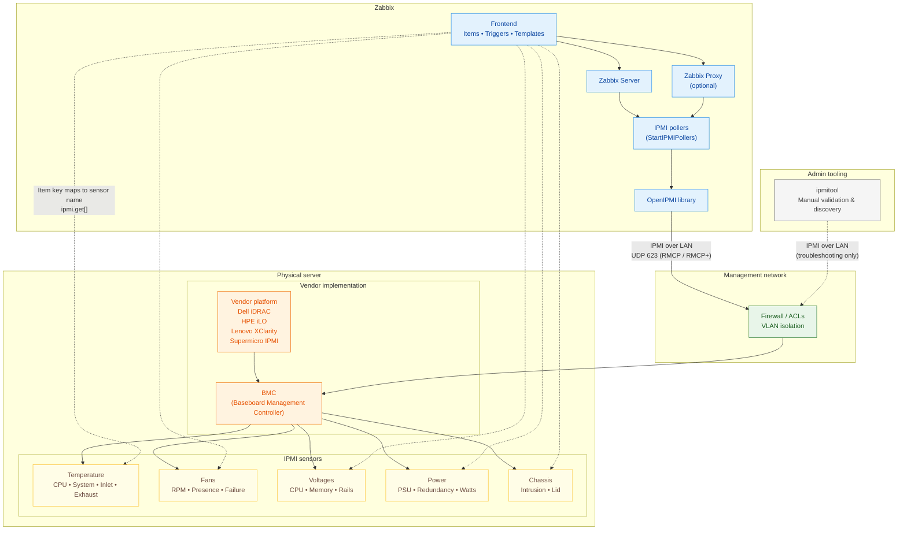

#IPMI Monitoring with Zabbix

## What is IPMI

Out-of-band management has been part of enterprise server administration for decades,
long before modern APIs and automation frameworks became common. One of the most widely
adopted standards in this space is the Intelligent Platform Management Interface
(IPMI). Despite its age and limitations, IPMI remains deeply embedded in data centers
and continues to play a role in hardware monitoring today.

This chapter introduces IPMI from a practical monitoring perspective and explains
how it integrates with Zabbix, while also setting realistic expectations about where
IPMI fits in modern environments.

### Understanding IPMI

IPMI allows administrators to monitor and manage physical server hardware independently
of the operating system. Even when a system is powered off, hung, or unable to
boot, IPMI usually remains accessible as long as the server has power.

At the center of IPMI is the Baseboard Management Controller (BMC). The BMC is
a small embedded controller with its own firmware, network interface, and access
to system sensors. Because it operates independently of the host operating system,
it can continue reporting hardware health even when the OS is unavailable.

Most server vendors implement IPMI through their own management platforms. While
they share a common IPMI foundation, each adds vendor-specific features and naming
conventions.

Common BMC implementations include:

- Dell – iDRAC
- HPE – iLO
- Lenovo – XClarity Controller
- Supermicro – IPMI
- Fujitsu – iRMC

From a monitoring perspective, these differences matter because sensor names,
availability, and behavior often vary by vendor and even by firmware version.



### IPMI Architecture and Sensors

IPMI monitoring is built around hardware sensors exposed by the BMC. These sensors
report real-time measurements and state information about the physical system.

Typical sensor categories include:

- Temperature sensors
  CPU temperature, system or motherboard temperature, inlet and exhaust air temperature
- Fan sensors
  Fan speed (RPM), fan presence, fan failure states
- Voltage sensors
  CPU voltage, memory voltage, standby voltage rails
- Power sensors
  Power supply status, redundancy state, power consumption
- Chassis sensors
  Chassis intrusion, lid open/closed state
- Miscellaneous sensors
  Battery status, watchdog timers, hardware fault indicators

Each sensor has a name, a type, and one or more thresholds that indicate warning
or critical conditions. Importantly, sensor names are vendor-defined and case-sensitive,
which has direct implications for monitoring tools such as Zabbix.

### Communication and Protocols

When accessed over the network, IPMI typically communicates using UDP port 623.
Older implementations rely on the Remote Management Control Protocol (RMCP), while
newer systems support RMCP+, which adds authentication and encryption.

Although RMCP+ improves security compared to earlier versions, its real world
effectiveness depends heavily on vendor configuration and firmware quality. As
a result, IPMI traffic still lacks many of the security and observability features
administrators expect from modern management interfaces.

### Security Caveats

IPMI’s design reflects the assumptions of an earlier era, and this has lasting
security implications. Many systems ship with IPMI enabled by default, sometimes
with weak or unchanged credentials. Legacy authentication methods and insecure
cipher suites may remain active unless explicitly disabled.

Unlike modern APIs, IPMI does not natively use HTTPS or certificates. Logging and
auditing capabilities are minimal, making it difficult to track access or investigate
incidents. Because the BMC operates below the operating system, a compromised
management controller can be extremely difficult to detect or remediate.

For these reasons, IPMI should always be treated as a high-privilege interface.
Best practice is to place it on a dedicated management network, restrict access
aggressively, and keep BMC firmware up to date. When used carefully, IPMI can be
safe enough for monitoring, but it should never be treated like a normal application
service.

### Verifying IPMI Access with ipmitool

Before configuring IPMI monitoring in Zabbix, it is often helpful to verify connectivity
manually. On most Linux distributions, this is done using the `ipmitool` utility.

A simple sensor query confirms that the BMC is reachable and that credentials are
correct. If sensor data can be retrieved successfully with `ipmitool`, the same
configuration will usually work in Zabbix as well.

These tools are primarily for validation and troubleshooting; they are not required
for day-to-day monitoring once Zabbix is configured.

### Native IPMI Monitoring in Zabbix

Zabbix includes native IPMI support, allowing it to poll BMCs directly without
agents or external scripts. This is done using the IPMI agent item type.

To enable IPMI monitoring, a host must be configured with an IPMI interface specifying
the BMC's management IP address and port. Credentials can be defined at the host
or template level, depending on how standardized the environment is.

Once configured, Zabbix queries individual sensors and stores their values just
like any other monitored metric.

### IPMI Items and Templates

Each IPMI item in Zabbix corresponds to a specific sensor name exposed by the BMC.
Because sensor naming is not standardized, templates often require customization.

Zabbix ships with generic IPMI templates that provide a useful starting point.
These templates usually include:

- Core temperature sensors
- Fan speed monitoring
- Power supply status
- Basic triggers for warning and critical states

In practice, these templates are rarely “plug and play.” Sensors may be missing,
renamed, or behave differently across vendors. As a result, IPMI templates are
best treated as baselines that are refined for specific hardware platforms.

### Practical Limitations

From a modern monitoring perspective, IPMI has clear limitations. Discovery
capabilities are weak, sensor models are inconsistent, and extending IPMI beyond
basic health checks is difficult. Automation and integration with external systems
are also limited compared to API-driven approaches.

These constraints do not make IPMI obsolete, but they do define its role. IPMI is
best suited for fundamental hardware health monitoring rather than deep observability
or automation.

### When IPMI Still Makes Sense

IPMI remains relevant in many environments, particularly where hardware fleets
are already deployed and newer management standards are unavailable. In controlled
networks with proper isolation and access controls, it provides reliable insight
into physical system health.

For many organizations, IPMI will continue to coexist with newer technologies
for years to come.

### Understanding How IPMI Tools Work

Before Zabbix enters the picture, it helps to understand how IPMI is typically
accessed from a system administrator’s point of view. The most common tool for
interacting with IPMI is `ipmitool`, a command-line utility that communicates directly
with the BMC.

ipmitool does not talk to the operating system. Instead, it connects straight to
the BMC using IPMI over LAN, authenticates using the configured credentials, and
requests sensor data or management actions. In many ways, Zabbix’s native IPMI
monitoring behaves very similarly, it simply automates and schedules the same
type of queries.

Using `ipmitool` manually is therefore an excellent way to validate connectivity,
credentials, and available sensors before attempting to monitor a system with Zabbix.

#### Installing ipmitool

The `ipmitool` package is widely available and easy to install on all major Linux
distributions.

On Red Hat Enterprise Linux, Rocky Linux, AlmaLinux, and other RHEL-based systems,
the package can be installed using:

```
dnf install -y ipmitool
```

On Debian and Ubuntu systems, installation is done with:

```
apt install -y ipmitool
```

Once installed, no additional services are required. The tool is invoked directly
from the command line and communicates with the BMC over the network.

#### Exploring IPMI Sensors with ipmitool

The most common starting point is to list available sensors. This provides immediate
insight into what the BMC exposes and what Zabbix will be able to monitor.

A typical command looks like this:

```
ipmitool -I lanplus -H <BMC_IP> -U <USER> sensor list
```

This command returns a list of sensors along with their current values and status.
While the exact output varies by vendor, readers will usually see entries for
temperatures, fans, voltages, and power supplies.

To focus on specific types of data, administrators often scan the output for
familiar patterns:

- Fan-related sensors usually include keywords like FAN, Fan1, or System Fan
- Temperature sensors often reference CPU, System, Inlet, or Exhaust
- Power supply sensors may indicate presence, redundancy, or failure states

This exploratory step is important because sensor names must be used exactly as
shown when configuring Zabbix IPMI items.

### How Zabbix Uses IPMI Internally

Zabbix does not invoke ipmitool or external commands when monitoring IPMI. Instead,
it integrates directly with the OpenIPMI library, a widely used, open-source implementation
of the IPMI specification.

OpenIPMI handles the low-level details of IPMI communication, including protocol
handling, authentication, and sensor access. Zabbix uses this library to communicate
with the BMC in a structured and efficient way, without relying on shell commands
or external processes.

From the user’s perspective, this distinction is mostly invisible. Whether IPMI
data is retrieved manually with ipmitool or automatically by Zabbix, the underlying
interaction with the BMC follows the same IPMI standards and exposes the same sensors.

#### Configuring IPMI Pollers

By default, Zabbix does not enable IPMI pollers. You could start with a low
number like 3 or 5. In environments with
only a few monitored servers, this is usually sufficient. However, in larger environments,
this configuration may quickly become a bottleneck.

The number of IPMI pollers is controlled by the following configuration parameter:

```
StartIPMIPollers
```

If IPMI checks begin to queue or time out, increasing this value is often necessary.
As with other Zabbix poller types, changes require a restart of the Zabbix server
or proxy to take effect.

Because IPMI pollers rely on network communication with management controllers, their performance is influenced not only by Zabbix itself, but also by:

- BMC responsiveness
- Network latency to the management network
- Firmware quality and load on the BMC

#### Relationship Between ipmitool and Zabbix

Although Zabbix does not use ipmitool internally, the two tools are closely related conceptually. Both rely on standard IPMI mechanisms and expose the same underlying sensor data.

For this reason, ipmitool remains the preferred tool for:

- Validating IPMI connectivity
- Discovering available sensors
- Verifying sensor names and behavior
- Troubleshooting authentication and firmware issues

If a sensor cannot be queried successfully with ipmitool, it will almost certainly fail in Zabbix as well.

#### Configuring an IPMI Item in Zabbix

Configuring an IPMI item in Zabbix is conceptually simple, but attention to detail is crucial.

An IPMI item requires:

- Item type set to IPMI agent
- A key that references the exact sensor name
- An update interval appropriate for hardware metrics

For example, to monitor a CPU temperature sensor, the item key might look like:

```
ipmi.get[CPU Temp]
```

If the sensor name does not match exactly — including case and spacing — the item will fail. For this reason, copying sensor names directly from ipmitool output is strongly recommended.

Triggers are typically defined on top of these items to detect warning and critical thresholds, either using vendor recommendations or operational experience.

### Known Issues and Common Pitfalls

IPMI monitoring works reliably once configured correctly, but several recurring issues are worth calling out explicitly.

One common problem is inconsistent sensor naming. The same server model may expose different sensor names depending on firmware version, making templates fragile across hardware revisions.

Another frequent issue is slow or unresponsive BMCs. Some management controllers respond slowly under load, which can cause timeouts or delayed data in Zabbix. This becomes more noticeable as the number of monitored systems grows.

Authentication problems are also common. Incorrect cipher suite settings, locked user accounts, or firmware bugs can all prevent successful IPMI polling even when credentials appear correct.

Finally, IPMI interfaces are sometimes overlooked during network changes. Firewall rules, VLAN reconfiguration, or routing changes can silently break access to the management network while leaving the operating system untouched.

### Practical Advice for Reliable IPMI Monitoring

From experience, IPMI monitoring works best when treated as infrastructure monitoring, not application monitoring. Polling intervals should be reasonable, sensor counts kept under control, and templates carefully validated per vendor.

Using ipmitool during setup and troubleshooting remains invaluable. If a sensor cannot be queried manually, Zabbix will not be able to retrieve it either.

When these practices are followed, IPMI provides stable and useful visibility into hardware health — even if it shows its age in other areas.


## Introduction to Redfish

### REST + HTTPS

### JSON schema

### Standardized resources

## Testing Redfish with a Simulator

### DMTF Mockup Server

### curl examples

### Browser screenshots

## Monitoring Redfish with Zabbix

### HTTP agent

### JSON preprocessing

### LLD examples

## IPMI vs Redfish comparison table


## Conclusion

## Questions

## Useful URLs
