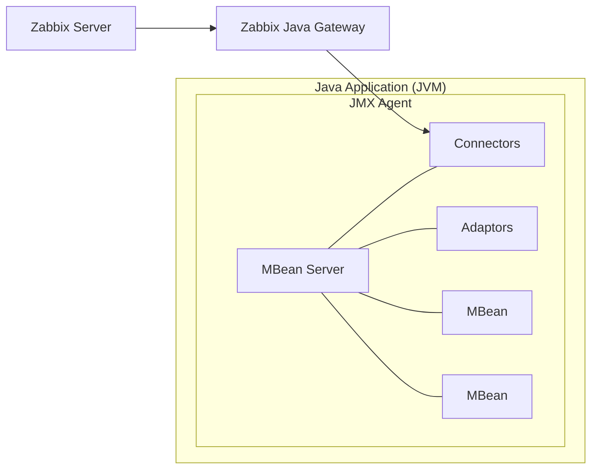

# Monitoring Java Applications with JMX

One of the neat features that Zabbix offers out of the box is the ability to monitor
Java applications. To make this happen, Zabbix uses something called the
`Java Gateway`, which communicates with Java applications via the `Java Management Extensions`
JMX, for short.

`JMX` is a built-in Java technology designed specifically for monitoring and managing
Java applications and the `Java Virtual Machine` (JVM). It works through components
called `MBeans` (Managed Beans), which act like data sensors and control points.
These MBeans can expose useful information like memory usage, thread counts, and
even allow runtime configuration changes, all while the application is running.

One of the strengths of JMX is its flexibility. It supports both local and remote
access, so whether your Java app is on the same machine or halfway across the
network, Zabbix can still keep an eye on it. Combined with the Java Gateway, this
makes JMX a powerful and scalable option for monitoring Java-based environments
with minimal setup. Also JMX was an extension but is part of JAVA SE since java 5.

## Key Concepts in JMX Monitoring

Before diving into JMX monitoring with Zabbix, it helps to get familiar with a
few core building blocks that make it all work:

**Managed Beans (MBeans):**
These are the heart of JMX. MBeans are Java objects that expose useful bits of
data (called attributes) and operations (as regular methods) from your application.
Think of them as little control panels inside your Java app, you can read metrics,
tweak settings, or trigger actions through them.

**JMX Agent:**
This is the engine behind the scenes. Running inside the Java Virtual Machine (JVM),
the JMX agent connects everything together. It's what lets management tools
(like Zabbix) interact with the MBeans.

**MBean Server:**
A key part of the JMX agent, the MBean server is like a central registry where
MBeans are registered and managed. It keeps everything organized and accessible.

**Connectors:**
Want to monitor your Java app remotely? That's where connectors come in. They
let external tools connect to the JMX agent over a network. So you're not limited
to local monitoring.

**Adaptors:**
Sometimes you need JMX data to speak a different language. Adaptors convert JMX
info into formats that non-Java tools can understand, like HTTP or SNMP, making
integration easier with broader monitoring ecosystems.

## Where Does the Zabbix Java Gateway Fit in this picture?

The Zabbix Java Gateway is an external component in the Zabbix ecosystem specifically
designed to handle JMX monitoring. While it's not part of the JMX framework itself,
it acts as a JMX client that connects to your Java application’s JMX agent and
collects data from MBeans. So, if we map it to the components we just discussed,
here's how it fits:

**Category: Connectors (Client-Side)**

Why? Because the Zabbix Java Gateway is essentially a remote management application
that connects to the JMX agent running inside your Java app’s JVM. It uses JMX's
remote communication protocols (usually over RMI) to pull data from the MBean server.

Think of it like this:

- Your Java app exposes data via MBeans.
- The JMX agent and MBean server inside the JVM make that data available.
- The Zabbix Java Gateway reaches in from the outside, asks for that data,
  and passes it along to your Zabbix server.

So, while connectors in JMX terminology usually refer to the part inside the JVM
that allows remote access, the Java Gateway is the counterpart on the outside.
The client that initiates those connections.

## Conclusion

## Questions

## Useful URLs
