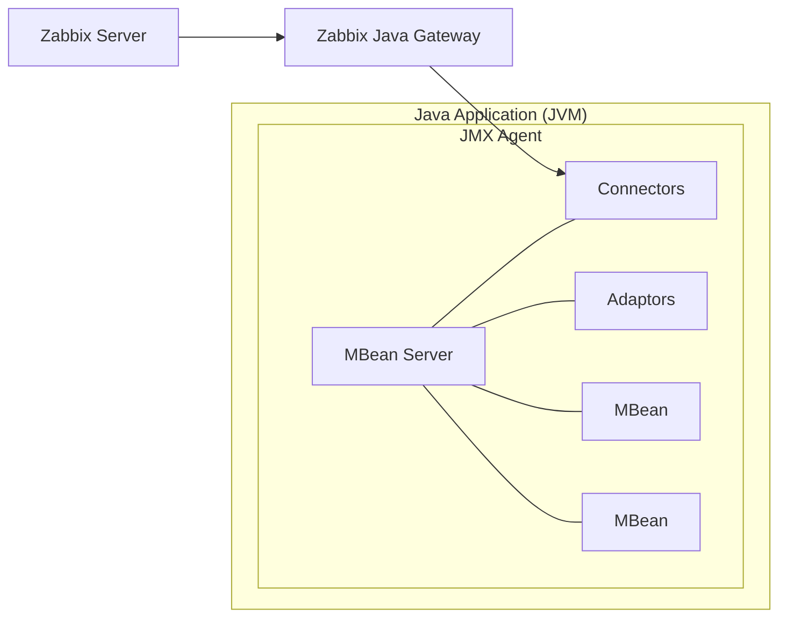

# Monitoring Java Applications with JMX

One of the neat features that Zabbix offers out of the box is the ability to monitor
Java applications. To make this happen, Zabbix uses something called the
`Java Gateway`, which communicates with Java applications via the
`Java Management Extensions` JMX, for short.

`JMX` is a built-in Java technology designed specifically for monitoring and managing
Java applications and the `Java Virtual Machine` (JVM). It works through components
called `MBeans` (Managed Beans), which act like data sensors and control points.
These MBeans can expose useful information like memory usage, thread counts, and
even allow runtime configuration changes, all while the application is running.

One of the strengths of JMX is its flexibility. It supports both local and remote
access, so whether your Java app is on the same machine or halfway across the
network, Zabbix can still keep an eye on it. Combined with the Java Gateway, this
makes JMX a powerful and scalable option for monitoring Java-based environments
with minimal setup. Also JMX was an extension but is part of JAVA SE since java 5.

## Key Concepts in JMX Monitoring

Before diving into JMX monitoring with Zabbix, it helps to get familiar with a
few core building blocks that make it all work:

**Managed Beans (MBeans):**
These are the heart of JMX. MBeans are Java objects that expose useful bits of
data (called attributes) and operations (as regular methods) from your application.
Think of them as little control panels inside your Java app, you can read metrics,
tweak settings, or trigger actions through them.

**JMX Agent:**
This is the engine behind the scenes. Running inside the Java Virtual Machine (JVM),
the JMX agent connects everything together. It's what lets management tools
(like Zabbix) interact with the MBeans.

**MBean Server:**
A key part of the JMX agent, the MBean server is like a central registry where
MBeans are registered and managed. It keeps everything organized and accessible.

**Connectors:**
Want to monitor your Java app remotely? That's where connectors come in. They
let external tools connect to the JMX agent over a network. So you're not limited
to local monitoring.

**Adaptors:**
Sometimes you need JMX data to speak a different language. Adaptors convert JMX
info into formats that non-Java tools can understand, like HTTP or SNMP, making
integration easier with broader monitoring ecosystems.

## JMX Core Architecture

To understand how Zabbix collects data from Java applications, it helps to know
the basic structure of JMX itself. JMX is built on a three-layer architecture that
separates how metrics are defined, how they are stored inside the JVM, and how
external tools can reach them.

- **Instrumentation Layer:** This is where the application exposes its internal
  state through MBeans (Managed Beans). They can be standard, dynamic, or MXBeans,
  and represent things like memory usage, thread counts, or application specific
  metrics.

- **Agent Layer:** – Every JVM contains an MBeanServer, which acts as a registry
  and makes these MBeans available for management. When you start a JVM with
  -Dcom.sun.management.jmxremote, you are exposing this server for external access.

- **Remote Management Layer:** This is how outside tools connect to the JVM.
  Connectors (such as RMI or JMXMP) and adaptors (such as HTTP or SNMP bridges)
  allow Zabbix and other monitoring systems to fetch the metrics. By default,
  Zabbix uses an RMI connector via the Java Gateway.

``` mermaid
flowchart LR
    A[Application] --> B[MBeans]
    B --> C[MBeanServer]
    C --> D[Connector RMI - JMXMP]
    D --> E[Zabbix Java Gateway]
    E --> F[Zabbix Server / DB]
    F --> G[Frontend]

    classDef app fill:#fef3c7,stroke:#111,stroke-width:1px,color:#111;
    classDef mbean fill:#dbeafe,stroke:#111,stroke-width:1px,color:#111;
    classDef gateway fill:#fde68a,stroke:#111,stroke-width:1px,color:#111;
    classDef zabbix fill:#bbf7d0,stroke:#111,stroke-width:1px,color:#111;

    class A app;
    class B,C mbean;
    class D,E gateway;
    class F,G zabbix;

```



## Where Does the Zabbix Java Gateway Fit in this picture?

The Zabbix Java Gateway is an external component in the Zabbix ecosystem specifically
designed to handle JMX monitoring. While it's not part of the JMX framework itself,
it acts as a JMX client that connects to your Java application’s JMX agent and
collects data from MBeans. So, if we map it to the components we just discussed,
here's how it fits: => **Category: Connectors (Client-Side)**

Why? Because the Zabbix Java Gateway is essentially a remote management application
that connects to the JMX agent running inside your Java app’s JVM. It uses JMX's
remote communication protocols (usually over RMI) to pull data from the MBean server.

Think of it like this:

- Your Java app exposes data via MBeans.
- The JMX agent and MBean server inside the JVM make that data available.
- The Zabbix Java Gateway reaches in from the outside, asks for that data,
  and passes it along to your Zabbix server.

So, while connectors in JMX terminology usually refer to the part inside the JVM
that allows remote access, the Java Gateway is the counterpart on the outside.
The client that initiates those connections.



## Setup Tomcat to monitor with Zabbix.

To ensure accurate testing of JMX monitoring with Zabbix, a dedicated host is essential.
Although configuration on the Zabbix server is possible, a separate machine provides a
more realistic representation of a production environment. For our setup, we'll
use a new virtual machine running either Rocky Linux or Ubuntu. This machine will
serve as our JMX-enabled target, and we'll install and configure Tomcat on it for
this purpose.

???+ info "Setup Tomcat"

    Red hat
    ```
    dnf install tomcat
    vi /etc/sysconfig/tomcat
    ```
    Ubuntu
    ```
    apt install tomcat10
    vi /etc/default/tomcat10
    ```
    Add the following config: in Ubuntu remove the original JAVA_OPTS line or
    place a # in front

    ```yaml
    JAVA_OPTS="\
      -Dcom.sun.management.jmxremote=true \
      -Dcom.sun.management.jmxremote.port=8686 \
      -Dcom.sun.management.jmxremote.rmi.port=8686 \
      -Dcom.sun.management.jmxremote.authenticate=false \
      -Dcom.sun.management.jmxremote.ssl=false \
      -Djava.rmi.server.hostname=<local ip or hostname>"
    ```

### Explanation of Each Line

Let's go over the lines we just configured. They are a set of configuration options,
called **JMX options**, passed to the Java Virtual Machine (JVM) at startup. These
options enable and configure the Java Management Extensions (JMX) agent, which
allows for remote monitoring and management of the application, in this case,
Apache Tomcat.

- **`JAVA_OPTS="... "`**
  This is a variable used by Tomcat's startup scripts to hold a collection of
  command-line arguments for the Java process. The backslash (`\`) at the end of
  each line is a shell syntax feature that allows a single command or variable
  to span multiple lines, making the configuration easier to read.

- **`-Dcom.sun.management.jmxremote=true`**
  This is the main switch to enable the JMX remote agent. By setting this to `true`,
  you're telling the JVM to start the JMX management server.

- **`-Dcom.sun.management.jmxremote.port=8686`**
  This option specifies the **port number** for the JMX agent to listen on for
  incoming connections. In this case, it's set to `8686`.

- **`-Dcom.sun.management.jmxremote.rmi.port=8686`**
  This sets the port for the **RMI (Remote Method Invocation) server**. The JMX
  agent uses RMI to communicate with remote clients. In this configuration,
  both the JMX agent and the RMI server are configured to use the same port,
  simplifying the setup.

- **`-Dcom.sun.management.jmxremote.authenticate=false`**
  This disables authentication for JMX connections. For production environments,
  this should be set to `true` to require a username and password. Setting it to
  `false` is only suitable for development or testing environments.

- **`-Dcom.sun.management.jmxremote.ssl=false`**
  This disables Secure Sockets Layer (SSL) for JMX connections, meaning communication
  is not encrypted. Like authentication, this should be set to `true` in a production
  environment to secure the connection.

- **`-Djava.rmi.server.hostname=<local ip>"`**
  This is a crucial option that tells the RMI server which **IP address** to announce
  to clients. Clients will use this hostname to connect to the server. If this
  is not explicitly set, the RMI server might use the server's internal hostname
  or a loopback address (`127.0.0.1`), which would prevent external connections.
  By setting it to `<your local IP>`, you ensure that the JMX port is bound to
  the correct network interface for remote access.

???+ Note

    ``` bash
    There isn't a single, universally "standard" port for JMX that is accepted
    across all applications and vendors. The JMX specification itself does not
    define a default port, leaving it to the implementer to choose one.

    However, certain ports have become common or de facto standards within the Java
    ecosystem. The most frequently seen ports for JMX are in the high-number range,
    typically:

    - 1099: This port is a historic default for the RMI Registry, which JMX often
      uses for communication. While it's not strictly a JMX port, it's often
      associated with older JMX configurations.

    - 8686: This port is a well-accepted and formally registered port for JMX with
      the Internet Assigned Numbers Authority (IANA). The IANA service name for port
      8686 is sun-as-jmxrmi. This makes it a great choice because it's officially
      recognized and less likely to conflict with other common services.

    Why Port 8686 is a Good Choice?
    Port 8686 is a User Port (1024-49151), which means it's available for registered
    services but isn't a "well known" port that requires a special permission level
    to use. It's IANA registration as sun-as-jmxrmi makes it a safe and logical
    choice for JMX monitoring, especially when you need to standardize port assignments
    across a large infrastructure.
    ```

## Setup Zabbix to monitor JMX

Now that we've set up a JMX-enabled application, we need to configure Zabbix to
monitor it. Since Zabbix can't connect directly to JMX endpoints, we need an
intermediary tool: the **Zabbix Java Gateway**.

This gateway needs to be installed and configured on your Zabbix server or proxy,
allowing a single gateway to service multiple JMX applications. The gateway operates
in a passive mode, which means it polls data directly from your JMX application.
The Zabbix server or proxy then polls the gateway to retrieve this data, completing
the connection chain.


_04.35 JMX Gateway_

???+ Info "Install the JAVA Gateway"

    Red Hat
    ```
    dnf install zabbix-java-gateway
    ```
    Ubuntu
    ```
    apt install zabbix-java-gateway
    ```

## Configuring Zabbix and the JAVA Gateway

After installing the gateway, you'll find its configuration file at `/etc/zabbix/zabbix_java_gateway.conf`.
The default `LISTEN_IP` is set to 0.0.0.0, which means it listens on all network
interfaces, though you can change this. The gateway listens on port 10052, a non
IANA registered port, which can also be adjusted using the `LISTEN_PORT` option
if needed.

The first setting we'll change is `START_POLLERS`. We need to uncomment this line
and set a value, for example, `START_POLLERS=5` to define the number of concurrent
connections. The TIMEOUT option controls network operation timeouts, while
`PROPERTIES_FILE` allows you to define or override additional key-value properties,
such as a keystore password, without exposing them in a command line.

For your Zabbix server, you'll need to update the configuration file at `/etc/zabbix/zabbix_server.conf`.

You'll need to modify three key options:

- **JavaGateway:** Uncomment this line and set its value to the IP address of
  the host running your Java gateway. This will likely be your Zabbix
  server itself, but it can be on a separate VM or proxy.

- **JavaGatewayPort:** This option should remain at the default `10052` unless
  you've changed the port in your gateway's configuration.

- **StartJavaPollers:** Uncomment and set this option to define the number of
  concurrent Java pollers the server will use. A good starting
  point is to match the number you set on the gateway, for
  example, 5.

After making the changes to `/etc/zabbix/zabbix_server.conf` and `/etc/zabbix/zabbix_java_gateway.conf`,
you need to restart the following services:

- Zabbix Java Gateway
- Zabbix Server

Restarting these two services applies the new configuration, allowing the server
to communicate with the Java Gateway and begin polling for JMX data. Also don't
forget to enable the `Zabbix Java Gateway` service.

???+ Info "Restart the services"

    RedHat and Ubuntu
    ```
    systemctl enable zabbix-java-gateway --now
    systemclt restart zabbix-server
    ```

On the application side don't forget to open the firewall so that our
`zabbix-java-gateway` can connect to our application.

!!! info "Allow JMX"

    Red Hat
    ```
    firewall-cmd --add-port=8686/tcp --permanent
    firewall-cmd --reload
    ```

    Ubuntu
    ```
    sudo ufw allow 8686/tcp
    ```


???+ Warning

    ```
    Don't forget to place SeLinux in permissive mode before you start else the
    JAVA gateway will not work. You should fix SeLinux permissions once the setup
    is working.
    ```

## Monitoring JMX items

After having setup everything, we can now connect to our Java application's JMX port to
verify everything is working.

For this, we can use JConsole, a monitoring tool that comes with the Java Development
Kit (JDK). Another great option is VisualVM, which offers a more visual and feature
rich experience. You can download it from [https://visualvm.github.io/download.html](https://visualvm.github.io/download.html).

Start your preferred application and connect to our JMX port on 8686.


_04.36 Jconsole_

After a successful login you should be greeted with a screen like this. Were you
have a tree view overview of all the Mbeans we can use to gather information
from.


_04.37 Login screen_

Before we can do this we need to create a new host in our Zabbix server. Let's
go to `Data collection` - `Hosts` and click on `Create host` in the upper right
corner. Use the following settings to create our host:

- Hostname : Tomcat
- Host groups: JMX
- Interfaces: JMX
    - IP address: IP of your Tomcat server
    - Port : 8686 or the port you specified in your Tomcat configuration.

Press the `Add` button when ready.

???+ Note

    ```
    It seems weird that we not specify the JavaGateway here but it's actually
    normal. Zabbix knows from its configuration file where the gateway is. So we
    need to specify the IP and the PORT of the JAVA application here that we would
    like to monitor.
    ```

### Create our first item

On our host Tomcat create a new item and add the following information.

- *Name:* requestCount
- *Type:* JMX Agent
- *Key:* jmx["Catalina:type=GlobalRequestProcessor,name=\"http-nio-8080\"", "requestCount"]
- *Type of information:* Numeric(unsigned)
- *Host interface:* The JMX interface we just created on our host.


_ch04.38 JMX item_

???+ Info "Verifying and Saving the Item"

    ```
    Before saving the configured item, use the Test button. Clicking Get value
    or Get value and test should populate the value field with data, confirming
    that the item is functional. Once the test is successful, you can save the
    item.
    ```
To understand how we constructed the item key, let's look at the process in JConsole.

1. Navigate to the MBeans tab and expand Catalina > GlobalRequestProcessor > http-nio-8080.

2. The ObjectNAme field on the right displays the MBean's fully qualified name:
   `Catalina:type=GlobalRequestProcessor,name="http-nio-8080"`. This is the base
   for our Zabbix item key.

The primary challenge with this specific key is that it contains double quotes (")
within the `name` attribute. Zabbix requires the entire JMX key to be enclosed
in double quotes, which would conflict with the existing quotes. To resolve this,
we must **escape** the inner double quotes with a backslash (\).

This results in the following structure for the Zabbix item key:
`jmx["Catalina:type=GlobalRequestProcessor,name=\"http-nio-8080\""]`.

This key is still incomplete. To specify the metric to be monitored, you must
append an attribute name, such as maxTime, requestCount, or bytesReceived, at
the end of the key, separated by a comma.
`jmx["Catalina:type=GlobalRequestProcessor,name=\"http-nio-8080\"","requestCount"]`


_04.39 requestCount item_

The `java.lang.management.Memory` MBean provides a good example of how to handle
CompositeData types in Zabbix. This MBean has an attribute called `HeapMemoryUsage`,
which is not a simple value but rather an instance of `CompositeData`. This special
JMX data type is used to represent complex structures.

This means that attributes like `init`, `used`, `committed`, or `max` aren't accessed
directly on the MBean itself. Instead, they are part of the `MemoryUsage` object
that is returned when you query the `HeapMemoryUsage` attribute.

To monitor a specific value from this composite object, you must specify the
attribute name within the `CompositeData` structure. For example, to get the maximum
heap memory usage, the Zabbix item key would be: `jmx["java.lang:type=Memory","HeapMemoryUsage.max"]`.


_04.40 HeapMemoryUsage

#### Viewing Tabular Data

To view the detailed breakdown of the `HeapMemoryUsage` attribute, double click on
its value in the attribute value column. This action displays the composite data
in a tabular format, making it easier to see individual metrics like `init`, `used`,
`committed`, and `max`.

#### Zabbix JMX Item Keys

Zabbix offers three primary item keys for JMX monitoring:

- **jmx[]:** This is the standard key used for monitoring a specific JMX attribute.
  It's the most common key for creating simple, direct checks.

- **jmx.get[]:** This key is used to retrieve a full object from an MBean. It is
  often paired with Low Level Discovery (LLD) rules and preprocessing steps to
  extract specific values from the returned data, allowing for more flexible data
  collection.

- **jmx.discovery[]:** This key is specifically designed for use with Low Level
  Discovery. It helps Zabbix automatically discover multiple JMX MBeans or attributes
  on a monitored host, which is essential for scaling JMX monitoring across a large
  number of components.

### Making use of jmx.get[]

The `jmx.get[]` item key returns a JSON array containing a list of MBean objects or
their attributes. Unlike `jmx.discovery[]`, it does not automatically define LLD
macros. Instead, it is particularly useful when you need to retrieve a structured
set of data and then process it using JSONPath in a dependent item or a low level
discovery rule.

While `jmx.get[]` is commonly used for Low Level Discovery (LLD), it is also highly
effective for creating dependent items without using a full discovery rule. This
allows you to collect multiple related metrics from a single request to the JMX
agent, which is more efficient.

For instance, the key `jmx.get[attributes,"*:type=GarbageCollector,name=PS MarkSweep"]`
would return a comprehensive payload with all attributes of the specified garbage
collector.

``` json
[
  {
    "name": "CollectionCount",
    "description": "java.lang:type=GarbageCollector,name=PS MarkSweep,CollectionCount",
    "type": "java.lang.Long",
    "value": "0",
    "object": "java.lang:type=GarbageCollector,name=PS MarkSweep"
  },
  ...
  ...
  ...
  ...
  {
    "name": "ObjectName",
    "description": "java.lang:type=GarbageCollector,name=PS MarkSweep,ObjectName",
    "type": "javax.management.ObjectName",
    "value": "java.lang:type=GarbageCollector,name=PS MarkSweep",
    "object": "java.lang:type=GarbageCollector,name=PS MarkSweep"
  }
]
```

This JSON output can then be used as the master item for multiple dependent items,
each with a preprocessing step to extract a specific value (e.g., `CollectionCount`
or `CollectionTime`) using a JSONPath expression. This technique is a powerful
way to reduce the load on both the JMX agent and the Zabbix server by making a
single call to collect multiple metrics.

## Performance Considerations for JMX Monitoring

JMX monitoring is powerful but comes with higher overhead compared to traditional
Zabbix agent checks. To ensure your monitoring remains efficient and doesn't impact
either your Zabbix infrastructure or the monitored JVMs, keep the following points
in mind.

Zabbix communicates with the Java Gateway synchronously:

- The Zabbix server sends a request for a JMX item.
- The Java Gateway connects to the target JVM and retrieves the data.
- Only when the response comes back does the Zabbix server proceed with that item's
  check.
This means that if JMX queries are slow (due to network, JVM GC pauses, or overloaded
gateways), your monitoring queue can back up.

To optimize performance:

- The Java Gateway bundles multiple requests for the same host and processes them
  in a single JVM connection.
- This reduces the overhead of repeatedly opening/closing JMX connections.
- For example, if you monitor 20 JVM attributes on the same Tomcat, the gateway
  will collect them in fewer, larger batches instead of 20 separate calls.

- Once a JMX connection to a JVM is established, the gateway keeps it alive and
  reuses it for subsequent checks.
- This avoids expensive RMI connection setup for
  every metric.
- If the JVM restarts or the connection drops, the gateway will re-establish it automatically.

Two important parameters in zabbix_server.conf and zabbix_java_gateway.conf directly
affect JMX performance:

- StartJavaPollers (on Zabbix Server)
    * Defines how many parallel JMX pollers the server can use.
    * Too few pollers → JMX checks queue up and fall behind.
    * Too many pollers → high load on Java Gateway and JVMs.
- StartPollers (general pollers)
  Balance with Java pollers so your server can handle both JMX and regular agent
  checks without bottlenecks.
- Rule of thumb: start small (Ex: 5–10 Java pollers) and increase gradually while
  monitoring load.

- Don't enable all MBeans just because you can.
- Focus on actionable JVM metrics (heap, non-heap, GC, threads, JDBC pools) and
  a few application-specific MBeans that map to real-world performance.
- Too many JMX items not only stress the JVM but also flood your Zabbix database
  with unnecessary history data.

## Monitoring JMX through Jolokia

While Zabbix can natively collect JMX data using the Zabbix Java Gateway, an
alternative worth considering is Jolokia — a lightweight JMX-to-HTTP bridge.

Jolokia exposes JMX MBeans over a simple REST/JSON interface, which means you
can collect Java metrics using Zabbix's HTTP Agent items instead of the Java Gateway.
The result is often lower overhead, easier network configuration, and greater flexibility.

Why Jolokia?

- No Gateway Needed. Jolokia runs as a Java agent, servlet, or OSGi bundle directly
  inside the JVM.
- Efficient Data Collection. You can request multiple attributes in a single HTTP
  call and split them into dependent items using JSONPath preprocessing.
- Firewall-Friendly. Works over standard HTTP(S) ports, avoiding the complexity
  of RMI and port ranges.
- Secure, it supports HTTPS, authentication, and access control policies out of
  the box.

Example:

```bash
curl -s http://localhost:8778/jolokia/read/java.lang:type=Memory,java.lang:type=Threading
```

In Zabbix:

Create an HTTP Agent master item pointing to the Jolokia endpoint.
Add dependent items to extract individual values, e.g.:

```json
$.value['java.lang:type=Memory']['HeapMemoryUsage']['used']
$.value['java.lang:type=Threading']['ThreadCount']
```

This approach allows you to collect dozens of metrics with a single network request.

???+ note "When to use it ?"

    Choose Jolokia if you prefer a stateless, agent-based setup or need to monitor
    many JVMs without maintaining a central Java Gateway. Stick with the Zabbix
    Java Gateway if you rely on built-in templates or want a fully integrated,
    out of the box JMX experience.


## Conclusion

Zabbix handles JMX monitoring synchronously, but optimizes performance with request
bundling and connection reuse. By tuning pollers, using reasonable update intervals,
and selecting only the most valuable metrics, you can scale JMX monitoring without
overloading your monitoring system or your Java applications.

## Questions

- Explain how the Zabbix Java Gateway fits into the overall JMX architecture.
  Why is it needed?
- In Zabbix, what is the difference between the item keys jmx[], jmx.get[] and
  jmx.discovery[]? Give an example use case for each.
- Reflect: In your environment, what Java-applications would benefit most from
  JMX monitoring? What metrics would you pick first, and why?
- What are security considerations when enabling remote JMX monitoring in production?
  What could go wrong if you leave flags like authenticate=false and ssl=false in
  a live environment?

## Useful URLs

- [https://www.youtube.com/watch?v=aKGYa6Y9r60&t=87s](https://www.youtube.com/watch?v=aKGYa6Y9r60&t=87s)
- [https://docs.oracle.com/javase/1.5.0/docs/guide/management/agent.html](https://docs.oracle.com/javase/1.5.0/docs/guide/management/agent.html)
- [https://www.zabbix.com/documentation/current/en/manual/config/items/itemtypes/jmx_monitoring](https://www.zabbix.com/documentation/current/en/manual/config/items/itemtypes/jmx_monitoring)
- [https://jolokia.org/](https://jolokia.org/)
