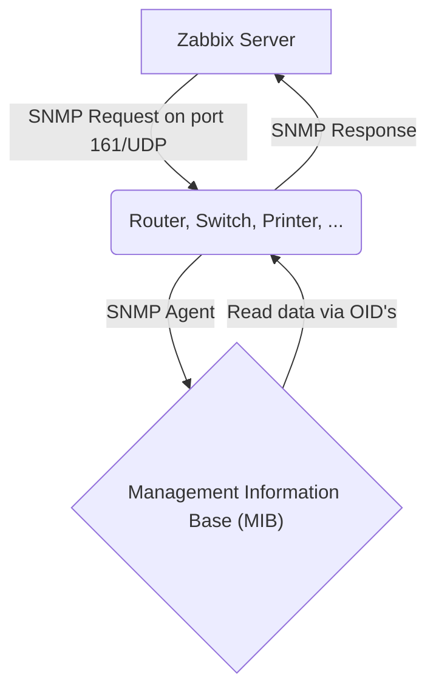

# SNMP Polling

In the previous chapter, we explored monitoring strategies that relied on both
active and passive Zabbix agents. This chapter introduces an alternative approach
monitoring via SNMP (Simple Network Management Protocol) which does not require
the installation of a Zabbix agent on the monitored device. This method is
especially useful in environments where agent based monitoring is impractical,
restricted or simply not allowed.

Simple Network Management Protocol (SNMP) is a widely adopted protocol designed
for monitoring and managing devices on IP networks. Despite the word "management"
in its name, SNMP is predominantly employed for monitoring purposes. Its widespread
support across networking hardware and embedded systems has made it a cornerstone
of modern network visibility solutions.

Originally developed in the late 1980s, SNMP has undergone several revisions.
Early versions, such as SNMPv1 and SNMPv2c, were hampered by significant security
limitations. As a result, while SNMP includes functionality for remote device
configuration, its use has remained largely to status monitoring rather than
active management of devices.

SNMP is especially valuable for monitoring resource constrained or embedded devices
that lack the capacity to run a full monitoring agent.

Common examples include:

- Printers
- Network switches, routers, and firewalls
- Uninterruptible Power Supplies (UPSs)
- NAS (Network-Attached Storage) appliances
- Environmental sensors (e.g., temperature, humidity sensors)

These devices often provide built-in SNMP support, making them accessible for monitoring
with minimal configuration. Additionally, SNMP can be employed on standard servers
where installing or maintaining a Zabbix agent is either impractical or not permitted.
This could be due to administrative policies, software compatibility or security
concerns, or simply a desire to reduce system footprint.

Recognizing the ubiquity of SNMP, Zabbix provides native SNMP support. This
capability is powered by the open-source Net-SNMP suite, available at
http://net-snmp.sourceforge.net. The integration allows Zabbix to retrieve
metrics from SNMP-enabled devices using industry-standard mechanisms.

In this chapter, we will cover the following:

- An introduction to the Net-SNMP toolkit and its core utilities.
- How to integrate MIB (Management Information Base) files into Zabbix, enabling
  the platform to interpret SNMP data correctly.
- The process of SNMP polling within Zabbix, including how to define SNMP-based
  items and retrieve data from devices.

This chapter serves as the foundation for SNMP-based monitoring in Zabbix. While
we begin with the essentials such as polling, MIB usage, and SNMP item
configuration this is just the start.

Later in this book, we will build upon this knowledge by exploring Low-Level
Discovery (LLD) mechanisms using SNMP. LLD allows Zabbix to automatically detect
and create monitoring items for dynamic or repetitive structures, such as
network interfaces, power supplies, ...

---

## Net-SNMP

The Simple Network Management Protocol (SNMP) is a widely used protocol for monitoring
and managing networked devices. It operates primarily over UDP port 161, though in
certain cases, SNMP agents or proxies may also support TCP port 161 for enhanced
reliability or integration with specific tools. SNMP allows administrators to query
information or trigger actions on remote devices using structured data identified
by Object Identifiers (OIDs).

To begin working with SNMP in a lab or testing environment, you may choose between
two approaches:

- Use an existing SNMP capable device already present in your network infrastructure.
- Deploy a lightweight SNMP agent on a general-purpose server, such as your Zabbix
  server or a dedicated virtual machine.

In this chapter, we will walk through the installation and configuration of a basic
SNMP agent on a Rocky or Ubuntu based Zabbix server. However, the same setup can
be applied to any compatible Linux system.

Note: If you're using a device already present on your network, ensure:

- You have network access to the device (verify routing and firewall settings).
- SNMP access is allowed from your Zabbix server’s IP address.
- The correct community string is configured, and your IP is included in the SNMP
  access control rules of the device.



---

### Testing an SNMP Device: Where to Start?

When you're looking to test an SNMP device, it's crucial to understand the available
SNMP versions and which ones you should prioritize. Currently, there are three
commonly used versions: **SNMPv1**, **SNMPv2c**, and **SNMPv3**.

- **SNMPv1**: This is the oldest version and should generally be avoided unless
  absolutely necessary. It's quite limited in functionality and has serious security
  vulnerabilities.
- **SNMPv2c**: Still the most prevalent version today, SNMPv2c offers improvements
  over v1, especially in data retrieval and performance. It's relatively straightforward
  to configure and use.
- **SNMPv3**: This version is rapidly gaining popularity and is considered the most
  secure and advanced option. It provides encryption, authentication, and user
  management, which are essential for secure networks.

#### Your First Test Attempt: SNMPv2c and the 'public' Community String

To begin your testing, we recommend trying to connect to your device using **SNMPv2c**
and the standard **community string 'public'**. Many devices ship with these default
settings, though it's certainly insecure for production environments.

You can use the `snmpstatus` command for this. Here’s an example of how you might
do this in your terminal:

```bash
snmpstatus -v 2c -c public [IP-address_of_the_device]
```

Replace `[IP-address_of_the_device]` with the actual IP address or hostname of the
device you wish to test.

#### What if You Get No Information Back?

If you don't receive any information after this attempt, don't panic. It simply means
the default settings likely don't apply to your device, or there might be a network
related issue. You'll need to dig deeper into your device's configuration or troubleshoot
your network.

**First, check the device's configuration:**

1. **SNMP Version**: Which SNMP version (v1, v2c, or v3) is configured and enabled?
2. **Community String (for v1/v2c)**: If your device uses SNMPv1 or SNMPv2c, what
   is the configured community string (similar to a password) for read-only and
   potentially read- write access? It's rarely 'public' in a properly configured
   environment.
3. **Username, Authentication, and Privacy (for v3)**: If your device uses SNMPv3,
   you'll need more specific information:
   - **Username**: What username has been created for SNMPv3?
   - **Authentication Protocol and Password**: Which authentication protocol (e.g.,
     MD5, SHA) is used, and what is its corresponding password?
   - **Privacy Protocol and Password**: Which encryption protocol (e.g., DES, AES)
     is used, and what is its corresponding password?

**Next, consider potential network issues:**

Even if your device is correctly configured, network obstacles can prevent SNMP communication.
Check for:

- **Firewall Blocking**: A firewall (either on your testing machine, the network,
  or the SNMP device itself) might be blocking the UDP port 161, which SNMP typically
  uses. Ensure the necessary ports are open.
- **ACL Settings on the Device**: The SNMP device itself might have Access Control
  List (ACL) settings configured to restrict access only to specific IP addresses.
  Verify that your testing machine's IP address is permitted.
- **Network Connectivity**: Basic network issues like incorrect IP addresses, subnet
  masks, or routing problems can also prevent communication. Ensure there's a clear
  network path between your testing machine and the SNMP device.

#### Examples of SNMPv3 Commands

Once you have the necessary information (and have ruled out network issues), you
can try connecting with SNMPv3. Here are some examples of how you might use `snmpstatus`
with SNMPv3 (depending on your configuration):

- **Authentication only (no encryption):**

  ```bash
  snmpstatus -v 3 -l authNoPriv -u [username] -a [authentication_protocol] -A [authentication_password]
  [IP-address_of_the_device]
  ```

  (Replace `[authentication_protocol]` with `MD5` or `SHA`)

- **Authentication and Encryption:**

  ```bash
  snmpstatus -v 3 -l authPriv -u [username] -a [authentication_protocol] -A [authentication_password]
  -x [privacy_protocol] -X [privacy_wachtwoord] [IP-address_of_the_device]
  ```

  (Replace `[authentication_protocol]` with `MD5` or `SHA` and `[privacy_protocol]`
  with `DES` or `AES`)

#### Next, consider potential network issues

Even if your device is correctly configured, network obstacles can prevent SNMP
communication. Check for:

**Firewall Blocking:** A firewall (either on your testing machine, the network, or
the SNMP device itself) might be blocking the UDP port 161, which SNMP typically
uses. Ensure the necessary ports are open.

**ACL Settings on the Device:** The SNMP device itself might have Access Control
List (ACL) settings configured to restrict access only to specific IP addresses.
Verify that your testing machine's IP address is permitted.

**Network Connectivity:** Basic network issues like incorrect IP addresses, subnet
masks, or routing problems can also prevent communication. Ensure there's a clear
network path between your testing machine and the SNMP device.

#### A Note on SNMPv1: Avoid if Possible

While you can technically test with SNMPv1, we strongly advise against using it
in production. SNMPv1 is an outdated and insecure protocol version vulnerable to
various attacks. Always try to connect with v2c or v3 first. Only if you are absolutely
certain that the device exclusively supports SNMPv1 and you have no other option,
you can try using it:

```bash
snmpstatus -v 1 -c [community_string] [IP-address_of_the_device]
```

However, remember that using SNMPv1 in a production environment poses a significant
security risk.

#### Understanding the Output of snmpstatus

Let's take a look at an example output from the `snmpstatus` command. Remember
this is just an example output it will differ from your result.

```bash
snmpstatus -v2c -c public 127.0.0.1
[UDP: [127.0.0.1]:161->[0.0.0.0]:33310]=>[Linux localhost.localdomain 5.14.0-570.28.1.el9_6.aarch64
#1 SMP PREEMPT_DYNAMIC Thu Jul 24 07:50:10 EDT 2025 aarch64] Up: 1:24:36.58
Interfaces: 2, Recv/Trans packets: 355763/355129 | IP: 37414/35988
```

This output provides a concise summary of the device's status, indicating a successful
SNMP query. Let's break down what each part means:

1. **`snmpstatus -v2c -c public 127.0.0.1`**:

   - `-v2c`: Specifies that SNMP version 2c was used.
   - `-c public`: Indicates that the community string "public" was used for authentication.
   - `127.0.0.1`: This is the target IP address, in this case, the localhost (the
     machine on which the command was run).

2. **`[UDP: [127.0.0.1]:161->[0.0.0.0]:33310]`**:

   - This section describes the communication path.
   - `UDP`: Confirms that the User Datagram Protocol was used, which is standard
     for SNMP.
   - `[127.0.0.1]:161`: This is the source of the SNMP request and the standard
     SNMP port (161) on which the SNMP agent listens.
   - `->[0.0.0.0]:33310`: This indicates the destination of the response. `0.0.0.0`
     is a placeholder for "any address," and `33310` is a high-numbered ephemeral
     port used by the client to receive the response.

3. **`=>[Linux localhost.localdomain 5.14.0-570.28.1.el9_6.aarch64 #1 SMP PREEMPT
_DYNAMIC Thu Jul 24 07:50:10 EDT 2025 aarch64]`**:

   - This is crucial information about the queried device itself.
   - `Linux localhost.localdomain`: Identifies the operating system as Linux, with
     the hostname `localhost.localdomain`.
   - `5.14.0-570.28.1.el9_6.aarch64`: This is the kernel version and architecture
   - `#1 SMP PREEMPT_DYNAMIC Thu Jul 24 07:50:10 EDT 2025 aarch64`: Provides further
     kernel build details, including the build date and time.

4. **`Up: 1:24:36.58`**:

   - This indicates the **uptime** of the device. The system has been running for
     1 day, 24 hours, 36 minutes, and 58 seconds.

5. **`Interfaces: 2, Recv/Trans packets: 355763/355129 | IP: 37414/35988`**:

   - **`Interfaces: 2`**: This tells us that the device has detected 2 network interfaces.
   - **`Recv/Trans packets: 355763/355129`**: These numbers represent the total
     number of packets received and transmitted across _all_ network interfaces
     on the device since it was last booted.
   - **`IP: 37414/35988`**: These figures likely represent the number of IP datagrams
     received and sent specifically by the IP layer on the device. This provides
     a more specific metric of IP traffic compared to the total packet count
     which includes other layer 2 protocols.

In summary, this output from `snmpstatus` quickly provides a clear overview of a
Linux system's basic health and network activity, confirming that the SNMP agent
is reachable and responding with the requested information using SNMPv2c.

---

### Installing SNMP Agent on a Linux Host

To install the SNMP agent and utilities on your Zabbix server or another compatible
system, follow the steps below.

1. Install Required Packages

```bash
# Optional: Update the package list
sudo dnf update -y
```

```bash
# Install Net-SNMP agent and utilities
sudo dnf install -y net-snmp net-snmp-utils
2. Configure the SNMP Agent
First, create a clean configuration file for the SNMP daemon:
```

```bash
sudo vi /etc/snmp/snmpd.conf
# Or
sudo nano /etc/snmp/snmpd.conf
```

Paste the following example configuration, which is optimized for SNMP-based
discovery and testing in Zabbix:

```bash
tee /etc/snmp/snmpd.conf <<EOF
# --------------------------------------------------------------------------
# BASIC ACCESS CONTROL
# --------------------------------------------------------------------------
# This defines who has access and with which community string.
# For a LAB ENVIRONMENT, 'public' is acceptable, but EMPHASIZE THAT THIS IS UNSAFE
# FOR PRODUCTION. In production, use SNMPv3 or restricted IP ranges.

# Read-only community string 'public' for all IP addresses (WARNING: LAB USE ONLY!)
rocommunity public
#
# IMPORTANT NOTE: The 'public' community string is the default and most well-known community string.
# Using this in a production environment is EXTREMELY INSECURE and makes your device vulnerable.
# Anyone who knows your device's IP address can query basic information about your system.
# USE THIS ONLY AND EXCLUSIVELY IN STRICTLY ISOLATED TEST OR LAB ENVIRONMENTS!
# For production environments:
# - Use a unique, complex community string (e.g., rocommunity YourSuperSecretString)
# - STRONGLY CONSIDER implementing SNMPv3 for superior security (authentication and encryption).
#

# BETTER FOR LAB (or production with restrictions):
# rocommunity my_secure_community_string 192.168.56.0/24
# Replace '192.168.56.0/24' with the subnet where your Zabbix Server is located.


# ============================================
# SNMPv3 Configuration (Recommended for Production, but here with examples)
# ============================================
#
# This section defines users for SNMPv3, each with a different security level.
# In a production environment, you would typically ONLY use the 'authPriv' option
# with strong, unique passwords. This setup is useful for lab and testing purposes.

# --- 1. SNMPv3 User with Authentication and Privacy (authPriv) ---
# THIS IS THE MOST SECURE AND RECOMMENDED SECURITY LEVEL FOR PRODUCTION.
# It requires both correct authentication and encryption of the traffic.
#
# Syntax: createUser USERNAME AUTH_PROTOCOL "AUTH_PASS" PRIV_PROTOCOL "PRIV_PASS"
# Example: createUser mysecureuser SHA "StrongAuthP@ss1" AES "SuperPrivP@ss2"

createUser secureuser SHA "AuthP@ssSec#1" AES "PrivP@ssSec#2"
rouser secureuser authPriv

# --- 2. SNMPv3 User with Authentication Only (authNoPriv) ---
# This level requires authentication, but the data is NOT encrypted.
# The content of SNMP packets can be read if traffic is intercepted.
# NOT RECOMMENDED FOR SENSITIVE DATA OR PRODUCTION ENVIRONMENTS.
#
# Syntax: createUser USERNAME AUTH_PROTOCOL "AUTH_PASS"
# Example: createUser authonlyuser SHA "AuthOnlyP@ss3"

createUser authonlyuser SHA "AuthOnlyP@ss3"
rouser authonlyuser authNoPriv

# --- 3. SNMPv3 User with No Authentication and No Privacy (noAuthNoPriv) ---
# THIS IS THE LEAST SECURE LEVEL AND SHOULD NEVER BE USED IN PRODUCTION!
# It offers NO SECURITY WHATSOEVER. It's purely for very specific test scenarios
# where security is not a concern.
#
# Syntax: createUser USERNAME
# Example: createUser insecureuser

createUser insecureuser
rouser insecureuser noAuthNoPriv

#
# IMPORTANT SECURITY NOTES FOR ALL SNMPv3 USERS:
# - Replace the example usernames and passwords with your OWN strong, unique values.
# - Passwords must be a MINIMUM of 8 characters long.
# - The passwords for AUTH and PRIV (with authPriv) do not have to be the same.
# - Restrict access to specific IP addresses (e.g., 'rouser USERNAME authPriv 192.168.1.0/24')
#   if you want to further tighten access.
#


# --------------------------------------------------------------------------
# SYSTEM INFORMATION (OPTIONAL)
# --------------------------------------------------------------------------
# This information is generally available via SNMP and useful for identification.
syslocation  "Rocky Linux Zabbix SNMP Lab Server"
syscontact   "Your Name <your.email@example.com>"
sysname      "RockySNMPHost01" # Often overridden by hostname, but can be specific

# --------------------------------------------------------------------------
# ENABLING CRUCIAL MIB MODULES FOR LLD
# --------------------------------------------------------------------------
# 'view' statements determine which parts of the MIB tree are visible.
# 'systemview' is a standard view. We ensure that the most useful OID trees
# for Zabbix LLD are included here.

# Standard System MIBs (uptime, description, etc.)
view systemview included .1.3.6.1.2.1.1    # SNMPv2-MIB::sysDescr, sysUptime, etc.

# HOST-RESOURCES-MIB: ESSENTIAL FOR LLD OF HARDWARE/OS COMPONENTS
# This MIB contains information about storage (filesystems), processors,
# installed software, running processes, etc.
view systemview included .1.3.6.1.2.1.25

# IF-MIB: ESSENTIAL FOR LLD OF NETWORK INTERFACES
# Contains detailed information about network interfaces.
view systemview included .1.3.6.1.2.1.2

# Other useful MIBs (often standard or optional)
view systemview included .1.3.6.1.2.1.4
view systemview included .1.3.6.1.2.1.6
view systemview included .1.3.6.1.2.1.7

# --------------------------------------------------------------------------
# EXTENDING SNMPD WITH EXEC COMMANDS (OPTIONAL FOR CUSTOM LLD)
# --------------------------------------------------------------------------
# This allows you to make the output of shell commands or scripts available via SNMP.
# This is ideal for monitoring things not natively available via SNMP.
# Example: Monitor the number of logged-in users (not LLD, but demonstrates the principle)
# exec activeUsers /usr/bin/who | wc -l

# Example: A script that generates LLD-like output
# imagine /opt/scripts/docker_lld.sh returns JSON that Zabbix can parse
# exec dockerContainers /opt/scripts/docker_lld.sh
# This requires a custom LLD parser in Zabbix. For an introduction, this
# might be a bit too advanced, but it's good to mention as a possibility.

# --------------------------------------------------------------------------
# SYSLOGGING
# --------------------------------------------------------------------------
# For logging snmpd activities (useful for debugging)
dontLogTCPWrappers no
EOF
```

Let's do some practical tests with this setup we just created. Start the SNMP Service
and Configure the Firewall

```bash
# Start the SNMP daemon
sudo systemctl start snmpd
```

```bash
# Enable it to start on boot
sudo systemctl enable snmpd
```

```bash
# Check that the service is running
sudo systemctl status snmpd
If your system uses firewalld, ensure that SNMP traffic is allowed:
```

```bash
# Add SNMP to permanent firewall rules
sudo firewall-cmd --add-service=snmp --permanent
```

```bash
# Reload the firewall configuration
sudo firewall-cmd --reload
```

```bash
# Confirm that SNMP is listed
sudo firewall-cmd --list-services --permanent
```

```bash
Verifying SNMP Functionality
From your Zabbix server or any SNMP client system with net-snmp-utils installed:

# Repace <IP_ADDRESS> wit the IP of the client where you installed the SNMP
# config. If localhost you can use 127.0.0.1.

# General system info (sysDescr, sysUptime, etc.)
snmpwalk -v2c -c public <IP_ADDRESS> .1.3.6.1.2.1.1

# List interface names (useful for interface LLD)
snmpwalk -v2c -c public <IP_ADDRESS> .1.3.6.1.2.1.2.2.1.2

# List filesystem descriptions
snmpwalk -v2c -c public <IP_ADDRESS> .1.3.6.1.2.1.25.2.3.1.3

# Get CPU load per processor core
snmpwalk -v2c -c public <IP_ADDRESS> .1.3.6.1.2.1.25.3.3.1.2
```

???+ note

    For SNMPv3 we can do the same. You could adapt the configuration file or just
    go with what we have prepared already in the snmpd.conf file.

```bash
vi /etc/snmp/snmpd.conf

# Look for the following lines and adapt them as you like.

createUser authonlyuser SHA "AuthOnlyP@ss3"
rouser authonlyuser authNoPriv

createUser secureuser SHA "AuthP@ssSec#1" AES "PrivP@ssSec#2"
rouser secureuser authPriv

createUser insecureuser
rouser insecureuser noAuthNoPriv
```

After you have adapted your config don't forget to restart the snmpd service

```bash
systemctl restart snmpd
```

You should now be able to test your items with SNMPv3 Let me give you an example
command for noAuthNoPriv,authNoPriv and the most secure authPriv. This should
work out of the box with what is already configured in our `snmpd.conf` file.

```bash
snmpwalk -v3 -l noAuthNoPriv -u insecureuser 127.0.0.1 .1.3.6.1.2.1.2.2.1.2
snmpwalk -v3 -l authNoPriv -u authonlyuser -a SHA -A AuthOnlyP@ss3 127.0.0.1 .1.3.6.1.2.1.2.2.1.2
snmpwalk -v3 -l authPriv -u secureuser -a SHA -A AuthP@ssSec#1 -x AES -X PrivP@ssSec#2 127.0.0.1 .1.3.6.1.2.1.2.2.1.2
```

???+ note

    If you change the config file and adapt the passwords and for some reason
    they do not get accepted do not worry just restart the service again it things
    still don't work you can remove the persistent key file
    sudo rm /var/lib/net-snmp/snmpd.conf
    It's quite brutal but in our test environment it will help you out.

## Conclusion

## Questions

## Useful URLs
