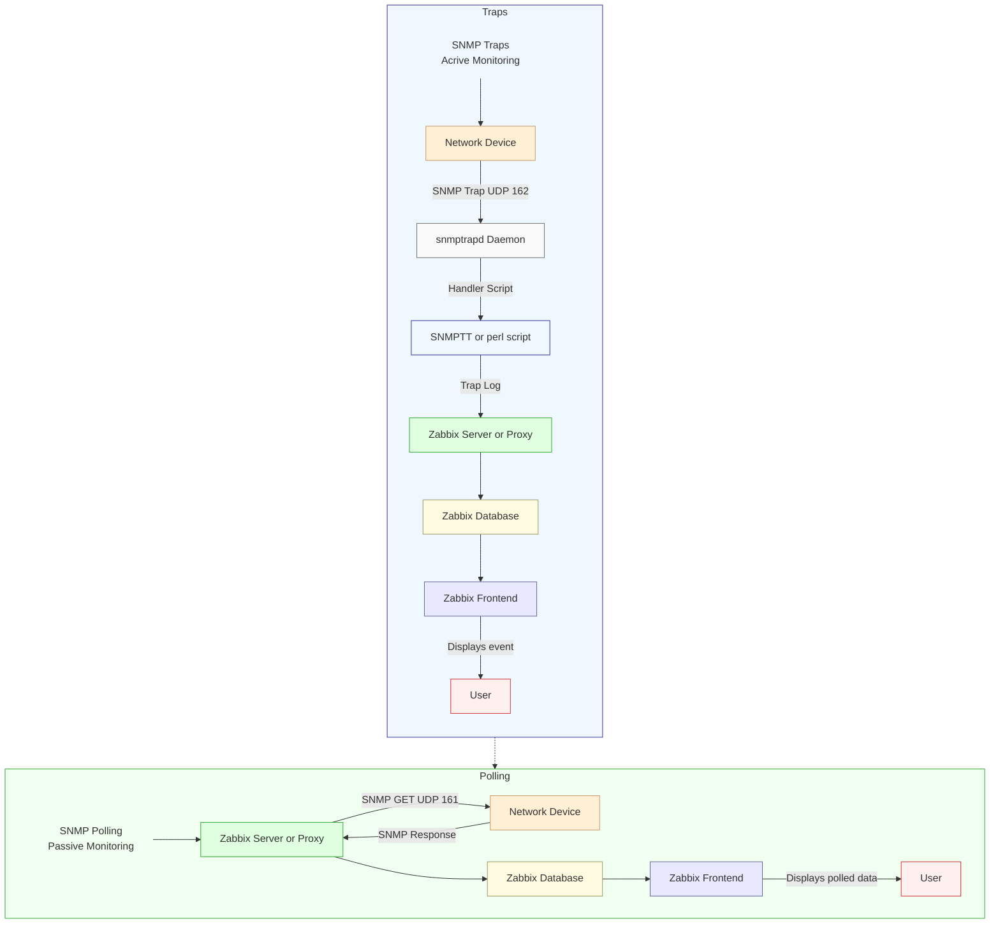

# SNMP Trapping

SNMP traps are one of the most powerful features in Zabbix network monitoring.
Unlike traditional SNMP polling, which periodically queries devices for status
updates, SNMP traps deliver real-time alerts directly from network equipment
the moment an event occurs, no waiting for the next polling cycle.

In this chapter, you'll learn how to set up SNMP trap handling in Zabbix, from
installing and configuring snmptrapd to integrating it with the Zabbix server.
You'll also discover how to analyse, filter, and map incoming traps using regular
expressions, and how to link them with triggers and notifications for instant
visibility into network issues.

Whether you're monitoring switches, routers, UPS systems, or firewalls, mastering
SNMP traps in Zabbix gives you faster event detection, reduced network load, and
deeper operational insight.

## Traps versus Polling

In Zabbix, SNMP (Simple Network Management Protocol) is one of the most common
methods for monitoring network devices such as switches, routers, firewalls, and
UPS systems.
There are two main ways Zabbix can receive information from an SNMP-enabled device:

- Polling (active monitoring) See our topic SNMP Polling in Chapter 4.
- Traps (passive monitoring)

To understand the differences between trapping and polling and understand the
advantages and disadvantages lets have a quick overview:

- With SNMP polling, the Zabbix server or proxy periodically queries the device for
specific values using SNMP GET requests. For example, CPU load, interface status,
temperature ... The device responds with the current data, and Zabbix stores it
in the database.

### Polling

Polling is a client initiated and scheduled process. It is predictable, reliable,
and suitable for continuous metrics that change over time.

**Advantages:**

- Easy to control frequency and timing.
- Works even if the device doesn't support traps.
- Historical trend data is consistent.

**Disadvantages:**

- Generates more network traffic on large infrastructures.
- Delays between polls mean slower event detection.
- If a device goes down, Zabbix won't notice until the next polling cycle. (This
can be detected by using the nodata function or using "SNMP agent availability"
item but not for individual items unless every items has the nodata function and
this is also a bad idea.)


### Trapping

SNMP traps work the opposite way. The device itself sends a message (trap) to the
Zabbix system when an event occurs. For example, a power failure, link down, or
temperature alarm. Zabbix listens for incoming traps via the snmptrapd daemon
and processes them through its SNMP trap item type.

Traps are event driven and asynchronous, meaning they are sent immediately when
something happens. No waiting or polling required.

**Advantages:**

- Instant notification of important events.
- Reduces network load (no regular queries).
- Ideal for devices that push alerts rather than respond to queries.

**Disadvantages:**

- Requires external configuration (snmptrapd, scripts, log parsing).
- Not all devices send traps for all events.
- If traps are missed or misconfigured, data is lost. (Traps use UDP)

| Method | Direction | Timing | Example | Pros | Cons |
|:----   |:----      |:----   |:----    |:---- |:---- |
| Polling (Sync)  | Zabbix → Device | Periodic | SNMP GET for CPU load | Predictable, simple |Slower, more traffic |
| Polling (Async) | Zabbix → Device | Parallel | Many SNMP GETs at once | Fast, scalable | More complex tuning |
| Traps | Device → Zabbix | Event-driven | Interface down trap | Instant alerts, low load | Requires trap daemon, can miss events |

---

## SNMP Traps flow in Zabbix



### SNMP Trap Flow (Active Monitoring)

In an SNMP Trap setup, communication is device initiated. Meaning the network
device sends an event message to Zabbix the moment something happens.
This is called active monitoring because Zabbix doesn't need to query the device
periodically.

**Step-by-step flow:**

- **Network Device:**
When an event occurs (for example, a power failure, interface down, or temperature
alarm), the device immediately sends an SNMP Trap to the configured destination
on UDP port 162.

- **snmptrapd Daemon:**
The Net-SNMP daemon **snmptrapd**  listens for incoming traps.
It acts as a relay between the device and Zabbix, executing a handler script
whenever a trap is received.

- **Trap Handler / Log File:**
The handler script (often zabbix_trap_receiver.pl or SNMPTT) processes the trap
and writes it into a log file, usually "/var/log/snmptrap/snmptrap.log."
This file contains the raw trap data including timestamps, source IPs, and OIDs.

- **Zabbix Server or Proxy:**
The Zabbix component (server or proxy) monitors the trap log for new entries and
matches them against configured SNMP trap items. These items use regular expressions
or string filters to extract relevant data.

- **Zabbix Database:**
Once processed, the trap information is stored in the database like any other
item value.

- **Zabbix Frontend:**
The event becomes visible in the Zabbix frontend almost instantly showing up in
Latest Data, Problems, or triggering actions and notifications based on your configuration.

???+ note

    SNMP traps deliver real-time alerts without polling overhead, making them
    ideal for event driven devices like UPSs, firewalls, or network switches.


### **SNMP Polling Flow (Passive Monitoring)**

In contrast, SNMP Polling is Zabbix initiated.
This is called passive monitoring because the Zabbix server (or proxy)  queries
the device at a set interval to retrieve values.

**Step-by-step flow:**

- **Zabbix Server or Proxy:**
Periodically sends an SNMP GET request to the device using UDP port 161.
Each SNMP item in Zabbix corresponds to a specific OID (Object Identifier) that
defines which metric is requested (e.g., CPU usage, interface status).

- **Network Device:**
Responds to the SNMP GET request with the current value of the requested OID.

- **Zabbix Database:**
The response data is stored in the database with a timestamp for trend analysis
and historical graphing.

- **Zabbix Frontend:**
Displays the collected values in graphs, dashboards, and triggers thresholds if
defined.

???+ note

    Polling provides consistent, periodic data collection. Ideal for metrics like
    bandwidth usage, temperature, or CPU load. However, it may have a small delay
    between data updates depending on the polling interval (e.g., every 30s,
    1min, etc.).

### Summary

| Feature            | SNMP Traps (Active)              | SNMP Polling (Passive)        |
| ------------------ | -------------------------------- | ----------------------------- |
| **Initiator**      | Network Device                   | Zabbix                        |
| **Direction**      | Device → Zabbix                  | Zabbix → Device               |
| **Transport Port** | UDP 162                          | UDP 161                       |
| **Frequency**      | Event-driven (immediate)         | Periodic (configurable interval) |
| **Resource Usage** | Lower (only on events)           | Higher (regular queries)      |
| **Data Type**      | Event notifications              | Continuous metrics            |
| **Best for**       | Fault and alert notifications    | Performance and trend monitoring |


!!! Tip

    In production Zabbix environments, many administrators combine both methods:
    - Use SNMP polling for regular metrics (e.g., interface traffic, system uptime).
    - Use SNMP traps for immediate events (e.g., link down, power failure).
    This hybrid approach gives you both real-time alerts and historical performance
    data, achieving complete SNMP visibility with minimal overhead.

---

## Setting up SNMP traps with zabbix_trap_receiver

In this section, we'll configure Zabbix to receive and process SNMP traps using
the Perl script zabbix_trap_receiver.pl. SNMP traps allow network devices to actively
send event information to the Zabbix server, enabling near real-time alerting without
periodic polling.

### **Open the Firewall for SNMP Trap Traffic**

By default, SNMP traps are received on UDP port 162.
Make sure this port is open on your Zabbix server:

!!! info "Open firewall port 162/udp"

    Red Hat
    ``` bash
    sudo firewall-cmd --add-port=162/udp --permanent
    sudo firewall-cmd --reload
    ```

    Ubuntu
    ```
    sudo ufw allow 162/udp
    ```

This allows incoming traps from SNMP-enabled devices.

### **Install Required SNMP Packages**

The snmptrapd daemon and Perl bindings are needed for trap handling.

!!! info "Install needed packages"

    Red Hat
    ``` bash
    sudo dnf install -y net-snmp-utils net-snmp-perl net-snmp
    ```
    
    Ubuntu
    ```
    sudo apt install snmpd snmp libsnmp-dev snmptrapd
    ```

This installs the SNMP tools, daemon, and Perl modules used by Zabbix's receiver
script.

### **Install zabbix_trap_receiver.pl**

Download the latest zabbix_trap_receiver.pl script from the official
Zabbix source archive [https://cdn.zabbix.com/zabbix/sources/stable/](https://cdn.zabbix.com/zabbix/sources/stable/)

```bash
sudo wget https://cdn.zabbix.com/zabbix/sources/stable/8.0/zabbix-8.0.0.tar.gz
```

Once downloaded, extract the file and copy the script to /usr/bin and make it executable:

```bash
sudo tar -xvf zabbix-8.0.0.tar.gz
sudo cp zabbix-8.0.0/misc/snmptrap/zabbix_trap_receiver.pl /usr/bin/.
sudo chmod +x /usr/bin/zabbix_trap_receiver.pl
```

This script receives traps from snmptrapd and writes them to a log file that Zabbix
can read.

### **Configure snmptrapd**

Edit the SNMP trap daemon configuration file:

```bash
sudo vi /etc/snmp/snmptrapd.conf
```

Append the following lines:

```bash
authCommunity execute public
perl do "/usr/bin/zabbix_trap_receiver.pl";
```

### **Explanation:**

- authCommunity execute public allows traps from devices using the community
  string public.
- The perl do line executes the Zabbix Perl handler for each incoming trap.

### **Edit the perl script**

```bash
sudo vi /usr/bin/zabbix_trap_receiver.pl
```

Replace `$SNMPTrapperFile = '/tmp/zabbix_traps.tmp';` with:

```bash
$SNMPTrapperFile = '/var/log/zabbix_traps_archive/zabbix_traps.log';
```

### **Enable SNMP Trap Support in Zabbix**

Edit the Zabbix server configuration file:

```bash
sudo vi /etc/zabbix/zabbix_server.conf
```

Uncomment or add the following parameters:

```bash
StartSNMPTrapper=1
SNMPTrapperFile=/var/log/zabbix_traps_archive/zabbix_traps.log
```

???+ note

    - StartSNMPTrapper=1 enables the Zabbix SNMP trapper process.
    - The SNMPTrapperFile path must match exactly the path used inside zabbix_trap_receiver.pl.

Restart the Zabbix server to apply changes:

```bash
sudo systemctl restart zabbix-server
```

### **Enable and Start snmptrapd**

Activate and start the SNMP trap daemon so it launches at boot:

```bash
sudo systemctl enable snmptrapd --now
```

This service will now listen on UDP 162 and feed incoming traps to Zabbix.

### **(Optional) Rotate the Trap Log File**

Zabbix writes all traps into a temporary log file.
To prevent this file from growing indefinitely, configure log rotation.

Create the directory:

```bash
sudo mkdir -p /var/log/zabbix_traps_archive
sudo chmod 755 /var/log/zabbix_traps_archive
```
On ubuntu only :

```bash
chown Debian-snmp: /var/log/zabbix_traps_archive/
```

Next we create a logrotate configuration file `/etc/logrotate.d/zabbix_traps`:

```bash
sudo vi /etc/logrotate.d/zabbix_traps
```

Add the following content to this file.

``` bash
/var/log/zabbix_traps_archive/zabbix_traps.log {
    weekly
    size 10M
    compress
    notifempty
    dateext
    dateformat -%Y%m%d
    missingok
    olddir /var/log/zabbix_traps_archive
    maxage 365
    rotate 10
}
```

### **Conclusion**

You've now configured Zabbix to:

- Listen for SNMP traps on UDP 162
- Use snmptrapd and zabbix_trap_receiver.pl to capture traps
- Write traps to a Zabbix-monitored log file
- Rotate the trap log automatically
- Verify correct trap delivery and troubleshoot via SELinux if needed

Once traps are arriving, you can create SNMP trap items in Zabbix (type SNMP trap,
key snmptrap[regex]) to trigger events, alerts, and dashboards.

## Setting up SNMP traps with bash parser

Using `perl` parser script might feel the only way to do trap parsing which
is not true. `bash` script will use less dependencies and can be shortcut
to get a working setup faster.

### Bash script to accept the trap

Create a file `/usr/bin/zabbix_trap_receiver.sh` with content:

```bash
#!/bin/bash

# Outcome will be produced into a file
OUT=/var/log/zabbix_traps_archive/zabbix_traps.log

# Put contents of SNMP trap from stdin into a variable
ALL=$(tee)

# Extract IP where trap is coming from
HOST=$(echo "$ALL" | grep "^UDP" | grep -Eo "[0-9]+\.[0-9]+\.[0-9]+\.[0-9]+" | head -1)

# Append SNMP trap into the log file
echo "ZBXTRAP $HOST
$(date)
$ALL" | tee --append "$OUT"
```

The most important part is for the message to hold keyword `ZBXTRAP`
which is followed by IP address.

!!! tip "tip"

    The bash `HOST` variable can be redefined to extract an IP address
    from actual trap message, therefore giving an opportunity
    automatically forward and store message in appropriate host in Zabbix.

To enable trap parser inside `/etc/snmp/snmptrapd.conf` instead of using:

```
perl do "/usr/bin/zabbix_trap_receiver.pl";
```

use:

```
traphandle default /usr/bin/zabbix_trap_receiver.sh
```

---

## Testing and debugging

### To test rotation manually

```bash
sudo logrotate --force /etc/logrotate.d/zabbix_traps
```

### Testing SNMP Trap Reception

We can simulate a trap manually using the snmptrap command.

``` bash
Example 1: SNMP v1 Test Trap
sudo snmptrap -v 1 -c public 127.0.0.1 '.1.3.6.1.6.3.1.1.5.4' '0.0.0.0' 6 33 '55' .1.3.6.1.6.3.1.1.5.4 s "eth0"
```

``` bash
Example 2: SNMP v2c Test Trap
sudo snmptrap -v 2c -c public localhost '' 1.3.6.1.4.1.8072.2.3.0.1 1.3.6.1.4.1.8072.2.3.2.1 i 123456
```

While using "zabbix_trap_receiver.pl" as a parser, the perl dependencies will be
validated only at the runtime when receiving the actual message. It can be handy
to see if the status of service is still healthy. Running the "status" for the
systemd service automatically prints the most recent log lines of snmptrapd.

``` bash
sudo systemctl status snmptrapd
```

For troubleshooting efficiency:

- Wrong order is: restart service, run status, send trap

- Correct order is: restart service, send trap, run status


### Testing SNMP Trap reception without UPD channel

This method helps to simulate an SNMP trap message even if device currently
cannot send one.

``` bash
echo "ZBXTRAP 127.0.0.1
$(date)
line two
line three" | sudo tee --append /var/log/zabbix_traps_archive/zabbix_traps.log
```

The most important part is having keyword "ZBXTRAP" (all caps) followed by the
IP address. The IP must belong to an **existing SNMP interface** behind 
Zabbix proxy/server.


### Validate if proxy/server runs a correct mapping

If the host is not yet made in frontend, that is perfect opportunity to validate
if Zabbix proxy/server service has recognised the mapping with a zabbix_traps.log file.

Every time the trap message is sent (and the device is not yet registered in GUI), 
it should print a line about "unmatched trap received from"

Send a test trap

```
sudo snmptrap -v 1 -c public 127.0.0.1 '.1.3.6.1.6.3.1.1.5.4' '0.0.0.0' 6 33 '55' .1.3.6.1.6.3.1.1.5.4 s "eth0"
```

Check immediately

``` bash
date
grep "unmatched trap received from" /var/log/zabbix/zabbix_proxy.log
```

If the line appear, it's a solid indication the settings about
StartSNMPTrapper and SNMPTrapperFile is configured correctly.


### SELinux considerations

If SELinux is enabled and traps are not being processed, check for denied actions:
``` bash
sudo ausearch -m AVC,USER_AVC -ts recent
```

Adjust SELinux policies or create exceptions for /usr/bin/zabbix_trap_receiver.pl and the trap log directory as needed.

### (Optional) SNMPv3 Trap Configuration

If using SNMPv3 for secure traps, you can define users directly in snmptrapd.conf:

``` bash
createUser -e <engineid> <user> SHA <key> AES <key>
authUser log,execute <user>
perl do "/usr/bin/zabbix_trap_receiver.pl";
```

This adds authentication and encryption for trap communication.

### Desperate snmptrapd.conf for SNMPv2

If community names for SNMPv2 traps are not known and deadlines are approaching,
we can allow every SNMP trap message to come in
by ignoring all community names.

Add at the beginning of existing configuration file add:

```
disableAuthorization yes 
```

For example with a bash parser it's enough to have only 2 active lines
to make it functional and have confidence that trap receiving is working.

```
echo "
# Allow everyone to register a message
disableAuthorization yes

# Forward message to parser script
traphandle default /usr/bin/zabbix_trap_receiver.sh
" | sudo tee /etc/snmp/snmptrapd.conf
```

This is only applicable to SNMPv2 traps. This will not work with SNMPv3 traps.


## Trap mapping and preprocessing

With SNMP traps now configured and the trap receiver operational, the next step
is to create a host in the Zabbix frontend so we can link incoming traps to a
specific monitored device.

In the Zabbix web interface, navigate to:
Data collection → Hosts, and click Create host.

- **Hostname :** Network Switch 01
- **Host groups :** SNMP Devices
- **Interfaces :** SNMP with IP 127.0.0.1


In Zabbix, the macro {$SNMP_COMMUNITY} is often defined globally under Administration
→ Macros. This global macro provides a default SNMP community string used by all
hosts that rely on SNMP for polling or trap-based communication.

However, a better approach, especially in larger or more secure environments is
to define a unique SNMP community per device and override the global macro at the
host level. This allows for more granular access control and simplifies troubleshooting
when multiple community strings are used across the network.

### Sending a Test Trap

With the host and trap receiver configured, we can now simulate a link down event
from our device by sending an SNMP trap manually from the command line:

On the command line we can now sent a trap to mimic a Link down on our device.
`snmptrap -v 2c -c public 127.0.0.1 '' 1.3.6.1.6.3.1.1.5.3`

This command sends a version 2c SNMP trap using the community string public to
the local Zabbix trap receiver, emulating a linkDown event defined by
OID 1.3.6.1.6.3.1.1.5.3.

### Verifying Trap Reception

After sending the test trap, open the Zabbix frontend and navigate to:
`Monitoring` → `Latest data`

Select the host `Network Switch 01`.
If everything is configured correctly, you should now see data populated in your
SNMP trap item, confirming that Zabbix successfully received and processed the
trap.


```
2025-10-13T21:10:58+0200 PDU INFO:
  errorindex                     0
  notificationtype               TRAP
  messageid                      0
  transactionid                  2
  receivedfrom                   UDP: [127.0.0.1]:50483->[127.0.0.1]:162
  community                      public
  requestid                      57240481
  version                        1
  errorstatus                    0
VARBINDS:
  DISMAN-EVENT-MIB::sysUpTimeInstance type=67 value=Timeticks: (227697) 0:37:56.97
  SNMPv2-MIB::snmpTrapOID.0      type=6  value=OID: IF-MIB::linkDown
```

Sending a More Realistic Trap Example

In a real production environment, SNMP traps usually include additional variable
bindings (varbinds) that describe the state of the affected interface or component.
To better simulate a real-world scenario, we can extend our previous test command
to include this extra information.

Run the following command on the Zabbix server:

```bash
snmptrap -v 2c -c public 127.0.0.1 '' \
  IF-MIB::linkDown \
  IF-MIB::ifIndex i 1 \
  IF-MIB::ifAdminStatus i 2 \
  IF-MIB::ifOperStatus i 2 \
  IF-MIB::ifName s "Gi0/1" \
  IF-MIB::ifDescr s "GigabitEthernet0/1"
```
This will give use the following output:

```
2025-10-13T21:53:15+0200 PDU INFO:
  errorstatus                    0
  version                        1
  requestid                      139495039
  community                      public
  transactionid                  14
  receivedfrom                   UDP: [127.0.0.1]:35753->[127.0.0.1]:162
  messageid                      0
  notificationtype               TRAP
  errorindex                     0
VARBINDS:
  DISMAN-EVENT-MIB::sysUpTimeInstance type=67 value=Timeticks: (481390) 1:20:13.90
  SNMPv2-MIB::snmpTrapOID.0      type=6  value=OID: IF-MIB::linkDown
  IF-MIB::ifIndex                type=2  value=INTEGER: 1
  IF-MIB::ifAdminStatus          type=2  value=INTEGER: 1
  IF-MIB::ifOperStatus           type=2  value=INTEGER: 1
  IF-MIB::ifName                 type=4  value=STRING: "Gi0/1"
  IF-MIB::ifDescr                type=4  value=STRING: "GigabitEthernet0/1"
```

### (optional) Bulletproof solution

Official Zabbix SNMP templates do not require installing MIB files, targeting
raw OIDs for data polling. If we continue this style for trapping too
we can create a dependency free solution by enabling a "numerical" flag inside
/etc/snmp/snmptrapd.conf

```
outputOption n
```

Edit the file, restart the snmptrapd service, send test trap, and check the log:

```
tail -99 /var/log/zabbix_traps_archive/zabbix_traps.log
```

!!! warning "In long run"

    Using a numerical traps will take much more time to design a template.
    More time in creating items and triggers. Due to the '.' (dot) symbol of
    being a special character in the regular expression world, the items
    keys will require to escape. This makes solution not visually pleasant.
    Ignoring escaping the '.' will also work 99.9% of time, but it violates the
    idea of bulletproof and precise solution.

---

Using numerical traps can be best direction if:

- There is a big passion about bulletproof solution. Creating solution with
bare minimum dependencies - MIBs are never required for Zabbix proxies.

- Template readability is not an issue. You are only person in the
monitoring department. There are no team mates.

- Have a lot of time to design solution

- You are willing to share your masterpiece with the internet.
Perhaps share it at GitHub


### Creating SNMP Trap Items

Now that our host is configured and we've verified that traps are being received,
we can create a set of items to store and process the trap data in a structured way.

We’ll start with a catch-all (fallback) item that captures every SNMP trap received
for this host. Then we'll add two dependent items to extract specific values such
as the administrative and operational interface status.

### Creating the SNMP Fallback Item

This item serves as the master collector for all incoming traps. Any dependent
items you create later will use this as their source.

In the Zabbix frontend, navigate to
`Data collection` → `Hosts` → `Network Switch 01` → `Items`
and click Create item.

Configure the following parameters:

- **Name:** SNMP Trap: Fallback
- **Type:** SNMP trap
- **Key:** snmptrap.fallback
- **Type of information:** Text

Next we will create 2 dependent items. One item for the ifAdminStatus and another
one for the ifOperStatus. You can do this by clicking on the 3 dots before our
fallback item or by just creating a new item and selecting type `Dependent item`

- **Name:** Trap ifAdminStatus
- **Type:** Dependent item
- **Key:** trap.ifAdminStatus
- **Type of information:** Numeric(unsigned)
- **Master item:** (Select your fallback item as master item)

Click on the `preprocessing` tab and select `Regular expression`.
use `IF-MIB::ifAdminStatus[\s\S]*?INTEGER:\s+(\d+)` in the Parameters field and
`\1` in the Output box.

Select the box `Custom on fail` and use the option `Discard value`.


Next we create our second item also dependent on our Fallback item.

- **Name:** Trap ifOperStatus
- **Type:** Dependent item
- **Key:** trap.ifAdminStatus
- **Type of information:** Numeric(unsigned)
- **Master item:** (Select your fallback item as master item)

Again go to the `Preprocessing` tab and enter following information.

Select `Regular expression` and for Parameters enter `IF-MIB::ifOperStatus[\s\S]*?INTEGER:\s+(\d+)`
and `\1` in the Output box.

Again add a `Custom on fail` step and select `Discard value`.


We have our items now but we still are missing our trigger. Go back to your host
and click on the triggers and add the following trigger.

**Name:** Problem (Link down:)
**Severity:** Warning

**Problem expression:** `last(/Network Switch 01/trap.ifOperStatus)=2 and last(/Network Switch 01/trap.ifAdminStatus)=2`

**Recovery expression:** `last(/Network Switch 01/trap.ifOperStatus)=1 and last(/Network Switch 01/trap.ifAdminStatus)=1`


Make sure to also select the box `Allow manual close.` This can help to close
the problem in case we don't receive a TRAP.

You should now be able to sent a trap to open and close a problem in Zabbix
based on the status of the ifOperStatus and the ifAdminStatus 

```bash
snmptrap -v 2c -c public 127.0.0.1 '' IF-MIB::linkDown   IF-MIB::ifIndex i 1   IF-MIB::ifAdminStatus i 2   IF-MIB::ifOperStatus i 2   IF-MIB::ifName s "Gi0/1"   IF-MIB::ifDescr s "GigabitEthernet0/1"
snmptrap -v 2c -c public 127.0.0.1 '' IF-MIB::linkDown   IF-MIB::ifIndex i 1   IF-MIB::ifAdminStatus i 1   IF-MIB::ifOperStatus i 1   IF-MIB::ifName s "Gi0/1"   IF-MIB::ifDescr s "GigabitEthernet0/1"
```

As a bonus you can add on the host a value map and link the items with it.


If you don't like 2 different items and want to be more fancy you could create
an dependent item like we did above and use JS instead of perl regex.

```JavaScript
var s = value;

function grab(re) {
  var m = s.match(re);
  return m ? m[1] : '';
}

// Extract fields from your sample payload
var ifName = grab(/IF-MIB::ifName[\s\S]*?STRING:\s+"([^"]+)"/m);
var admin  = grab(/IF-MIB::ifAdminStatus[\s\S]*?INTEGER:\s+(\d+)/m);
var oper   = grab(/IF-MIB::ifOperStatus[\s\S]*?INTEGER:\s+(\d+)/m);

// Map 1/2/3 -> up/down/testing
var map = { '1':'up', '2':'down', '3':'testing' };
var a = map[admin] || admin || '?';
var o = map[oper]  || oper  || '?';
var name = ifName || 'ifName=?';

return 'interface=' + name + ' adminStatus=' + a + ' operStatus=' + o;
```
This will return output in latest data like `interface=Gi0/1 adminStatus=down operStatus=down`

Another solution way more easy could be to create a specific item instead of
falling back on the fallback item that looks exactly for a link that goes Down
or Up. This can be done by creating a specific item like this:

`snmptrap["IF-MIB::link(Down|Up)"]`

We could then create a trigger like:
`str(/Network Switch 01/snmptrap["IF-MIB::link(Down|Up)"],"IF-MIB::linkDown")=1`
and a recovery trigger like :
`str(/Network Switch 01/snmptrap["IF-MIB::link(Down|Up)"],"IF-MIB::linkUp")=1`

As you can see the solutions are endless and SNMP traps are not so easy and
probably need some tweaking before you have it all working like you want.

???+ note

    The snmptrap.fallback is a good point to start with if you have no clue what
    traps to expect it can help you to discover all the traps and stay to be sure
    you catch all traps even if they are not configured on your host.


## Deploying bare minimum MIB files

Gathering proper MIB files might sounds a tedious and time consuming task.

Installing too many MIBs will cause degradation for the
SNMP trap translation process and slow down the SNMP polling process.

Here is an universal method (treat it as one option) on how to obtain bare minimum
MIBs to work with most of devices. This is useful for SNMP polling too.

The project [https://github.com/netdisco/netdisco-mibs](https://github.com/netdisco/netdisco-mibs)
exist for 20 years and is a collection of MIBs for a lot of vendors. Dare I say: all vendors?

To install/replace the Linux distribution stock MIB bundle:

```bash
# move to /tmp
cd /tmp

# download
curl -kL https://github.com/netdisco/netdisco-mibs/archive/refs/heads/master.zip -o /tmp/netdisco-mibs.zip

# unpack. this will create '/tmp/netdisco-mibs-master' directory
unzip /tmp/netdisco-mibs.zip -d /tmp

# remove existing/official MIBs from Linux distribution
rm -rf /usr/share/snmp/mibs/*

# install Netdisco collection. it will move all directories which start with lower case letter or digit
find /tmp/netdisco-mibs-master -mindepth 1 -maxdepth 1 -type d -name '[a-z0-9]*' -exec mv {} /usr/share/snmp/mibs/ \;

# list what is installed
ls -1 /usr/share/snmp/mibs

# cleanup
rm -rf /tmp/netdisco*
```

To enable bare minimum MIBs we need to enable two catalogs "rfc" and "net-snmp".

Overwrite/replace configuration by using:

```bash
echo "
mibs :
mibdirs /usr/share/snmp/mibs/rfc:/usr/share/snmp/mibs/net-snmp
mibs +ALL
" | sudo tee /etc/snmp/snmp.conf
```

!!! tip "Fun fact"
    
    Modifying /etc/snmp/snmp.conf file the changes are applied on the fly.
    No need to restart anything.

### Include another vendor

Let's say we need to work with Cisco equipment. We can double-check if vendor
is included in Netdisco bundle. Grep for case insensitive name:

```bash
ls -1 /usr/share/snmp/mibs | grep -i Cisco
```

If the vendor is in list, then include "cisco" directory
together with "rfc" and "net-snmp" directory, like this:

```bash
echo "
mibs :
mibdirs /usr/share/snmp/mibs/rfc:/usr/share/snmp/mibs/net-snmp:/usr/share/snmp/mibs/cisco
mibs +ALL
" | sudo tee /etc/snmp/snmp.conf
```

Adding multiple vendors is possible but it will slow down the translation speed.
Adding plus one vendor usually add at least 1s more to the translation speed.

## Conclusion

We started by setting up the trap reception environment using snmptrapd and the
zabbix_trap_receiver.pl script, then integrated it into Zabbix through the SNMP
Trapper process.
You also learned how to open the necessary firewall ports, configure log rotation
for the trap file, and verify successful reception using test traps.

In the Zabbix frontend, we created a host representing our SNMP device, added
a catch-all trap item, and built dependent items to extract key values such as
ifAdminStatus and ifOperStatus.
From there, we constructed a simple yet effective trigger pair that raises an alert
when a linkDown trap is received and automatically resolves it when a linkUp trap
arrives.

Combine traps with SNMP polling to balance real-time alerts with long-term
performance metrics.

SNMP traps are one of the most powerful mechanisms in Zabbix for achieving proactive
monitoring. When properly configured, they provide immediate visibility into the
health and state of your infrastructure, allowing you to respond to issues the
moment they happen, not minutes later.

## Questions

- What is the key difference between SNMP polling and SNMP traps in how they collect data?
- Why are SNMP traps often described as active monitoring while SNMP polling is passive?
- What is the purpose of the zabbix_trap_receiver.pl script, and where is it defined in the SNMP configuration?
- What role does the parameter StartSNMPTrapper play in zabbix_server.conf?
- In what kind of situations would you prefer SNMP traps over polling?
- How could you use SNMP traps in combination with SNMP polling for a hybrid monitoring strategy?

## Useful URLs

- [https://www.zabbix.com/documentation/current/en/manual/config/items/itemtypes/snmptrap](https://www.zabbix.com/documentation/current/en/manual/config/items/itemtypes/snmptrap)
- [https://git.zabbix.com/projects/ZBX/repos/zabbix/browse/misc/snmptrap](https://git.zabbix.com/projects/ZBX/repos/zabbix/browse/misc/snmptrap)
- [https://www.net-snmp.org/](https://www.net-snmp.org/)
- [https://datatracker.ietf.org/doc/html/rfc3416](https://datatracker.ietf.org/doc/html/rfc3416)
- [https://datatracker.ietf.org/doc/html/rfc1905](https://datatracker.ietf.org/doc/html/rfc1905)
- [https://datatracker.ietf.org/doc/html/rfc1157](https://datatracker.ietf.org/doc/html/rfc1157)


