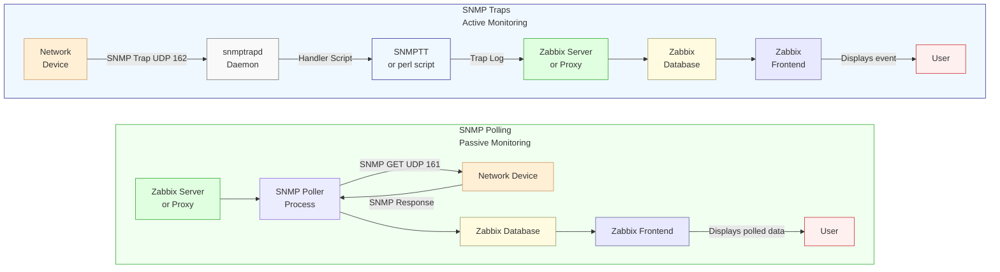

# SNMP Trapping

SNMP traps are one of the most powerful features in Zabbix network monitoring.
Unlike traditional SNMP polling, which periodically queries devices for status
updates, SNMP traps deliver real-time alerts directly from network equipment
the moment an event occurs, no waiting for the next polling cycle.

In this chapter, you'll learn how to set up SNMP trap handling in Zabbix, from
installing and configuring *snmptrapd* to integrating it with the Zabbix server.
You'll also discover how to analyse, filter, and map incoming traps using regular
expressions, and how to link them with triggers and notifications for instant
visibility into network issues.

Whether you're monitoring switches, routers, UPS systems, or firewalls, mastering
SNMP traps in Zabbix gives you faster event detection, reduced network load, and
deeper operational insight.

---

## Traps versus Polling

In Zabbix, SNMP (*Simple Network Management Protocol*) is one of the most common
methods for monitoring network devices such as switches, routers, firewalls, and
UPS systems.
There are two main ways Zabbix can receive information from an SNMP-enabled device:

- Polling (active monitoring) See previous topic [SNMP Polling](./snmp-polling.md).
- Traps (passive monitoring)

To understand the differences between trapping and polling and understand the
advantages and disadvantages lets have a quick overview:

---

### Polling

With SNMP polling, the Zabbix server or proxy periodically queries the device for
specific values using SNMP GET requests. For example, CPU load, interface status,
temperature ... The device responds with the current data, and Zabbix stores it
in the database.

Polling is a client initiated and scheduled process. It is predictable, reliable,
and suitable for continuous metrics that change over time.

**Advantages:**

- Easy to control frequency and timing.
- Works even if the device doesn't support traps.
- Historical trend data is consistent.

**Disadvantages:**

- Generates more network traffic on large infrastructures.
- Delays between polls mean slower event detection.
- If a device goes down, Zabbix won't notice until the next polling cycle. (This
  can be detected by using the `nodata` function or using "*SNMP agent availability*"
  item but not for individual items unless every items has the `nodata` function and
  this is also a bad idea.)

---

### Trapping

SNMP traps work the opposite way. The device itself sends a message (trap) to the
Zabbix system when an event occurs. For example, a power failure, link down, or
temperature alarm. Zabbix listens for incoming traps via the snmptrapd daemon
and processes them through its SNMP trap item type.

Traps are event driven and asynchronous, meaning they are sent immediately when
something happens. No waiting or polling required.

**Advantages:**

- Instant notification of important events.
- Reduces network load (no regular queries).
- Ideal for devices that push alerts rather than respond to queries.

**Disadvantages:**

- Requires external configuration (snmptrapd, scripts, log parsing).
- Not all devices send traps for all events.
- If traps are missed or misconfigured, data is lost. (Traps use UDP)

| Method | Direction | Timing | Example | Pros | Cons |
|:----   |:----      |:----   |:----    |:---- |:---- |
| Polling (Sync)  | Zabbix → Device | Periodic | SNMP GET for CPU load | Predictable, simple |Slower, more traffic |
| Polling (Async) | Zabbix → Device | Parallel | Many SNMP GETs at once | Fast, scalable | More complex tuning |
| Traps | Device → Zabbix | Event-driven | Interface down trap | Instant alerts, low load | Requires trap daemon, can miss events |

---

## SNMP flows in Zabbix


```mermaid
---
config:
  flowchart:
    subGraphTitleMargin:
      bottom: 30
---
flowchart TB
    %% --- Traps section (top) ---
    subgraph TRAPS[SNMP Traps
                   Active Monitoring]
        direction LR
        DEV2[Network
             Device]
        TRAPD[snmptrapd
              Daemon]
        HANDLER[SNMPTT
                or perl script]
        ZBXT[Zabbix Server
             or Proxy]
        DBT[Zabbix 
            Database]
        UI2[Zabbix 
            Frontend]
        USER2[User]

        DEV2 -->|SNMP Trap UDP 162| TRAPD
        TRAPD -->|Handler Script| HANDLER
        HANDLER -->|Trap Log| ZBXT
        ZBXT --> DBT
        DBT --> UI2
        UI2 -->|Displays event| USER2
    end

    %% --- Invisible connector to force vertical stacking ---
    TRAPS ~~~ POLLING

    %% --- Polling section (bottom) ---
    subgraph POLLING[SNMP Polling
                     Passive Monitoring]
        direction LR
        ZBX[Zabbix Server
            or Proxy]
        POLLER[SNMP Poller 
               Process]
        DEV[Network Device]
        ZBX --> POLLER
        POLLER -->|SNMP GET UDP 161| DEV
        DEV -->|SNMP Response| POLLER
        POLLER --> DBP[Zabbix Database]
        DBP --> UI1[Zabbix Frontend]
        UI1 -->|Displays polled data| USER1[User]
    end

    %% --- Styling ---
    style POLLING fill:#f0fff0,stroke:#3a3,stroke-width:1px
    style TRAPS fill:#f0f8ff,stroke:#339,stroke-width:1px
    style ZBX fill:#e0ffe0,stroke:#3a3
    style DEV fill:#ffefd5,stroke:#c96
    style DEV2 fill:#ffefd5,stroke:#c96
    style TRAPD fill:#f9f9f9,stroke:#777
    style HANDLER fill:#f0f8ff,stroke:#339
    style ZBXT fill:#e0ffe0,stroke:#3a3
    style DBP fill:#fffbe0,stroke:#996
    style DBT fill:#fffbe0,stroke:#996
    style UI1 fill:#e8e8ff,stroke:#669
    style UI2 fill:#e8e8ff,stroke:#669
    style USER1 fill:#fff0f0,stroke:#c33
    style USER2 fill:#fff0f0,stroke:#c33
```

_4.33 SNMP Traps vs Polling Flow_

---

### SNMP Trap Flow (Active Monitoring)

In an SNMP Trap setup, communication is device initiated. Meaning the network
device sends an event message to Zabbix the moment something happens.
This is called active monitoring because Zabbix does not need to query the device
periodically.

**Step-by-step flow:**

- **Network Device:**

    When an event occurs (for example, a power failure, interface down, or temperature
    alarm), the device immediately sends an SNMP Trap to the configured destination
    on UDP port 162.

- **snmptrapd Daemon:**

    The Net-SNMP daemon **snmptrapd**  listens for incoming traps.
    It acts as a relay between the device and Zabbix, executing a handler script
    whenever a trap is received.

- **Trap Handler / Log File:**

    The handler script (often zabbix_trap_receiver.pl or SNMPTT) processes the trap
    and writes it into a log file, usually "/var/log/snmptrap/snmptrap.log."
    This file contains the raw trap data including timestamps, source IPs, and OIDs.

- **Zabbix Server or Proxy:**

    The Zabbix component (server or proxy) monitors the trap log for new entries and
    matches them against configured SNMP trap items. These items use regular expressions
    or string filters to extract relevant data.

- **Zabbix Database:**

    Once processed, the trap information is stored in the database like any other
    item value.

- **Zabbix Frontend:**

    The event becomes visible in the Zabbix frontend almost instantly showing up in
    Latest Data, Problems, or triggering actions and notifications based on your configuration.

???+ tip

    SNMP traps deliver real-time alerts without polling overhead, making them
    ideal for event driven devices like UPSs, firewalls, or network switches.

---

### SNMP Polling Flow (Passive Monitoring)

In contrast, SNMP Polling is Zabbix initiated.
This is called passive monitoring because the Zabbix server (or proxy)  queries
the device at a set interval to retrieve values.

**Step-by-step flow:**

- **Zabbix Server or Proxy:**

    Periodically sends an SNMP GET request to the device using UDP port 161.
    Each SNMP item in Zabbix corresponds to a specific OID (Object Identifier) that
    defines which metric is requested (e.g., CPU usage, interface status).

- **Network Device:**

    Responds to the SNMP GET request with the current value of the requested OID.

- **Zabbix Database:**

    The response data is stored in the database with a timestamp for trend analysis
    and historical graphing.

- **Zabbix Frontend:**

    Displays the collected values in graphs, dashboards, and triggers thresholds if
    defined.

???+ tip

    SNMP polling provides consistent, periodic data collection. Ideal for metrics like
    bandwidth usage, temperature, or CPU load. However, it may have a small delay
    between data updates depending on the polling interval (e.g., every 30s,
    1min, etc.).

---

### Summary

| Feature            | SNMP Traps (Active)              | SNMP Polling (Passive)        |
| ------------------ | -------------------------------- | ----------------------------- |
| **Initiator**      | Network Device                   | Zabbix                        |
| **Direction**      | Device → Zabbix                  | Zabbix → Device               |
| **Transport Port** | UDP 162                          | UDP 161                       |
| **Frequency**      | Event-driven (immediate)         | Periodic (configurable interval) |
| **Resource Usage** | Lower (only on events)           | Higher (regular queries)      |
| **Data Type**      | Event notifications              | Continuous metrics            |
| **Best for**       | Fault and alert notifications    | Performance and trend monitoring |


!!! Tip

    In production Zabbix environments, many administrators combine both methods:
    - Use SNMP polling for regular metrics (e.g., interface traffic, system uptime).
    - Use SNMP traps for immediate events (e.g., link down, power failure).
    This hybrid approach gives you both real-time alerts and historical performance
    data, achieving complete SNMP visibility with minimal overhead.

---

## Setting up SNMP traps with zabbix_trap_receiver

SNMP traps allow network devices to actively send event information to the 
Zabbix server, enabling near real-time alerting without periodic polling.

In this section, we'll configure Zabbix to receive and process SNMP traps using
the Perl script `zabbix_trap_receiver.pl`. Do note that this is just one of the
available methods to receive SNMP traps in Zabbix, but it is the most commonly used
and is supported by the Zabbix team.

---

### Install Required SNMP Packages

First of all we need to be able to accept incoming SNMP trap connections
on our Zabbix server. This is done by installing the *snmptrapd* daemon, which is
part of the Net-SNMP suite. We also need the Perl bindings for SNMP to run the
trap receiver script that will process incoming traps and write them to a log file
that Zabbix can read.

!!! info "Install needed packages"

    Red Hat
    ``` bash
    sudo dnf install net-snmp-utils net-snmp-perl net-snmp
    ```

    Suse
    ``` bash
    zypper install net-snmp perl-SNMP
    ```
    
    Ubuntu
    ```
    sudo apt install snmpd snmp libsnmp-dev snmptrapd
    ```

This installs the SNMP tools, daemon, and Perl modules used by Zabbix's receiver
script.

Refer to previous topic [SNMP Polling: Deploying Bare Minimum MIB Files](./snmp-polling.md#deploying-bare-minimum-mib-files)
on how to install MIB files if you want to have human readable trap messages in 
the log file. 
This is optional but highly recommended for easier troubleshooting and better 
visibility of trap contents.

---

#### Open the Firewall for incoming SNMP Trap Traffic

By default, SNMP traps are received on port 162, most commonly using UDP, but 
can also use TCP.
Make sure this port is open on your Zabbix server:

!!! info "Open firewall port 162/udp"

    Red Hat / Suse
    ``` bash
    sudo firewall-cmd --add-service=snmptrap --permanent
    sudo firewall-cmd --reload
    ```

    Ubuntu
    ```
    sudo ufw allow snmptrap
    sudo ufw reload
    ```

This allows incoming traps from SNMP-enabled devices to be received by the 
*snmptrapd* daemon.

---

### Setting up SNMP traps with zabbix_trap_receiver.pl

Next, we need to set up the trap receiver script that will process incoming traps
and write them to a log file that Zabbix can read. This script is provided by 
the Zabbix team and is commonly used to integrate SNMP traps with Zabbix.

???+ tip 
    Alternatively, you can use a custom script or SNMPTT (SNMP Trap Translator) if 
    you prefer. We will give an example of creating a bash script later on, but
    for now let's use the official Zabbix Perl script.

Download the latest `zabbix_trap_receiver.pl` script from the official
Zabbix GIT repository: [https://git.zabbix.com/projects/ZBX/repos/zabbix/browse/misc/snmptrap](https://git.zabbix.com/projects/ZBX/repos/zabbix/browse/misc/snmptrap))

!!! info "Download zabbix_trap_receiver.pl"

    ```bash
    sudo wget https://git.zabbix.com/projects/ZBX/repos/zabbix/raw/misc/snmptrap/zabbix_trap_receiver.pl
    ```

Once downloaded, move the script to /usr/bin and make it executable:

!!! info "Install zabbix_trap_receiver.pl"

    ```bash
    sudo mv zabbix_trap_receiver.pl /usr/local/bin/
    sudo chmod +x /usr/local/bin/zabbix_trap_receiver.pl
    ```

    If you have SELinux enabled, you will need to set the correct context for the
    script:

    ```bash
    sudo restorecon -v /usr/local/bin/zabbix_trap_receiver.pl
    ```

This script will receive traps from *snmptrapd* and write them to a log file that Zabbix
can read. By default, the script writes to `/tmp/zabbix_traps.tmp`, but we will
configure it to write to a different location in the next step.

!!! info "Configure the perl script"

    Edit the trap receiver script:

    ```bash
    sudo vi /usr/local/bin/zabbix_trap_receiver.pl
    ```

    Set the desired log file path in the script by searching for the line that 
    defines `$SNMPTrapperFile` and updating it to:

    ```bash
    $SNMPTrapperFile = '/var/log/zabbix_traps_archive/zabbix_traps.log';
    ```

Of course, for the script to be able to write to this file, the directory must 
exist and have the appropriate permissions.

!!! info "Create log directory for traps"
    Create the directory:

    ```bash
    sudo mkdir -p /var/log/zabbix_traps_archive
    sudo chmod 755 /var/log/zabbix_traps_archive
    ```
    On ubuntu only :

    ```bash
    chown Debian-snmp: /var/log/zabbix_traps_archive/
    ```

---

#### Configure snmptrapd

So now that we have the trap receiver script installed and configured, we need to tell 
*snmptrapd* to use it to process incoming traps. This is done by editing the
`/etc/snmp/snmptrapd.conf` file and adding the appropriate configuration to execute
the script for each incoming trap.

!!! info "Configure snmptrapd"

    Edit the SNMP trap daemon configuration file:

    ```bash
    sudo vi /etc/snmp/snmptrapd.conf
    ```

    Add following lines:

    ```text
    authCommunity execute public
    perl do "/usr/local/bin/zabbix_trap_receiver.pl";
    ```

**Explanation:**

    - `authCommunity execute public` allows traps from devices using the community
    string public.
    - The `perl do` line executes the Zabbix Perl handler for each incoming trap.

---

### Alternative: Setting up SNMP traps with bash parser

Using `perl` parser script might feel the only way to do trap parsing but that
is not true. A `bash` script for example will use less dependencies and can be shortcut
to get a working setup faster.

???+ example "Bash script to accept the trap"

    Create a file `/usr/local/bin/zabbix_trap_receiver.sh` with content:

    ```bash
    #!/bin/bash

    # Outcome will be produced into a file
    OUT=/var/log/zabbix_traps_archive/zabbix_traps.log

    # Put contents of SNMP trap from stdin into a variable
    ALL=$(tee)

    # Extract IP where trap is coming from
    HOST=$(echo "$ALL" | grep "^UDP" | grep -Eo "[0-9]+\.[0-9]+\.[0-9]+\.[0-9]+" | head -1)

    # Append SNMP trap into the log file
    echo "ZBXTRAP $HOST
    $(date)
    $ALL" | tee --append "$OUT"
    ```

The most important part is for the message to hold the keyword `ZBXTRAP`
followed by the IP address.

!!! tip

    The bash `HOST` variable can be redefined to extract an IP address
    from the actual trap message, therefore giving an opportunity to
    automatically forward and store messages in the appropriate host in Zabbix.

!!! info "Configure snmptrapd to use bash parser"

    To enable the bash trap parser, inside `/etc/snmp/snmptrapd.conf`, instead 
    of using:

    ```text
    perl do "/usr/local/bin/zabbix_trap_receiver.pl";
    ```

    use:

    ```text
    traphandle default /usr/local/bin/zabbix_trap_receiver.sh
    ```

---

### Configure Zabbix Server

Now we need to make sure that the Zabbix server is configured to read from this
log file:

!!! info "Enable SNMP Trap Support in Zabbix"

    Edit the Zabbix server configuration file:

    ```bash
    sudo vi /etc/zabbix/zabbix_server.d/snmp_trapper.conf
    ```

    Uncomment or add the following parameters:

    ```bash
    StartSNMPTrapper=1
    SNMPTrapperFile=/var/log/zabbix_traps_archive/zabbix_traps.log
    ```

**Explanation:**

    - `StartSNMPTrapper=1` enables the Zabbix SNMP trapper process.
    - The `SNMPTrapperFile` path must match exactly the path used inside
      `zabbix_trap_receiver.pl`.

Restart the Zabbix server to apply changes:

!!! info "Restart Zabbix server"

    ```bash
    sudo systemctl restart zabbix-server
    ```

---

#### SELinux

If SELinux is enabled on your system, you may need to create a custom policy to
allow the Zabbix Server to read the trap log file. 
You can create a policy module using the `audit2allow` tool based on the denied
actions logged in the audit logs.

First check for any denied actions related to the Zabbix server and the trap log
file:

???+ example "Check for SELinux denials"

    ```shell-session
    localhost:~$ sudo ausearch -c 'zabbix_server' -ts recent
    time->Sun Mar  8 23:04:40 2026
    type=AVC msg=audit(1773007480.439:3417): avc:  denied  { read } for  pid=5278 comm="zabbix_server" name="zabbix_traps.log" dev="vda3" ino=21234 scontext=system_u:system_r:zabbix_t:s0 tcontext=system_u:object_r:snmpd_log_t:s0 tclass=file permissive=0

    ```
If you see any denied actions related to reading the trap log file like in the 
example above, you can create a custom policy module:

!!! info "Create SELinux policy module for Zabbix SNMP trap log access"
    
    Create a custom policy based on the denials:
    ```bash
    ausearch -c 'zabbix_server' -ts recent --raw | audit2allow -M my-zabbixserver-snmptrap
    semodule -X 300 -i my-zabbixserver-snmptrap.pp
    ```

---

### Enable and Start snmptrapd

Finally, activate and start the SNMP trap daemon so it launches at boot:

!!! info "Enable and start snmptrapd"

    ```bash
    sudo systemctl enable snmptrapd --now
    ```

This service will now listen on UDP 162 and feed incoming traps to Zabbix.

!!! warning "Important"

    Any changes in the `/etc/snmp/snmptrapd.conf` file or the trap receiver script 
    will require a restart of the *snmptrapd* service to take effect as *snmptrapd*
    reads its configuration *and* the script only at startup. It will execute the
    script from memory for each incoming trap to avoid the overhead of reading 
    the script from disk again for every trap.

---

### (Optional) Rotate the Trap Log File

Zabbix writes all traps into a temporary log file.
To prevent this file from growing indefinitely, you can configure log rotation
using *logrotate*. The *logrotate* utility will automatically rotate, compress, 
and manage old logfiles and is installed by default on most Linux distributions.
If not, you can install it using your package manager, but we will assume it's 
already installed.

!!! info "Configure log rotation for trap log"
    Create a new logrotate configuration file `/etc/logrotate.d/zabbix_traps`:

    ```bash
    sudo vi /etc/logrotate.d/zabbix_traps
    ```

    Add the following content to this file.

    ``` bash
    /var/log/zabbix_traps_archive/zabbix_traps.log {
        weekly
        size 10M
        compress
        notifempty
        dateext
        dateformat -%Y%m%d
        missingok
        olddir /var/log/zabbix_traps_archive
        maxage 365
        rotate 10
    }
    ```

**Explanation:**

    - This configuration rotates the trap log `weekly` or when it exceeds 
      `size 10M` except `notifempty` and it will not fail on `missingok`.
    - Old logs are `compress`ed and stored in the same `olddir`ectory with a 
      `dateext`ension in `dateformat -%Y%m%d`.
    - It keeps up to `rotate 10` rotated logs and deletes logs older than 
      `maxage 365` days.

#### Test log-rotation manually

You can manually test the log rotation to ensure it's working correctly:

!!! info "Force log rotation"

    ```bash
    sudo logrotate --force /etc/logrotate.d/zabbix_traps
    ```

## Testing and debugging

### Testing SNMP Trap Reception

First we open the log file to monitor incoming traps in real-time:

!!! info "Monitor trap log file"

    ``` bash
    tail -f /var/log/zabbix_traps_archive/zabbix_traps.log
    ```

Next, we can simulate a trap manually using the `snmptrap` command in a separate 
terminal.

???+ example "Send test SNMP traps"

    Example 1: SNMP v1 Test Trap
    ``` bash
    sudo snmptrap -v 1 -c public 127.0.0.1 '.1.3.6.1.6.3.1.1.5.4' '0.0.0.0' 6 33 '55' .1.3.6.1.6.3.1.1.5.4 s "eth0"
    ```

    Example 2: SNMP v2c Test Trap
    ``` bash
    sudo snmptrap -v 2c -c public localhost '' 1.3.6.1.4.1.8072.2.3.0.1 1.3.6.1.4.1.8072.2.3.2.1 i 123456
    ```

When you now verify the terminal with the log file, you should see the trap 
message with the source IP and timestamp displayed.

While using "zabbix_trap_receiver.pl" as a parser, the perl dependencies will be
validated only at the runtime when receiving the actual message. It can be handy
to see if the status of service is still healthy. Running the "status" for the
systemd service automatically prints the most recent log lines of snmptrapd.

!!! info "Check snmptrapd status"

    ``` bash
    sudo systemctl status snmptrapd
    ```

For troubleshooting efficiency:

- Wrong order is: restart service, run status, send trap

- Correct order is: restart service, send trap, run status

---

### Testing SNMP Trap reception without UPD channel

This method helps to simulate a SNMP trap message even if the device currently
cannot send one.

!!! info "Simulate SNMP trap message"

    ``` bash
    echo "ZBXTRAP 127.0.0.1
    $(date)
    line two
    line three" | sudo tee --append /var/log/zabbix_traps_archive/zabbix_traps.log
    ```

The most important part is having keyword "ZBXTRAP" (all caps) followed by the
IP address. The IP must belong to an **existing SNMP interface** behind 
Zabbix proxy/server.

---

### Validate if proxy/server runs a correct mapping

If the host is not yet configured in frontend, that is a perfect opportunity to validate
if the Zabbix proxy/server service has recognised the mapping with a `zabbix_traps.log` file.

Every time a trap message is received for an unknown host in Zabbix it will
print a line about "unmatched trap received from" in the log file.

!!! info "Send a test trap"

    ```
    sudo snmptrap -v 1 -c public 127.0.0.1 '.1.3.6.1.6.3.1.1.5.4' '0.0.0.0' 6 33 '55' .1.3.6.1.6.3.1.1.5.4 s "eth0"
    ```

Immediately after sending the trap, check the Zabbix proxy/server log for any 
unmatched trap messages:

!!! example "Check for unmatched trap messages in Zabbix logs"

    Zabbix Proxy:
    ``` bash
    date
    grep "unmatched trap received from" /var/log/zabbix/zabbix_proxy.log
    ```

If the line appears, it's a solid indication the settings `StartSNMPTrapper` 
and `SNMPTrapperFile` are configured correctly.

---

### SELinux considerations

If SELinux is enabled and traps are not being processed, check for denied actions:

!!! info "Check for SELinux denials related to Zabbix trap reception"

    Specific for the zabbix process:
    ``` bash
    ausearch -c 'zabbix_server' -ts recent
    ```
    replace `zabbix_server` with `zabbix_proxy` if you are using a proxy.

    more generally for any AVC denials:
    ``` bash
    sudo ausearch -m AVC,USER_AVC -ts recent
    ```

Adjust SELinux policies or create exceptions for `/usr/local/bin/zabbix_trap_receiver.pl`
and the trap log directory as needed.

### (Optional) SNMPv3 Trap Configuration

If using SNMPv3 for secure traps, you can define users directly in `/etc/snmp/snmptrapd.conf`:

!!! info "Configure SNMPv3 trap user"

    ``` bash
    createUser -e <engineid> <user> SHA <key> AES <key>
    authUser log,execute <user>
    perl do "/usr/bin/zabbix_trap_receiver.pl";
    ```

This adds authentication and encryption for trap communication.

---

### Desperate snmptrapd.conf for SNMPv2

If community names for SNMPv2 traps are not known and deadlines are approaching,
we can allow every SNMP trap message to come in by ignoring all community strings.

Add at the beginning of the existing `/etc/snmp/snmptrapd.conf` file:

!!! info "Allow all SNMP traps regardless of community string"

    ```text
    disableAuthorization yes 
    ```

For example with a bash parser it's enough to have only 2 active lines
to make it functional and have confidence that trap receiving is working.

???+ example "Minimal snmptrapd.conf for SNMPv2 traps"

    ```text
    echo "
    # Allow everyone to register a message
    disableAuthorization yes

    # Forward message to parser script
    traphandle default /usr/bin/zabbix_trap_receiver.sh
    " | sudo tee /etc/snmp/snmptrapd.conf
    ```

This is only applicable to SNMPv2 traps. This will not work with SNMPv3 traps.

!!! warning "Security risk"

    This configuration allows any SNMP trap message to be accepted regardless of
    the community string, which can pose a significant security risk. It is
    recommended to use this setting only temporarily for testing purposes and to
    revert to a more secure configuration as soon as possible.

---

## Trap mapping and preprocessing

With SNMP traps now configured and the trap receiver operational, the next step
is to create a host in the Zabbix frontend so that we can link incoming traps to a
specific monitored device.

In the Zabbix web interface, navigate to:
**Data collection** → **Hosts**, and click **Create host**.

- **Hostname :** `Network Switch 01`
- **Host groups :** SNMP Devices
- **Interfaces :** SNMP with IP `127.0.0.1`


In Zabbix, the macro `{$SNMP_COMMUNITY}` is often defined globally under **Administration**
→ **Macros**. This *global* macro provides a default SNMP community string used by all
hosts that rely on SNMP for polling or trap-based communication.

However, a better approach, especially in larger or more secure environments is
to define a unique SNMP community per device and override the global macro at
host level. This allows for more granular access control and simplifies troubleshooting
when multiple community strings are used across the network.

---

### Sending a Test Trap

With the host and trap receiver configured, we can now simulate a link down event
from our device by sending an SNMP trap manually from the command line:

On the command line we can now sent a trap to mimic a Link down on our device.

???+ example "Send a test SNMP trap"

    ```bash
    snmptrap -v 2c -c public 127.0.0.1 '' 1.3.6.1.6.3.1.1.5.3
    ```

This command sends a version 2c SNMP trap using the community string public to
the local Zabbix trap receiver, emulating a *linkDown* event defined by
OID `1.3.6.1.6.3.1.1.5.3`.

---

### Verifying Trap Reception

After sending the test trap, open the Zabbix frontend and navigate to:
**Monitoring** → **Latest data**

Select the host `Network Switch 01`.
If everything is configured correctly, you should now see data populated in your
SNMP trap item, confirming that Zabbix successfully received and processed the
trap.

???+ example "Example of received SNMP trap in latest data"

    ```text
    2025-10-13T21:10:58+0200 PDU INFO:
    errorindex                     0
    notificationtype               TRAP
    messageid                      0
    transactionid                  2
    receivedfrom                   UDP: [127.0.0.1]:50483->[127.0.0.1]:162
    community                      public
    requestid                      57240481
    version                        1
    errorstatus                    0
    VARBINDS:
    DISMAN-EVENT-MIB::sysUpTimeInstance type=67 value=Timeticks: (227697) 0:37:56.97
    SNMPv2-MIB::snmpTrapOID.0      type=6  value=OID: IF-MIB::linkDown
    ```

---

### Sending a More Realistic Trap Example

In a real production environment, SNMP traps usually include additional variable
bindings (varbinds) that describe the state of the affected interface or component.
To better simulate a real-world scenario, we can extend our previous test command
to include this extra information.

Run the following command on the Zabbix server:

???+ example "Send a more detailed SNMP trap"

    ```bash
    snmptrap -v 2c -c public 127.0.0.1 '' \
    IF-MIB::linkDown \
    IF-MIB::ifIndex i 1 \
    IF-MIB::ifAdminStatus i 2 \
    IF-MIB::ifOperStatus i 2 \
    IF-MIB::ifName s "Gi0/1" \
    IF-MIB::ifDescr s "GigabitEthernet0/1"
    ```

This will give use the following output:

???+ example "Example of a more detailed SNMP trap in latest data"

    ```text
    2025-10-13T21:53:15+0200 PDU INFO:
    errorstatus                    0
    version                        1
    requestid                      139495039
    community                      public
    transactionid                  14
    receivedfrom                   UDP: [127.0.0.1]:35753->[127.0.0.1]:162
    messageid                      0
    notificationtype               TRAP
    errorindex                     0
    VARBINDS:
    DISMAN-EVENT-MIB::sysUpTimeInstance type=67 value=Timeticks: (481390) 1:20:13.90
    SNMPv2-MIB::snmpTrapOID.0      type=6  value=OID: IF-MIB::linkDown
    IF-MIB::ifIndex                type=2  value=INTEGER: 1
    IF-MIB::ifAdminStatus          type=2  value=INTEGER: 1
    IF-MIB::ifOperStatus           type=2  value=INTEGER: 1
    IF-MIB::ifName                 type=4  value=STRING: "Gi0/1"
    IF-MIB::ifDescr                type=4  value=STRING: "GigabitEthernet0/1"
    ```

---

### Creating SNMP Trap Items

Now that our host is configured and we've verified that traps are being received,
we can create a set of items to store and process the trap data in a structured way.

We’ll start with a catch-all (fallback) item that captures every SNMP trap received
for this host. Then we'll add two dependent items to extract specific values such
as the administrative and operational interface status.

---

#### Creating the SNMP Fallback Item

This item serves as the master collector for all incoming traps. Any dependent
items you create later will use this as their source.

In the Zabbix frontend, navigate to
**Data collection** → **Hosts** → *Network Switch 01* → **Items**
and click Create item.

Configure the following parameters:

- **Name:** `SNMP Trap: Fallback`
- **Type:** SNMP trap
- **Key:** `snmptrap.fallback`
- **Type of information:** Text

Next we will create 2 dependent items. One item for the `ifAdminStatus` and another
one for the `ifOperStatus`. You can do this by clicking on the 3 dots before our
fallback item or by just creating a new item and selecting type `Dependent item`

- **Name:** `Trap ifAdminStatus`
- **Type:** Dependent item
- **Key:** `trap.ifAdminStatus`
- **Type of information:** Numeric(unsigned)
- **Master item:** (Select your fallback item as master item)

Click on the **Preprocessing** tab and select **Regular expression**.
use `IF-MIB::ifAdminStatus[\s\S]*?INTEGER:\s+(\d+)` in the Parameters field and
`\1` in the Output box.

Select the box **Custom on fail** and use the option **Discard value**.


Next we create our second item also dependent on our Fallback item.

- **Name:** `Trap ifOperStatus`
- **Type:** Dependent item
- **Key:** `trap.ifOperStatus`
- **Type of information:** Numeric(unsigned)
- **Master item:** (Select your fallback item as master item)

Again go to the **Preprocessing** tab and enter following information.

Select **Regular expression** and as Parameters enter `IF-MIB::ifOperStatus[\s\S]*?INTEGER:\s+(\d+)`
and `\1` in the Output box.

Again add a **Custom on fail** step and select **Discard value**.


We have our items now but we still are missing our trigger. Go back to your host
and click on the triggers and add the following trigger.

- **Name:** `Problem (Link down:)`
- **Severity:** Warning
- **Problem expression:** `last(/Network Switch 01/trap.ifOperStatus)=2 and last(/Network Switch 01/trap.ifAdminStatus)=2`
- **Recovery expression:** `last(/Network Switch 01/trap.ifOperStatus)=1 and last(/Network Switch 01/trap.ifAdminStatus)=1`


Make sure to also select the box **Allow manual close**. This can help to close
the problem in case we don't receive a TRAP.

You should now be able to sent a trap to open and close a problem in Zabbix
based on the status of the ifOperStatus and the ifAdminStatus 

???+ example "Send test SNMP traps to trigger the problem"

    ```bash
    snmptrap -v 2c -c public 127.0.0.1 '' IF-MIB::linkDown   IF-MIB::ifIndex i 1   IF-MIB::ifAdminStatus i 2   IF-MIB::ifOperStatus i 2   IF-MIB::ifName s "Gi0/1"   IF-MIB::ifDescr s "GigabitEthernet0/1"
    snmptrap -v 2c -c public 127.0.0.1 '' IF-MIB::linkDown   IF-MIB::ifIndex i 1   IF-MIB::ifAdminStatus i 1   IF-MIB::ifOperStatus i 1   IF-MIB::ifName s "Gi0/1"   IF-MIB::ifDescr s "GigabitEthernet0/1"
    ```

As a bonus you can add on the host a value map and link the items with it.


If you don't like 2 different items and want to have a more fancy solution you
could create a dependent item like we did above and use JS instead of perl regex.

???+ example "Using JS to extract multiple values from the trap message"

    ```JavaScript
    var s = value;

    function grab(re) {
    var m = s.match(re);
    return m ? m[1] : '';
    }

    // Extract fields from your sample payload
    var ifName = grab(/IF-MIB::ifName[\s\S]*?STRING:\s+"([^"]+)"/m);
    var admin  = grab(/IF-MIB::ifAdminStatus[\s\S]*?INTEGER:\s+(\d+)/m);
    var oper   = grab(/IF-MIB::ifOperStatus[\s\S]*?INTEGER:\s+(\d+)/m);

    // Map 1/2/3 -> up/down/testing
    var map = { '1':'up', '2':'down', '3':'testing' };
    var a = map[admin] || admin || '?';
    var o = map[oper]  || oper  || '?';
    var name = ifName || 'ifName=?';

    return 'interface=' + name + ' adminStatus=' + a + ' operStatus=' + o;
    ```
    
    This will return output in latest data like 
    
    ```text
    interface=Gi0/1 adminStatus=down operStatus=down
    ```

Another solution, way more easy, could be to create a specific item instead of
falling back on the fallback item that looks exactly for a link that goes *Down*
or *Up*. This can be done by creating a specific item like this:

- **Item Key:** `snmptrap["IF-MIB::link(Down|Up)"]`

We could then create a trigger like:

- **Problem expression:** `str(/Network Switch 01/snmptrap["IF-MIB::link(Down|Up)"],"IF-MIB::linkDown")=1`

and a recovery trigger like :

- **Recovery expression:** `str(/Network Switch 01/snmptrap["IF-MIB::link(Down|Up)"],"IF-MIB::linkUp")=1`

As you can see, the possibilities are endless and SNMP traps are not so easy and
probably need some tweaking before you have it all working like you want.

???+ note

    The `snmptrap.fallback` is a good point to start with if you have no clue what
    traps to expect. It can help you to discover all the traps and make sure
    you catch all traps even if they are not configured on your host.

---

## Conclusion

We started by setting up the trap reception environment using *snmptrapd* and the
`zabbix_trap_receiver.pl` script, then integrated it into Zabbix through the SNMP
Trapper process.
You also learned how to open the necessary firewall ports, configure log rotation
for the trap file, and verify successful reception using test traps.

In the Zabbix frontend, we created a host representing our SNMP device, added
a catch-all trap item, and built dependent items to extract key values such as
`ifAdminStatus` and `ifOperStatus`.
From there, we constructed a simple yet effective trigger pair that raises an alert
when a `linkDown` trap is received and automatically resolves it when a `linkUp` trap
arrives.

Combine traps with SNMP polling to balance real-time alerts with long-term
performance metrics.

SNMP traps are one of the most powerful mechanisms in Zabbix for achieving proactive
monitoring. When properly configured, they provide immediate visibility into the
health and state of your infrastructure, allowing you to respond to issues the
moment they happen, not minutes later.

## Questions

- What is the key difference between SNMP polling and SNMP traps in how they collect data?
- Why are SNMP traps often described as active monitoring while SNMP polling is passive?
- What is the purpose of the zabbix_trap_receiver.pl script, and where is it defined in the SNMP configuration?
- What role does the parameter StartSNMPTrapper play in zabbix_server.conf?
- In what kind of situations would you prefer SNMP traps over polling?
- How could you use SNMP traps in combination with SNMP polling for a hybrid monitoring strategy?

## Useful URLs

- [https://www.zabbix.com/documentation/current/en/manual/config/items/itemtypes/snmptrap](https://www.zabbix.com/documentation/current/en/manual/config/items/itemtypes/snmptrap)
- [https://git.zabbix.com/projects/ZBX/repos/zabbix/browse/misc/snmptrap](https://git.zabbix.com/projects/ZBX/repos/zabbix/browse/misc/snmptrap)
- [https://www.net-snmp.org/](https://www.net-snmp.org/)
- [https://datatracker.ietf.org/doc/html/rfc3416](https://datatracker.ietf.org/doc/html/rfc3416)
- [https://datatracker.ietf.org/doc/html/rfc1905](https://datatracker.ietf.org/doc/html/rfc1905)
- [https://datatracker.ietf.org/doc/html/rfc1157](https://datatracker.ietf.org/doc/html/rfc1157)
