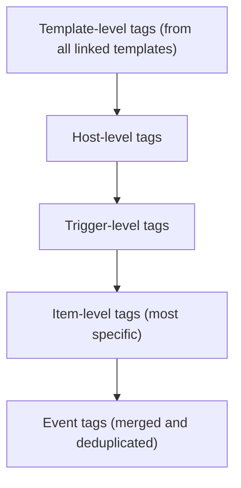

# Working with templates

Templates are one of the most fundamental building blocks in Zabbix. They define
what and how to monitor, and serve as reusable configuration blueprints that can
be applied to any number of hosts. By grouping related items, triggers, graphs,
discovery rules, and macros into a single logical entity, templates make it possible
to standardize and scale monitoring efficiently.

In Zabbix 8.0, the template system has matured significantly. It now uses a monolithic,
self contained design. A deliberate departure from the older inheritance based approach
used in previous versions. This design philosophy makes templates easier to export,
share, and maintain, especially when managing multiple environments or distributing
monitoring logic across teams.

???+ info "Fun fact"

    In earlier releases such as Zabbix 3.0, there were only around 30–40 built-in
    templates available out of the box. In contrast, Zabbix 8.0 ships with hundreds
    of official templates and integrations, covering everything from operating systems
    and databases to cloud platforms and network devices. This dramatic growth
    highlights how Zabbix has evolved into a full-featured monitoring ecosystem
    with native support for nearly any technology stack.

## Template Fundamentals

A template in Zabbix encapsulates all the elements required to monitor a specific
technology or system. This can range from a simple operating system agent to a
complex multi-layer application such as PostgreSQL, VMware, or Kubernetes.

Each template can include:

- **Items:** definitions of data to collect (e.g., system.cpu.load, vfs.fs.size[/,free]).
- **Triggers:** logical expressions that evaluate collected data to identify problem
  conditions.
- **Graphs:** visual representations of collected metrics.
- **Discovery Rules:** automated mechanisms to detect entities (like filesystems
  or interfaces) and dynamically create item prototypes.
- **Value Maps:** mappings that translate raw data into human-readable text.
- **Macros:** reusable variables that make templates configurable and environment
  agnostic.
- **Tags:** metadata used for filtering, correlation, and alert routing.
- **Dashboards:** predefined visualization layouts attached to the template.

Templates are linked to hosts to apply these monitoring definitions. Once linked,
the host immediately inherits all monitoring logic from the template.

## The Monolithic Template Model

Before Zabbix 6.x, templates could be built hierarchically, using inheritance between
parent and child templates. While powerful, this approach often led to dependency
complexity, version mismatches, and export/import challenges.

Starting with Zabbix 6.4 and refined in 7.x, the preferred design is monolithic
templates meaning each template is self contained and does not rely on inheritance.
This makes templates easier to:

- Export and share as standalone YAML files.
- Version control in Git or CI/CD environments.
- Import without dependency conflicts.

Monolithic templates are also simpler to maintain, as all configuration elements
are defined within one object, avoiding the “template chain” problem where one
missing dependency breaks the import process.

### Template UUIDs

Starting with Zabbix 6.2, every configuration entity, including templates, is
assigned a Universally Unique Identifier (UUID). This fundamentally changed how
Zabbix tracks and synchronizes configuration objects across different environments.

#### Purpose of UUIDs

Before UUIDs were introduced, Zabbix relied on template names to identify and match
templates during import/export. This created issues when two templates had identical
names or when renaming templates between environments.

UUIDs solve this problem by providing a persistent, globally unique reference for
each template, independent of its name or internal database ID.

#### Benefits

- **Reliable synchronization:** Imports and updates use the UUID, preventing duplication
  and mismatched merges.
- **Conflict prevention:** Avoids overwriting templates with the same name.
- **Version-control stability:** Git-based workflows can track the same object
  across environments.
- **Improved automation:** APIs and pipelines can safely address templates by UUID
  rather than numeric IDs.

Example YAML template:

```YAML
zabbix_export:
  version: '8.0'
  templates:
    - uuid: a4c1d0f2d7de4a40a8b347afeb9a88df
      template: 'Template OS Rocky Linux'
      groups:
        - name: 'Templates/Operating Systems/Linux'
      items:
        - uuid: f0c1b836c81d4bba9419dc12bce7e411
          name: 'System uptime'
          key: 'system.uptime'
          type: ZABBIX_AGENT

```

???+ info "Behavior and Persistence"

    The UUID remains constant even if the template is renamed or moved between
    groups. However, when a template is cloned or copied, Zabbix generates new
    UUIDs for the template and all of its entities. This ensures the cloned template
    is treated as a distinct object and does not conflict with the original during
    import, export, or API synchronization.

#### What Happens When You Clone a Template

When you clone or copy a template (for example, to customize it), Zabbix creates
a completely new object. All nested entities like items, triggers, discovery rules,
dashboards, etc. will receive new UUIDs.

This means your cloned template is independent:

- It will not overwrite the original during imports.
- It can coexist safely even if it has a similar name.
- It is ideal for creating customized variants of official templates.

???+ info "Best practice"

    Add a suffix or prefix such as (Custom) to distinguish cloned templates and
    document their origin in the template notes like:
    - Origin: Template OS Linux by Zabbix agent
    - Based on UUID: a4c1d0f2d7de4a40a8b347afeb9a88df

## Template Groups

Template groups in Zabbix are used for `organization` and `access control targeting`.
They provide a logical way to categorize templates (for example, Operating Systems,
Databases, Network Devices), but they do not themselves define access rights.

A template group itself does not carry permissions.
Instead, `user groups` are granted `permissions` on `template groups`.
These permissions determine whether members of a user group can view (read-only)
or modify (read-write) the templates contained within those groups when working
in the frontend.

In other words:

- **Template groups:** organize and classify templates.
- **User groups:** hold the permissions that control access to those template groups.

This model provides flexible role based access control (RBAC): administrators can
manage access centrally by assigning or revoking permissions for user groups
rather than editing individual templates.

### Permissions and Access Control

In Zabbix 8.0, access to templates is controlled by a combination of `user roles`
and `usergroup` permissions.

- **Roles** define what actions a user can perform globally. Such as viewing problems,
  acknowledging events, or modifying configuration.
- **User groups:** define which objects the role can act on by granting `Read-only
  (RO)` or `Read-write (RW)` permissions to specific object groups (host groups,
  template groups, map groups, etc.).
- Template groups are simply one of those object groups: a scope to which permissions
  can be applied.

For example, a user role may allow configuration changes, but the user will only
be able to modify templates that belong to template groups where their user group
has RW access.

This separation provides precise control between what actions are allowed and where
they are allowed.

#### Impact of template permissions

Although template group permissions primarily govern configuration access, they
can also influence operational behavior in the frontend. When users view or interact
with problems, their ability to take certain actions depends both on their role
and their permissions for the underlying host or template.

| Action                      | Read-only (RO) | Read-write (RW) |
| :-------------------------- | :------------: | :-------------: |
| Acknowledge problem         |        ✅       |        ✅        |
| Add comment / update status |        ✅       |        ✅        |
| Suppress problem            |        ✅       |        ✅        |
| Change problem severity     |        ❌       |        ✅        |
| Manually close problem      |        ❌       |        ✅        |
| Modify trigger severity     |        ❌       |        ✅        |
| Edit or link templates      |        ❌       |        ✅        |

???+ info ""

    Read-only users can acknowledge or suppress issues but cannot change severity
    or manually close problems.

As an example in Zabbix:

Consider two distinct user groups with different roles and permissions:

- **Operations (RO):** Members can view hosts and problems, acknowledge or suppress
  issues, but cannot change severity levels or modify triggers.
- **Monitoring Admins (RW):** Members can edit templates, adjust trigger logic,
  and manually close problems.

If both groups monitor hosts that use templates from Templates/Applications/Databases:

- **Operations:** can acknowledge and suppress problems as part of daily triage.
- **Monitoring Admins:** can modify or tune the underlying template configuration
  when a systemic issue is detected.

This segregation maintains stability. Operations staff can handle incidents, while
admins manage definitions.

### Permissions and Roles – How Access Really Works

Zabbix enforces permissions through user groups and roles, not through inheritance
between objects. There is no automatic propagation of permissions from template
groups to host groups or between templates and the hosts that use them.

- Roles determine what actions users may perform (view, edit, acknowledge,
  configure, etc.).
- User groups determine where those actions may occur by assigning RO/RW/Deny
  rights on object groups.
- Template groups and host groups are independent targets. A user with RW access
  to a host group does not automatically gain rights to the related template group,
  and vice versa.

This clear separation ensures operational access (hosts) and configuration access
(templates) remain distinct, preventing unintended modifications.

???+ note

    Roles (user, admin and super admin) define what you can do.
    Usergroup permissions define where you can do it.

### Best Practices for Permissions

- **Separate operational and design access:** Grant RO rights to operations teams
  for monitoring, and RW rights to administrators maintaining templates.
- **Align permissions logically:** If a user group manages database hosts, grant
  them RW access to both the relevant host groups and the corresponding `Templates/Databases`
  group.
- **Review permissions regularly:** Periodically audit usergroup assignments to
  ensure only authorized teams have configuration privileges.
- **Use clear naming conventions for groups:** Distinguish functional scopes (Templates/OS/Linux)
  from organizational ones (Templates/Customers/Prod). This improves clarity when
  assigning permissions in large environments.

### Template Subgroups

Zabbix 3.2 introduced nested template groups (subgroups), enabling a hierarchical
structure similar to host groups. Subgroups allow administrators to build organized,
multi-level collections of templates, which improves navigation and permission
granularity.

Example hierarchy:

```text
Templates
├── Operating Systems
│   ├── Linux
│   ├── Windows
│   └── Network Appliances
└── Applications
    ├── Databases
    │   ├── PostgreSQL
    │   ├── MySQL
    │   └── Oracle
    └── Web Servers
```

- **Hierarchy for organization and permissions only:** Subgroups do not change how
  templates link to hosts; they are purely structural.
- **Automatic downward inheritance:** If a user group has RW or RO access to a
  parent template group, that access automatically extends to all its existing
  subgroups. You can still assign explicit permissions on individual subgroups
  to override inherited rights.
- **Parent-creation edge case:** When you create a new parent group for an already
  existing subgroup (for example, creating Applications when Applications/Databases
  already exists), no permissions are automatically assigned to the new parent.
  Administrators must manually grant permissions on the parent group if required.
- **Search and filtering benefits:** The hierarchical view makes it easier to locate
  and manage templates in large environments.
- **Consistency with host groups:** Subgroup behavior and inheritance are identical
  for host groups and template groups, providing a uniform organizational model.

???+ tip

    Use top-level groups for broad classifications (e.g., Templates/Applications)
    and subgroups for vendor or technology specialization. Assign RW rights at
    the top level for global administrators, and finer-grained access on subgroups
    for specialized teams.

## Tags

Tags are metadata elements used throughout Zabbix for event classification, filtering,
correlation, and alert routing. They attach semantic meaning to triggers, items,
or templates, helping to describe what the metric or event represents.

### Purpose of Tags

- **Event correlation:** tags are used by the event correlation engine to match
  or suppress related problems.
- **Alerting and automation:** tags appear in actions, allowing conditional notifications
  or escalations.
- **Service mapping:** tags link triggers and events to defined business services.
- **Filtering:** dashboards, reports, and API queries can filter by tag values.

### Examples

For a PostgreSQL database template:
```yaml
service: database
component: backend
```

For a network device template:
```yaml
vendor: cisco
interface: uplink
```

### Some good practices to consider

- Use consistent naming for tag keys across templates (e.g., service, component,
  role).
- Avoid over tagging; focus on attributes useful for filtering or alerting.
- Use lower case, underscore separated keys for uniformity.

### Tag Inheritance and Merging Behavior

When templates are linked to hosts and hosts or items already define their own
tags — Zabbix merges all tag sources into a single event level tag set.
Understanding this inheritance order is crucial for predictable alerting and correlation.



Interpretation:

Zabbix merges tags from top to bottom.
Template level tags are the most general, while item level tags are the most specific.
All resulting tags flow into the generated event.

**Inheritance Order explained:**

1. Item-level tags → applied directly to collected metrics (most specific).
2. Trigger-level tags → apply to problems generated by the trigger.
3. Host-level tags → inherited by all items and triggers on that host.
4. Template-level tags → base tags from all linked templates.

The final event inherits all tags from these levels, with duplicates automatically
removed.

#### Conflict Handling**

- If the same tag key appears multiple times with different values, all values are
  kept.
- Duplicate key–value pairs are deduplicated.
- Tags are additive, not overridden. Unlinking or clearing a template removes only
  that template’s tags from future events.

**Example :**

| Source                  | Tag Key     | Tag Value     |
| :---------------------- | :---------- | :------------ |
| Template OS Linux       | `service`   | `os`          |
| Template App PostgreSQL | `service`   | `database`    |
| Host                    | `region`    | `europe`      |
| Item                    | `component` | `replication` |


The resulting event tags will be:
```yaml
service: os
service: database
region: europe
component: replication
```

#### Some good practices when tagging

- Keep template level tags generic (e.g., service: database).
- Use host level tags for environmental context (e.g., region: europe, customer:
  acme).
- Apply item/trigger-level tags for event specificity (component: disk, component:
  replication).
- Regularly audit merged event tags under Monitoring → Problems → Tags to verify
  inheritance behavior.

## Template macros

Macros are variables that make templates flexible and reusable. They define thresholds, credentials, or paths that can be adjusted per environment without editing template logic.

Example:

```bash
{$CPU_UTIL_MAX}=90
{$MEMORY_WARN}=75
```
Macros can be defined globally, at the template level, host-group level, or host level, and can be overridden according to a strict precedence order.

5.1 Macro Precedence and Conflict Resolution

When multiple templates linked to the same host define the same macro, Zabbix resolves conflicts by comparing template IDs.

✅ The macro from the template with the lowest templateid takes precedence.

Example
| Template Name           | Template ID | Macro             | Value |
| :---------------------- | :---------- | :---------------- | :---- |
| Template OS Linux       | 10101       | `{$CPU_UTIL_MAX}` | 85    |
| Template App PostgreSQL | 10115       | `{$CPU_UTIL_MAX}` | 90    |

→ The oldest template (lowest ID) wins → {$CPU_UTIL_MAX}=85.

Precedence Hierarchy
| Level             | Description                          | Notes                       |
| :---------------- | :----------------------------------- | :-------------------------- |
| 1. Host macro     | Defined on host                      | Highest priority            |
| 2. Template macro | Lowest template ID wins if duplicate | Applies to linked templates |
| 3. Global macro   | Default fallback                     | Lowest priority             |

Best Practices

Keep macro names unique within template families.

Use host-level overrides for environment-specific adjustments.

Document shared macros to prevent conflicts.


