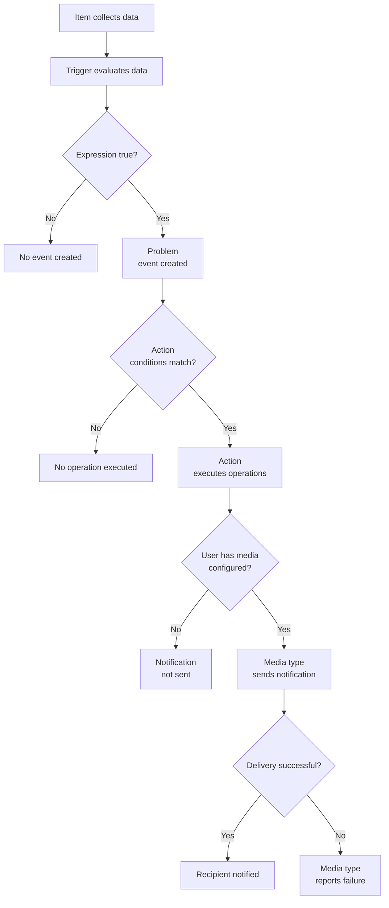

# Sending out alerts with Zabbix

After delving into templates, it's time to **return to the data flow** and bring
everything together by exploring integrations with powerful external services.
In this chapter, we’ll **complete the data flow journey**, showing how to extend
Zabbix capabilities through seamless connections with third-party tools
and platforms.

Knowing that something is wrong is only useful if the right person finds out in
time to act. Zabbix collects data continuously and evaluates it against trigger
expressions, but detection alone does not constitute alerting. Getting a problem
from detection to notification requires three components working in sequence:
actions, media types, and user media configuration.

Individually, each of these features is straightforward. Actions define the
conditions under which Zabbix should react and what operations to perform. Media
types define the delivery channel — email, SMS, a webhook to an external system,
or a custom script. User media configuration connects a specific user to a specific
media type, providing the address or endpoint that Zabbix should use to reach them.

Together, they form the alerting pipeline of Zabbix.

## The alerting pipeline

A complete alert follows a defined path through the system:

1. An item collects data
2. A trigger evaluates the data against an expression
3. A problem event is created when the expression evaluates to true
4. An action matches the event against its conditions and executes its operations
5. A media type delivers the notification to the configured recipient

Every step in this chain must be correctly configured for an alert to reach its
destination. A failure or misconfiguration at any point silently breaks the chain.

## Where alerting problems come from

In production environments, alerting failures are rarely caused by a single
obvious misconfiguration. They almost always come from a gap in the pipeline: a
link between two components that was never established or that broke silently after
a configuration change.

The most common gaps are: triggers that fire but match no action, because the
action conditions are too narrow or target the wrong host group; actions that
execute but reach no user, because no user is assigned to the relevant user group;
users who exist in the right group but have no media configured for their account;
and media types that are correctly configured in Zabbix but fail at the delivery
layer because of an external dependency such as an SMTP relay, a webhook endpoint,
or a script that returns an unexpected exit code.

Understanding the full pipeline makes troubleshooting significantly faster. When
an alert does not arrive, you can walk the chain from trigger to media type and
identify exactly which link is broken, rather than rechecking every component
from scratch.

## Designing reliable alerting

Reliable alerting is not only about sending messages when something goes wrong. It
requires that trigger definitions are precise enough to signal real problems without
generating noise, that actions are scoped to the right hosts and severities so that
the right teams receive the right alerts, that every user who is expected to receive
notifications has media correctly configured on their account, and that the delivery
channels themselves are tested and monitored.

In larger environments this also means defining escalation policies — what happens
if the first notification is not acknowledged within a given time — routing alerts
by severity so that informational events do not page an on-call engineer, and
integrating with external systems such as ticketing platforms or incident management
tools through custom alert scripts or webhooks.

## What this part of the book covers

This chapter covers each component of the alerting pipeline in isolation and
brings them together by showing how a problem event travels from
detection to notification, what can break at each stage, and how to verify that
the full chain is working correctly.

**Actions** covered how to define conditions, operations, and escalation steps so
that Zabbix responds to the right events in the right way.

**Media types** covered the built-in delivery channels — email, SMS, and webhooks —
as well as custom alert scripts for integrations that Zabbix does not support
natively.

**Custom alert scripts** covered how to write and deploy scripts that Zabbix calls
as a media type, giving you full control over the notification delivery mechanism.

By combining a precise trigger, a well-scoped action, a working media type, and
correctly configured user media, you have a complete and testable alerting pipeline.
When any of those elements is missing or misconfigured, Zabbix cannot close the
chain, and the problem will go unnoticed.
