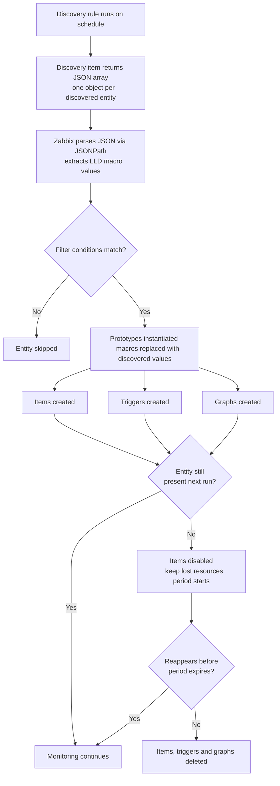

# Using Low level discovery to automate

Monitoring a static infrastructure is straightforward: you know your hosts, you
know your interfaces, and you create items manually. The moment your environment
becomes dynamic, virtual machines being provisioned and decommissioned, containers
starting and stopping, disk volumes being added, manual configuration becomes a
liability. Items go missing. New entities go unmonitored. Templates drift out of
sync with reality.

Low-Level Discovery (LLD) solves this by letting Zabbix automatically detect
entities in your environment and create the corresponding items, triggers, and
graphs from predefined prototypes.

## How LLD works

Every LLD rule starts with a discovery item: a check that runs on a schedule and
returns a JSON array. Each element in that array represents one discovered entity —
a filesystem, a network interface, a Windows service, or anything else your
environment exposes. Zabbix parses the JSON, extracts the values using JSONPath
expressions, and uses those values to instantiate items, triggers, and graphs from
the prototypes you defined.

The discovered values are made available inside prototypes as LLD macros. These
macros follow the format `{#MACRO_NAME}` and are replaced with the actual discovered
value at instantiation time. For example, a network interface discovery rule might
return a macro `{#IFNAME}` with values such as `eth0` or `ens3`. A prototype item
with the key `net.if.in[{#IFNAME}]` becomes `net.if.in[eth0]` and
`net.if.in[ens3]` automatically.

## The two categories of LLD

Zabbix ships with a set of built-in discovery rules that cover the most common use
cases. These rely on native Zabbix agent checks and require no scripting:

- Filesystem discovery (`vfs.fs.discovery`)
- Network interface discovery (`net.if.discovery`)
- CPU and CPU core discovery
- Windows service discovery
- Systemd service discovery
- JMX object discovery (via the Zabbix Java gateway)
- SNMP OID discovery

Beyond the built-in rules, Zabbix supports custom discovery using any external
data source. The only technical requirement is that the discovery item returns
valid JSON containing an array of objects. The source can be a shell script, a
Python or Go binary, an HTTP agent check querying an API, or any other mechanism
that can produce JSON. This is the basis for custom LLD.

## What gets created

For each entity returned by a discovery rule, Zabbix can create four types of
objects from prototypes:

- Item prototypes, which become regular items
- Trigger prototypes, which become regular triggers
- Graph prototypes, which become regular graphs
- Host prototypes, which become regular hosts (used with network discovery)

Prototypes are configured on the template or host in the Zabbix frontend, under
the discovery rule. They look and behave like their non-prototype equivalents,
with the addition of LLD macros as placeholders.

## Filtering discovered entities

Not every entity returned by a discovery rule is worth monitoring. The loopback
interface `lo` is rarely useful to track, certain temporary filesystem mount points
should be excluded, and in large environments you may only want to discover services
matching a specific naming pattern.

LLD rules include a filter mechanism for exactly this purpose. Filters are evaluated
against the LLD macro values returned by the discovery item before any prototypes
are instantiated. Only entities whose macro values match the filter conditions
proceed to the creation phase. Filters support regular expressions and can be
combined using AND or AND/OR logic, giving you fine-grained control over which
entities Zabbix acts on.

Filters are the correct place to exclude unwanted entities. Trying to handle this
in the discovery script itself is possible but couples exclusion logic to the
script rather than to the Zabbix configuration, which makes it harder to adjust
without redeploying the script.

Filtering is one of the most important mechanisms for controlling scale.
Without proper filtering, discovery rules may create unnecessary items,
increasing load on the system without adding value.

## Overrides

In some environments, discovered entities are not homogeneous. You may want to
monitor all network interfaces but collect traffic data at a shorter interval for
uplinks than for regular access ports. Or you may want to disable certain trigger
prototypes for a subset of discovered filesystems, such as read-only media, without
creating a separate discovery rule.

Overrides allow you to apply different prototype behavior per entity based on
conditions evaluated against the discovered LLD macro values. Within a single
discovery rule you can, for example, set a different item update interval, change
a trigger severity, or suppress prototype creation entirely for entities that
match a given pattern. Overrides were introduced in Zabbix 4.2 and are configured
directly on the discovery rule in the frontend.

The practical benefit is that a single discovery rule with a few overrides can
replace what would otherwise require multiple rules with duplicated prototypes.
The detailed configuration of overrides is covered in the chapters where they are
most relevant.

## Lifecycle of discovered entities

LLD rules run on a configurable schedule. Each time a rule runs, Zabbix compares
the returned JSON with what was previously discovered. New entities are instantiated
from the prototypes. Entities that were previously discovered but are no longer
present in the JSON output enter a lost state.

What happens to lost entities is controlled by the **keep lost resources period**
setting on the discovery rule. During this period the corresponding items, triggers,
and graphs remain in place but the items are disabled, meaning no new data is
collected. If the entity reappears before the period expires, the items are
re-enabled automatically and monitoring resumes without any manual intervention.

If the entity does not reappear within the keep lost resources period, Zabbix
deletes the items, triggers, and graphs that were created for it. Setting this
period to zero causes immediate deletion the next time the discovery rule runs and
the entity is absent, which is almost never the right choice in production
environments because transient unavailability of a host or service will cause
discovered objects to be destroyed and recreated repeatedly.

A reasonable starting value for most environments is one to seven days, depending
on how frequently your infrastructure changes and how much history you want to
retain for decommissioned entities.

## What this part of the book covers

The following chapters work through each category of LLD in detail.

**Custom LLD** covers writing your own discovery scripts, structuring the JSON
output correctly, and using the results to monitor application-specific entities
that Zabbix has no built-in check for.

**Dependent LLD** covers how to setup LLD with dependent items in Zabbix.

**Built-in LLD** covers the native agent-based discovery rules for filesystems,
network interfaces, CPUs, and services, and shows how to configure prototypes,
filters, and overrides against them.

**SNMP LLD** covers discovery using SNMP OID walks, which is the primary mechanism
for monitoring network equipment such as switches and routers.

**Windows LLD** covers service discovery and WMI-based discovery on Windows hosts.

By the end of this part you will be able to build discovery rules for any entity
in your infrastructure, configure filters to control what gets monitored, apply
overrides to handle heterogeneous environments, and manage the lifecycle of
discovered objects as your infrastructure evolves.
