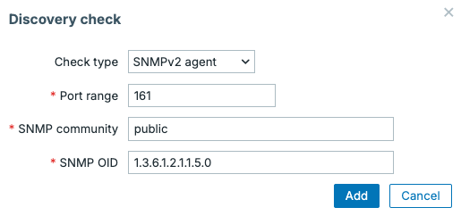
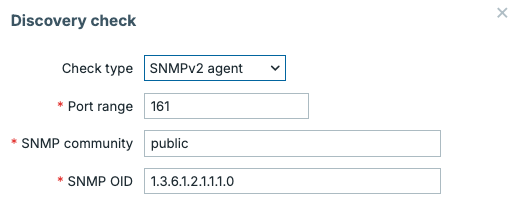
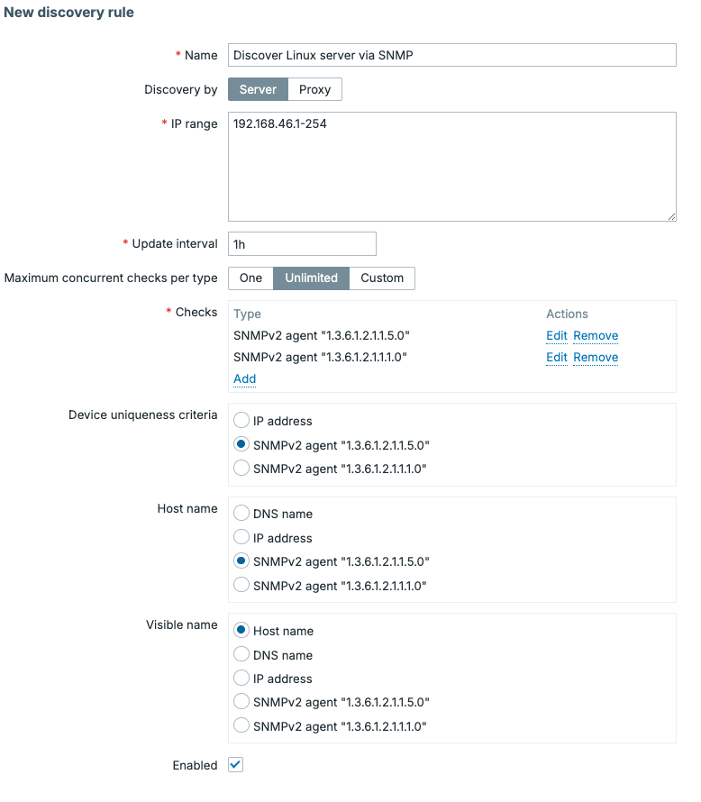
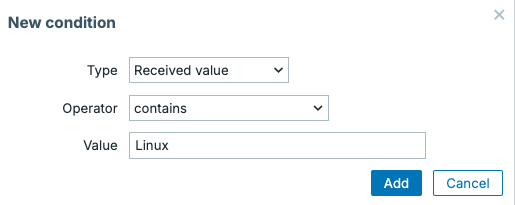
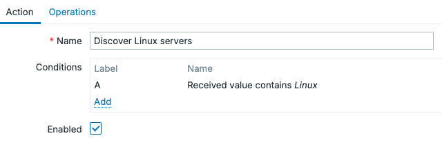
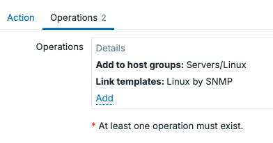
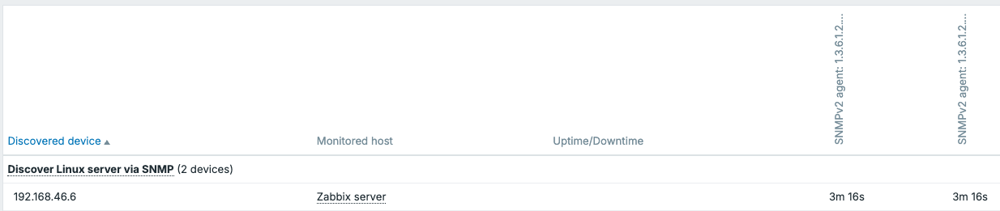

# Automating adding hosts with network discovery

In this chapter, we'll explore one of the more useful automation features included in Zabbix called **network discovery**. This feature allows Zabbix to do port scans to actively scan networks for new devices, making it an excellent solution for environments where hosts appear and disappear regularly.

Once a device has been discovered, Zabbix can automatically execute discovery actions, creating hosts, assigning templates, placing them into host groups, and adding tags. Specifically for Zabbix agent and SNMP type of checks, we can even execute the discovery actions based on real data collected. For example using the system name, description or other information to automatically assign host groups, tags and even templates.

## Understanding network discovery

Before configuring network discovery, it is important to understand how it differs from active agent autoregistration, which we will discuss in the next part of the book.

Active agent autoregistration is only used for Zabbix agents in Active mode. In an Active agent autoregistration setup it's the Zabbix agent that contacts the server and provides the required data to create a host in Zabbix.

Network discovery works the other way around.

Instead of waiting for a device to contact Zabbix, the Zabbix server or proxy actively scans one or more IP ranges, kind of like a port scan with nmap, looking for devices. Once devices are found, data can be sent to discovery actions to create hosts.

Zabbix does this by generating a discovery event. In our discovery actions that event its data can be matched against the configured discovery actions conditions.

This makes network discovery especially useful for monitoring:

- Network equipment through SNMP
- Printers
- Legacy systems
- Appliances
- Systems where installing a Zabbix agent is not possible


## Creating a discovery rule

Let's create our first network discovery rule.

Navigate to `Data collection` | `Discovery`, then click on `Create discovery rule`.

Give the discovery rule a descriptive name, like `Discover Linux server via SNMP`.

Next, configure the IP range you would like to scan.

For example:

```text
192.168.46.1-254
```

It is also possible to add multiple ranges:

```text
192.168.46.1-254,
192.168.47.1-254
```

Now we need to configure our discovery checks. In our example, we will be going to discover Linux servers via SNMP. I want the hostname to be the same as the servers configured hostname. I also want to know if the server is actually a Linux server. Therefore we will use two OIDs:

- 1.3.6.1.2.1.1.5.0 = System hostname
- 1.3.6.1.2.1.1.1.0 = System description

Adding those checks will looks like this.

{ align=center }

*10.1 Network discovery rule check hostname*

{ align=center }

*10.2 Network discovery rule check description*

Our Linux servers in the IP range 192.168.46.1-254 will only be discovered when these checks succeeds.

We also need to configure an update interval, which determines how often Zabbix will scan all the IP addresses in the the configured IP range.

!!! note

    Please keep in mind that the larger the IP range(s), the longer Zabbix needs to
    scan each IP address in the range. The update interval needs to happen less often than it takes
    to run the entire scan. Also keep in mind that continuously scanning large networks can
    generate unwanted network traffic.

With everything set our discovery rule now looks like the image below.

{ align=center }

*10.3 Creating a network discovery rule*


## Creating discovery actions

With the network discovery rule created, we have done only half of the process. For hosts to be created, we still need to add discovery actions.

Navigate to `Alerts` | `Actions` | `Discovery actions`, then click on `Create action`.

Autoregistration actions, discovery actions and even trigger actions are all very alike. They consist of conditions and operations.

With our discovery rule receiving the OID `1.3.6.1.2.1.1.1.0`, we have a great value to check if the host is actually running like. With it we can create the following conditions.

{ align=center }

*10.4 Network discovery action condition*

Added that looks like the following.


{ align=center }

*10.5 Network discovery action conditions*

When the conditions are met, we can then set up the operations to.

- Add host to `Servers/Linux`
- Link the `Linux by SNMP` template

{ align=center }

*10.6 Network discovery action operations*

## Checking the discovered hosts

Once discovery is running, we can check our discovered devices easily under `Monitoring` | `Discovery`. On this page you will find any discovered devices in the IP range, as well as their linked host, if any was created.

{ align=center }

*10.7 Network discovery monitoring*

## Discovery by proxies

One major advantage of network discovery is that discovery rules can be executed by either the Zabbix server or the Zabbix proxies.

Instead of requiring the central Zabbix server to scan remote networks, a proxy can perform the scans locally. This way we can make sure to only allow discovery from the correct network segments.

!!! note

    Please keep in mind that many security departements or external security companies see
    Zabbix network discovery as an nmap like port scan. This could trigger an alert on their side, as they
    see the traffic pattern happen. Make sure they know what you are doing, so they can create
    an exception in their alerting patterns.


## Conclusion

Network discovery is a powerful automation feature that allows Zabbix to create hosts automatically by actively scanning your network. Discovered hosts can immediately be added to the correct host groups, templates, and become part of your monitoring environment with minimal manual setup.

While active agent autoregistration is ideal for servers running the Zabbix agent, network discovery is great at finding devices such as switches, printers, routers, and other appliances where installing a Zabbix agent is either impossible or not desired.


## Questions

- What is the difference between network discovery and active agent
  autoregistration?
- Which discovery checks are available in Zabbix?
- Why is it recommended to use Zabbix proxies for network discovery in remote
  locations?
- What are some best practices when configuring network discovery?

## Useful URLs

- https://www.zabbix.com/documentation/current/en/manual/discovery/network_discovery