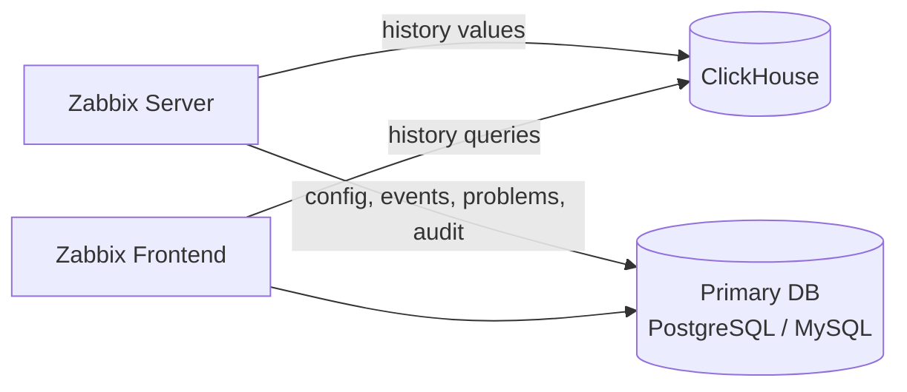

# Storing history data in Clickhouse

Beginning with Zabbix 8, ClickHouse can be used as an external storage backend
for item history. Configuration, events, problems, audit data, and other
operational data remain in the primary PostgreSQL or MySQL database.

When an item value type is stored in ClickHouse, Zabbix does not calculate or
store trend data for that history. Long-term graphing therefore depends on retaining
sufficient raw history in ClickHouse.

For environments collecting large volumes of monitoring data, this architecture
significantly reduces load on the primary database and improves overall scalability.

In this chapter, you will install ClickHouse and configure it for use with
Zabbix 8, import the required history schema, and verify that Zabbix is successfully
storing history in ClickHouse.

---

## What Moves to ClickHouse ...  and What Doesn't

ClickHouse stores the raw item history values for the value types assigned
to the ClickHouse history provider:

- Numeric unsigned
- Numeric floating point
- Character
- Log
- Text
- JSON

The following data remains in the primary PostgreSQL or MySQL database:

- Configuration data
- Events and problems
- Audit log
- Users, sessions, actions, and operational tables
- History value types that were not assigned to ClickHouse

!!! warning "Trends are not generated"
    
    Zabbix does not calculate or store trends for history value types stored
    in ClickHouse. 
 
    This means that long-term graphs cannot fall back to hourly
    trend data after the raw history has expired. Configure a sufficiently long
    ClickHouse TTL for the period that must remain available for graphs,
    reports, and historical analysis.



_13.13 Zabbix ClickHouse history storage architecture_

With that distinction in mind, let's set up the backend.

---

## Lab Environment

The examples in this chapter were tested using:

* Rocky Linux 9 and openSUSE Leap 16.0
* ClickHouse 26.6.1.1193
* Zabbix 8

but should work with any recent Red Hat or SUSE derivative.

---

## Installing ClickHouse

Begin by installing the official ClickHouse repository and packages.

!!! info "Installing ClickHouse"

    Red Hat
    ```bash
    dnf install -y dnf-plugins-core
    dnf config-manager --add-repo https://packages.clickhouse.com/rpm/clickhouse.repo
    dnf install -y clickhouse-server clickhouse-client
    ```

    SUSE
    ```bash
    zypper addrepo --refresh --gpgcheck https://packages.clickhouse.com/rpm/clickhouse.repo
    zypper --gpg-auto-import-keys refresh clickhouse-stable
    zypper install clickhouse-server clickhouse-client
    ```

Before starting ClickHouse, we need to tune the system for optimal performance.

1. **Hugepages**
   Clickhouse does not use hugepages and requires it to be disabled. 
   On SUSE, transparent hugepages are enabled by default. 
   
   You can check the current status with:

   ```shell-session
   cat /sys/kernel/mm/transparent_hugepage/enabled
   ```
   You will see something like:

   ```text
   [always] madvise never
   ```
   The value in brackets indicates the current setting. If it is set to `always`,
   you need to set it to `madvise` or to `never`.

   To disable it, edit `/etc/default/grub` and add the `transparent_hugepage=never`
   parameter at the end of the `GRUB_CMDLINE_LINUX_DEFAULT` variable:

   ```ini
   GRUB_CMDLINE_LINUX_DEFAULT="... transparent_hugepage=never"
   ```

   Then update the grub configuration and reboot the system:

   ```bash
   grub2-mkconfig -o /boot/grub2/grub.cfg
   reboot
   ```

2. **Delay accounting**
   ClickHouse requires Kernel delay accounting to be enabled. On SUSE, delay
   accounting is disabled by default. You can check the current status with:

   ```bash
   cat /sys/kernel/debug/delayacct
   ```
   If it displays `0`, it is disabled and you need to enable it.

   Create a new file `/etc/sysctl.conf.d/99-clickhouse.conf` and add the following line:

   ```ini
    # Enable delay accounting
    kernel.task_delayacct = 1
    ```
    
    Then apply the changes:
    
    ```bash
    sysctl -p /etc/sysctl.conf.d/99-clickhouse.conf
    ```

3. **Number of threads**
   ClickHouse is a multi-threaded application and requires a sufficient number
   of threads to be available. On SUSE, the default max. number of threads is 15574
   however, ClickHouse requires at least 30000.
   To ensure that the ClickHouse-server service has enough threads, create a 
   new systemd override file:

   ```bash
   systemctl edit clickhouse-server
   ```
   and add the following lines:

   ```ini
   [Service]
   LimitNPROC=30000
   ```

Enable the ClickHouse service so it starts automatically at boot.

!!! info "Enabling ClickHouse service"

    ```bash
    systemctl enable clickhouse-server
    systemctl start clickhouse-server
    ```
    Note: On Red Hat and SUSE 15, the above commands work as expected. However, on
    SUSE 16, the helper script `systemd-sysv-install` is not available as SysV init
    compatibility is removed on that platform. This will cause `systemctl enable
    clickhouse-server` to fail. Therefore we need to use the full path to the systemd
    service file to ignore the SysV init script and enable the systemd service directly:

    ```bash
    systemctl enable /lib/systemd/system/clickhouse-server.service
    ```

    This will probably be fixed in a future SUSE release as from SystemD 260,
    SysV init compatibility will also be removed from systemd itself, but for
    now Suse ships SystemD 257.

Verify that the service is running before continuing.

!!! info "Verifying ClickHouse service"

    ```bash
    systemctl status clickhouse-server
    ```
---

## Configuring ClickHouse

By default, ClickHouse only listens on the loopback interface. That's fine when
Zabbix and ClickHouse run on the same host, but many environments use a dedicated
ClickHouse server or cluster instead.

!!! info "Configuring ClickHouse to listen on all interfaces"

    Create the following configuration file:
    `/etc/clickhouse-server/config.d/listen.xml`

    ```xml
    <clickhouse>
        <listen_host>0.0.0.0</listen_host>
    </clickhouse>
    ```

    Reload the configuration by restarting ClickHouse.

    ```bash
    systemctl restart clickhouse-server
    ```
---

## Correcting Filesystem Permissions

ClickHouse needs write access to its data directory. Incorrect ownership or SELinux
contexts are a common source of startup failures or permission errors during database
creation.

Ensure the directory has the correct ownership and permissions.

!!! info "Correcting ClickHouse data directory permissions"

    ```bash
    chown -R clickhouse:clickhouse /var/lib/clickhouse
    chmod 0750 /var/lib/clickhouse
    restorecon -Rv /var/lib/clickhouse
    ```

---

## Creating the Database

Connect to ClickHouse:

!!! info "Connecting to ClickHouse"

    ```bash
    clickhouse-client
    ```

Create the Zabbix database:

!!! info "Creating the Zabbix database"

    ```sql
    CREATE DATABASE zabbix;
    ```

---

## Creating the Zabbix User

Create a dedicated database user for Zabbix:

!!! info "Creating the Zabbix user"

    ```sql
    CREATE USER zabbix
    IDENTIFIED WITH sha256_password
    BY 'zabbix';
    ```

Grant the required privileges:

!!! info "Granting privileges"

    ```sql
    GRANT CREATE, ALTER, DROP, INSERT, SELECT, UPDATE, OPTIMIZE
    ON zabbix.* TO zabbix;
    ```

Exit the client and verify connectivity over HTTP:

!!! info "Verifying HTTP connectivity"

    ```bash
    curl -u zabbix:zabbix \
    "http://127.0.0.1:8123/?database=zabbix&query=SELECT%201"
    ```

The command should return:

!!! example "Expected output"

    ```text
    1
    ```

This confirms the HTTP interface is working and the user has sufficient permissions.

---

## Importing the Zabbix History Schema

The Zabbix package `zabbix-sql-scripts` contains helper scripts that automatically create
the required ClickHouse tables. Refer to [Chapter 0 - Getting Started: Preparing the system for Zabbix](../ch00-getting-started/preparation.md#install-the-zabbix-repository)
to install the Zabbix repository and then install the `zabbix-sql-scripts` package.

Navigate to the ClickHouse database scripts:

!!! info "Importing the Zabbix history schema"

    Navigate to the directory containing the ClickHouse schema scripts installed
    by the `zabbix-sql-scripts` package:

    ```bash
    cd /usr/share/zabbix/sql-scripts/clickhouse
    ```

    Execute each schema script:

    ```bash
    ./history_schema.sh \
        --server http://127.0.0.1:8123 \
        --db zabbix \
        --user zabbix \
        --password zabbix
    ```

    Repeat the process for the remaining history types:

    ``` bash
    history_uint_schema.sh
    history_str_schema.sh
    history_text_schema.sh
    history_log_schema.sh
    history_json_schema.sh
    ```
    You can also use `history_all.sh` instead of running the script one by one.

Once complete, ClickHouse will contain a separate table for every supported Zabbix
history value type.

---

## Configuring Retention and Partitioning

The schema generation scripts let you customize both data retention and partitioning
at creation time.

### Configuring Retention (TTL)

Each history table includes a Time-To-Live (TTL) expression that automatically
removes old history data. By default, the scripts retain history for 31
days (2,678,400 seconds).

!!! info "Setting a custom retention period"

    To retain history for 90 days instead, specify this extra parameter to the
    scripts:

    ```bash
    --ttl 7776000
    ```

    The generated table will include:

    ```sql
    TTL clock_ns + toIntervalSecond(7776000)
    ```

Unlike traditional databases, ClickHouse removes expired data automatically during
background merge operations, there's no housekeeping job to schedule or monitor.

### Choosing a Partitioning Strategy

The default partitioning strategy creates one partition per day:

!!! info "Daily partitions"

    ```bash
    --partition toDate
    ```

Daily partitions work well for smaller installations, but can result in a very
large number of partitions over time. Larger environments generally benefit
from monthly partitions instead:

!!! info "Monthly partitions"

    Add this extra parameter to the schema generation scripts:
    ```bash
    --partition toYYYYMM
    ```

    This produces tables similar to:

    ```sql
    ENGINE = MergeTree
    PARTITION BY toYYYYMM(clock_ns)
    PRIMARY KEY (itemid, clock_ns)
    ORDER BY (itemid, clock_ns)
    TTL clock_ns + toIntervalSecond(7776000)
    ```

Monthly partitions typically strike the best balance between:

* partition count
* merge efficiency
* retention management
* query performance

For most production deployments, monthly partitions combined with an appropriate
TTL are recommended.

!!! eample "Importing the history schema with a 90-day retention and monthly partitions"

    ```bash
    ./history_uint_schema.sh \
        --server http://127.0.0.1:8123 \
        --db zabbix \
        --user zabbix \
        --password zabbix \
        --ttl 7776000 \
        --partition toYYYYMM
    ```

---

## Configuring Zabbix

Create the Zabbix server configuration file:

`/etc/zabbix/zabbix_server.conf.d/clickhouse.conf`

!!! info "Zabbix server configuration"

    Configure ClickHouse as the history provider:

    ```ini
    HistoryProvider=clickhouse;value_types="uint,dbl,str,log,text,json",url=http://127.0.0.1:8123,db=zabbix,username=zabbix,password="zabbix"
    ```

    When using ClickHouse 26.6 or another version newer than officially supported,
    also set:

    ```ini
    AllowUnsupportedDBVersions=1
    ```

Save the configuration file.

---

## Verifying the Configuration

Before restarting the server, validate the configuration:

!!! info "Validating the configuration"

    ```bash
    zabbix_server -T
    ```

If the configuration test passes, restart the Zabbix server:

!!! info "Restarting the Zabbix server"

    ```bash
    systemctl restart zabbix-server
    ```

Monitor the log:

!!! info "Monitoring the Zabbix server log"

    ```bash
    tail -f /var/log/zabbix/zabbix_server.log
    ```

A successful connection produces output similar to:

!!! example "Successful connection to ClickHouse"

    ```bash
    retrieving history provider "clickhouse" information
    history provider "clickhouse" version "26.6.1.1193"
    ```

At this point, newly collected history values are being written directly
to ClickHouse.

---

## Verifying ClickHouse

A few simple commands confirm that ClickHouse is functioning correctly.

Check the installed version:

!!! info "Checking the ClickHouse version"
    ```bash
    clickhouse-client --query "SELECT version()"
    ```

Verify that the HTTP interface is operational:

!!! info "Verifying the HTTP interface"

    ```bash
    curl http://127.0.0.1:8123/ping
    ```

    Expected output:

    ```bash
    Ok.
    ```

List the imported tables:

!!! info "Listing the ClickHouse tables"

    Connect to ClickHouse using `clickhouse-client` and run:

    ```sql
    USE zabbix;
    SHOW TABLES;
    ```

    Expected output:

    ```bash
    history
    history_uint
    history_str
    history_text
    history_log
    history_json
    ```

If all six tables are present and Zabbix reports a successful connection, the
history backend is correctly configured.

---

## Frontend

In our frontend file `zabbix.conf.php` we also need to make some changes so that
the frontend knows where to find the history data.

!!! warning "Restart PHP-FPM or Apache"

    Restart PHP-FPM or Apache after modifying zabbix.conf.php if configuration
    caching is enabled.`

!!! info "Zabbix frontend configuration"

    Add the following to your `zabbix.conf.php` file:

    ```php
    $HISTORY_PROVIDERS[] = [
        'types' => ['uint', 'dbl', 'str', 'log', 'text', 'json'],
        'provider' => 'clickhouse',
        'url' => 'http://127.0.0.1:8123',
        'db' => 'zabbix',
        'username' => 'zabbix',
        'password' => 'zabbix'
    ];
    ```

???+ note

    ClickHouse history storage is supported by the Zabbix server only.
    It cannot be configured as the local database or history backend of a
    Zabbix proxy.

---

### Important limitations

- Binary history values are not supported by ClickHouse.
- JSON arrays cannot be stored as JSON item values.
- Data stored in ClickHouse is not managed by the Zabbix housekeeper. Retention
  must be configured using ClickHouse TTL policies.
- Both the Zabbix server and the frontend must be able to connect to the ClickHouse
  server.
- Trend functions are unavailable for value types stored in ClickHouse.

---

## Backups

It's worth treating ClickHouse's backup strategy as a separate decision from your
primary database's backup strategy, rather than assuming they should mirror each
other.

For many organizations, raw history data is effectively disposable: it's valuable
for troubleshooting and short-term analysis, but it isn't the system of record
for configuration or for the current state of problems, that all lives in the
primary database, which still needs rigorous, tested backups. Depending on your
retention requirements and risk tolerance, ClickHouse history may warrant a
lighter-weight approach, such as periodic snapshots or simply relying on TTL-based
expiry and re-collection, rather than the same RPO/RTO targets you'd apply to
PostgreSQL or MySQL.

If you do need durable ClickHouse backups, for example, to satisfy a compliance
requirement around historical data retention — tools like `clickhouse-backup` can
perform consistent backups of MergeTree tables without stopping the server. Weigh
this against your actual retention needs before adding the operational overhead.

---

## Looking Ahead: Clusters and High Availability

This chapter covers a single-node ClickHouse instance, which is sufficient for many
lab and small production environments. For larger or high-availability deployments,
ClickHouse supports clustering through **ClickHouse Keeper** (for coordination),
**ReplicatedMergeTree** tables (for data redundancy across nodes), and **distributed
tables** (to query across shards transparently).

---

## Troubleshooting

### Frontend Shows Empty History

If graphs or Latest data do not display history after enabling ClickHouse:

- verify the `$HISTORY_PROVIDERS` configuration in `zabbix.conf.php`
- verify the frontend can reach the ClickHouse HTTP endpoint
- confirm that new history is being written to the ClickHouse tables

### ClickHouse Cannot Create Tables — Permission Denied

If ClickHouse reports a permission error such as:

``` bash
Permission denied
```

verify the ownership and SELinux contexts:

```bash
chown -R clickhouse:clickhouse /var/lib/clickhouse
restorecon -Rv /var/lib/clickhouse
```

Restart ClickHouse afterwards.

### Zabbix Cannot Connect to ClickHouse

Verify connectivity manually:

```bash
curl -u zabbix:zabbix \
"http://127.0.0.1:8123/?database=zabbix&query=SELECT%201"
```

When Zabbix and ClickHouse run on the same server, prefer `http://127.0.0.1:8123`
over a hostname, this avoids potential DNS or hostname resolution issues.

---

## Questions

- Why would you use ClickHouse instead of storing all history in PostgreSQL or MySQL?
- Which Zabbix data is stored in ClickHouse, and which data remains in the primary database?
- What is the purpose of the `HistoryProvider` parameter in `zabbix_server.conf`?
- Why doesn't the Zabbix housekeeper remove data from ClickHouse?

---

## Useful URLs

[https://clickhouse.com/docs/faq/operations/delete-old-data](https://clickhouse.com/docs/faq/operations/delete-old-data)
[https://clickhouse.com/docs/](https://clickhouse.com/docs/)
[https://www.zabbix.com/documentation/8.0/en/manual/appendix/install/clickhouse_setup?hl=ClickHouse%2Cclickhouse%2CCLICKHOUSE](https://www.zabbix.com/documentation/8.0/en/manual/appendix/install/clickhouse_setup?hl=ClickHouse%2Cclickhouse%2CCLICKHOUSE)
