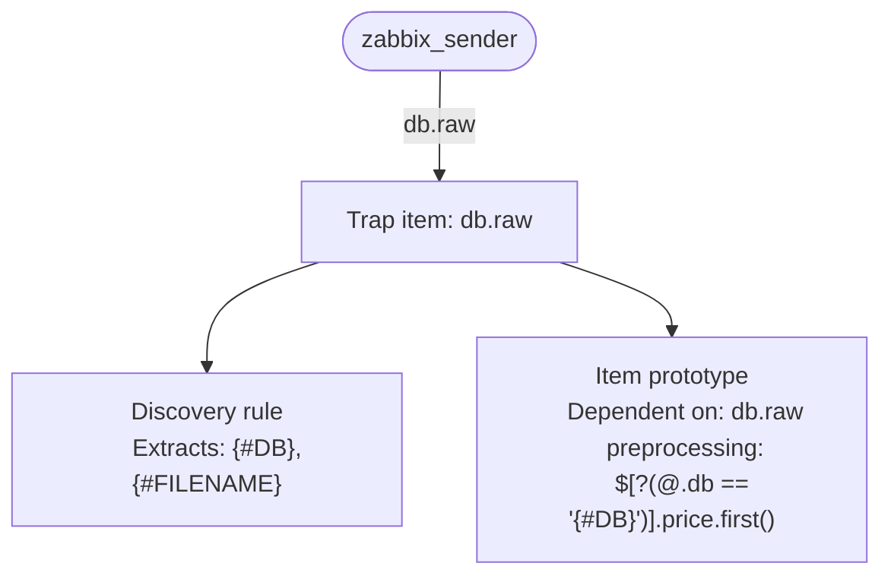
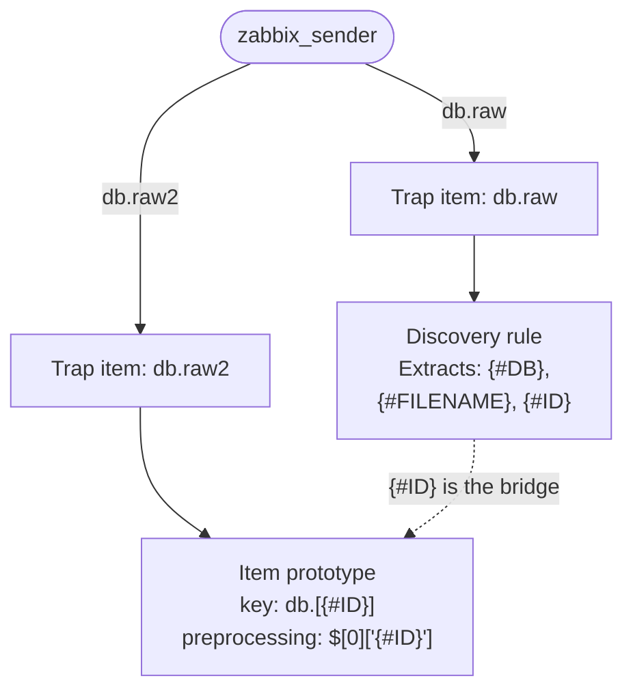

# Filtering LLD Data Without JSONPath Filters in Item Keys

When working with Low-Level Discovery (LLD) in Zabbix, a common challenge arises
when your master item returns a JSON array and you need each discovered item to
fetch only its own slice of that data. The common approach is to use a JSONPath
filter expression directly in the item prototype's preprocessing step:

```
$[?(@.db == '{#DB}')].price.first()
```

This works, but it has a significant drawback: you are hardcoding the filter value.
When Zabbix resolves LLD macros in preprocessing parameters, the expression becomes
brittle and harder to maintain, especially when the filter value needs to be dynamic
per discovered object.

---

## The Two Approaches

### Approach A — JSONPath filter (The more complex option)

In this approach a single trap item `db.raw` does everything: it feeds the discovery
rule and also serves as the master item for all item prototypes. The preprocessing
step uses a filter expression to extract the relevant row per discovered object:

```
$[?(@.db == '{#DB}')].price.first()
```

**Problems with this approach:**

- The filter expression is verbose and hard to read at a glance.
- The `.first()` function is required because the filter operator always returns
  an array, even when only one match exists.
- Special characters make the expression more fragile and easier to get wrong.
- Debugging failed preprocessing is harder because the resolved expression changes
  per discovered item.
- A single key has to serve two structurally different purposes (list of objects
  for discovery, and a data source for value extraction), which limits how you can
  design each payload.

**Data flow:**



**Test payload:**

```bash
zabbix_sender -z <your_zabbix_server> -s "DB-TEST-A" \
  -k db.raw \
  -o '[{"db":"database1","filename":"db1.conf","price":42},{"db":"database2","filename":"db2.conf","price":99}]'
```

---

### Approach B — LLD macro as lookup key (the recommended pattern)

Instead of filtering by a field value in preprocessing, extract a unique identifier
(such as an `id` field) during LLD and store it as an LLD macro, `{#ID}`. That
macro then becomes part of the dependent item's key, and preprocessing uses a direct
path rather than a filter.

Two separate trap items are used intentionally:

| Key | Purpose |
|---|---|
| `db.raw` | Feeds the **discovery rule** — the flat list of objects to discover |
| `db.raw2` | Feeds the **item prototypes** — structured data optimised for value extraction |

The key insight is in the design of `db.raw2`. Instead of a flat array where each
row contains all fields, `db.raw2` is a single element array containing one object
whose top level keys are the `{#ID}` values themselves. This means each item prototype
can reach its own data with a direct path:

```
$[0]["{#ID}"]
```

No filter operator. No `.first()`. No special character escaping.

**Data flow:**


**The bridge between the two payloads is `{#ID}`**. Its value in `db.raw`
(e.g. `db1`) must exactly match a top-level key in `db.raw2`. The
LLD macro path `$.id` extracts it from each object during discovery.

**Test payloads:**

```bash
# Step 1 — send the discovery payload
zabbix_sender -z <your_zabbix_server> -s "DB-TEST-B" \
  -k db.raw \
  -o '[{"db":"database1","filename":"db1.conf","id":"db1"},{"db":"database2","filename":"db2.conf","id":"db2"}]'

# Step 2 — send the item data payload (after discovery has run)
zabbix_sender -z <your_zabbix_server> -s "DB-TEST-B" \
  -k db.raw2 \
  -o '[{"db1":{"size":1024,"status":"ok","connections":12},"db2":{"size":2048,"status":"warn","connections":57}}]'
```

---

## JSON Payload Design

The difference in payload structure is the foundation of the whole pattern.

**Approach A — single payload, value embedded per row:**

```json
[
  {"db": "database1", "filename": "db1.conf", "price": 42},
  {"db": "database2", "filename": "db2.conf", "price": 99}
]
```

**Approach B — two payloads with complementary structures:**

`db.raw` (for discovery):
```json
[
  {"db": "database1", "filename": "db1.conf", "id": "db1"},
  {"db": "database2", "filename": "db2.conf", "id": "db2"}
]
```

`db.raw2` (for item value extraction):
```json
[
  {
    "db1": {"size": 1024, "status": "ok",   "connections": 12},
    "db2": {"size": 2048, "status": "warn", "connections": 57}
  }
]
```

The `db.raw2` structure is wrapped in an outer array so that `$[0]` gives you
the object, and `$[0]["db1"]` gives you the full data block for that database
instance. You can extend the inner object with as many fields as needed without
changing the preprocessing expression.

---

## Template: Approach A

Import this template to test the JSONPath filter pattern on a host group called
`Databases`.

```yaml
zabbix_export:
  version: '7.4'
  host_groups:
    - uuid: 748ad4d098d447d492bb935c907f652f
      name: Databases
  hosts:
    - host: DB-TEST-A
      name: DB-TEST-A (JSONPath filter approach)
      groups:
        - name: Databases
      items:
        - name: 'DB-TEST-A raw data'
          type: TRAP
          key: db.raw
          value_type: TEXT
      discovery_rules:
        - name: 'Discovery DB'
          type: DEPENDENT
          key: discovery.db
          enabled_lifetime_type: DISABLE_AFTER
          enabled_lifetime: 1h
          item_prototypes:
            - name: '{#DB} - {#FILENAME}'
              type: DEPENDENT
              key: 'db.[{#DB}]'
              value_type: TEXT
              preprocessing:
                - type: JSONPATH
                  parameters:
                    - '$[?(@.db == ''{#DB}'')].price.first()'
              master_item:
                key: db.raw
          master_item:
            key: db.raw
          lld_macro_paths:
            - lld_macro: '{#DB}'
              path: $.db
            - lld_macro: '{#FILENAME}'
              path: $.filename
```

---

## Template: Approach B

Import this template to test the LLD macro key pattern on the same host group.

```yaml
zabbix_export:
  version: '7.4'
  host_groups:
    - uuid: 748ad4d098d447d492bb935c907f652f
      name: Databases
  hosts:
    - host: DB-TEST-B
      name: DB-TEST-B (LLD macro key approach)
      groups:
        - name: Databases
      items:
        - name: 'DB-TEST-B raw structure'
          type: TRAP
          key: db.raw
          value_type: TEXT
        - name: 'DB-TEST-B raw data'
          type: TRAP
          key: db.raw2
          value_type: TEXT
      discovery_rules:
        - name: 'Discovery DB'
          type: DEPENDENT
          key: discovery.db
          enabled_lifetime_type: DISABLE_AFTER
          enabled_lifetime: 1h
          item_prototypes:
            - name: '{#DB} - {#FILENAME}'
              type: DEPENDENT
              key: 'db.[{#ID}]'
              value_type: TEXT
              preprocessing:
                - type: JSONPATH
                  parameters:
                    - '$[0]["{#ID}"]'
              master_item:
                key: db.raw2
          master_item:
            key: db.raw
          lld_macro_paths:
            - lld_macro: '{#DB}'
              path: $.db
            - lld_macro: '{#FILENAME}'
              path: $.filename
            - lld_macro: '{#ID}'
              path: $.id
```

---
!!! warning

    Create 2 files with the content from the above examples and import them as a
    host. When import make sure to not delete missing hosts.


## Comparison Summary

| | Approach A | Approach B |
|---|---|---|
| Trap items | 1 | 2 |
| Preprocessing expression | `$[?(@.db == '{#DB}')].price.first()` | `$[0]["{#ID}"]` |
| Filter operator needed | Yes | No |
| `.first()` needed | Yes | No |
| Item key | `db.[{#DB}]` | `db.[{#ID}]` |
| Payload design | Single flat array | Two complementary structures |
| Readability | Verbose | Clear and direct |
| Debugging | Expression changes per item | Expression is always the same |

!!! note

    Approach A is still fine for quick prototypes, small payloads, or one-off lab
    use; Approach B is preferable when you want stable preprocessing and clearer
    debugging
    
---

## Why Two Trap Items?

Separating `db.raw` and `db.raw2` is a deliberate design decision, not just a side
effect of the pattern. It gives you independent control over two structurally
different payloads:

- `db.raw` only needs to list the objects to discover, with enough fields to
  populate LLD macros. It can be lightweight and change infrequently.
- `db.raw2` holds the actual monitoring data and can grow as you add more metrics
  per database. Its structure (keyed by `{#ID}`) stays stable regardless of how
  many fields you add.

!!! note
  
    This separation also makes it easier to feed the two items from different
    collection sources or at different intervals in more advanced setups. Two
    trap items buy cleaner payload design, but they also mean you must think
    about send order and lifecycle more carefully.

---

## Conclusion

By designing your JSON payload so that the unique identifier becomes both an LLD
macro (`{#ID}`) and a top level key in the data payload (`db.raw2`), each discovered
item can reach its own data with a simple, direct JSONPath expression. The result
is a more readable, maintainable, and debuggable discovery setup, with no filter
operator required.
