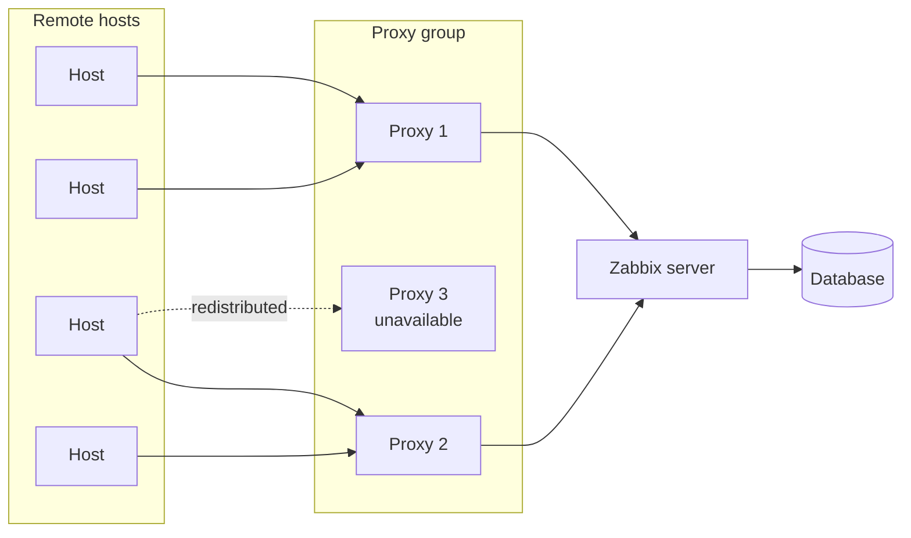

# Proxy's en de Zabbix webservice

Dit hoofdstuk behandelt twee componenten die los van de Zabbix server worden
geïnstalleerd en die uitbreiden wat een Zabbix installatie kan doen. Ze hebben
technisch weinig gemeen, maar beide ontbreken vaak in basisopstellingen en beide
hebben een significante impact op hoe een monitoring omgeving schaalt en werkt.
De eerste is de Zabbix proxy, een gedistribueerd knooppunt voor het verzamelen
van gegevens. De tweede is de Zabbix webservice, een component die nodig is voor
het gepland genereren van PDF rapporten.

## De Zabbix proxy

Een Zabbix proxy is een proces dat bewakingsgegevens verzamelt namens de Zabbix
server. Vanuit het perspectief van de bewaakte hosts gedraagt een proxy zich
identiek aan de server: het accepteert passieve agent verbindingen, initieert
actieve controles, voert SNMP queries uit, voert externe controles uit en
verwerkt IPMI. Het verschil zit in wat er met de gegevens gebeurt na het
verzamelen. Een proxy buffert de verzamelde gegevens lokaal in zijn eigen
database en stuurt ze met regelmatige tussenpozen door naar de Zabbix server, in
plaats van ze rechtstreeks naar de database van de server te schrijven.

Dit buffergedrag is de architecturale eigenschap die proxy's nuttig maakt. De
Zabbix server hoeft maar één verbinding per proxy te onderhouden, ongeacht
hoeveel hosts die proxy controleert. De server hoeft de gemonitorde hosts niet
rechtstreeks te bereiken en de proxy kan doorgaan met het verzamelen en opslaan
van gegevens, zelfs als de verbinding met de server tijdelijk niet beschikbaar
is.

### When to use a proxy

Proxies are the correct solution in three recurring situations.

The first is remote locations. When monitored hosts are in a branch office, a
data centre in another region, or a cloud environment with restricted network
access, opening firewall rules from the Zabbix server to every individual host
is impractical. A proxy placed in that location needs only a single outbound or
inbound connection to the server, and handles all local data collection
internally.

The second is network segmentation. In environments where monitored systems are
in isolated network segments — a production OT network, a PCI-scoped
environment, a DMZ — a proxy can be placed inside the segment with access to the
monitored hosts while the Zabbix server remains outside. The proxy bridges the
collection boundary without requiring the server to have direct access to
sensitive network zones.

The third is load distribution. A single Zabbix server has limits on how many
items it can collect per second before performance degrades. Distributing
collection across multiple proxies offloads the polling work from the server and
allows the installation to scale horizontally. The server focuses on processing,
storing, and presenting data while the proxies handle the collection.

### Active and passive proxies

Zabbix proxies operate in one of two modes, which describe the direction of the
connection between the proxy and the server.

In active mode the proxy initiates the connection to the Zabbix server. The
proxy contacts the server to retrieve its configuration and to submit collected
data. This mode is preferred in most deployments because it requires only
outbound connectivity from the proxy, which is easier to permit through
firewalls than inbound connections to the server.

In passive mode the server initiates the connection to the proxy. The server
contacts the proxy to request configuration synchronisation and data submission.
This mode is less common and requires the Zabbix server to be able to reach the
proxy directly.

### Data buffering and resilience

Because a proxy stores collected data in its own local database before
forwarding it to the server, monitoring continues uninterrupted during
connectivity disruptions. When the connection to the server is restored, the
proxy forwards all buffered data in sequence. The length of time data can be
buffered is limited by the proxy's local database capacity and the
`ProxyLocalBuffer` and `ProxyOfflineBuffer` configuration parameters, which
control how long the proxy retains data locally.

This resilience property is particularly relevant for remote locations with
unreliable WAN links. A proxy at a remote site will continue collecting data
during an outage and deliver it to the server once connectivity is restored,
preserving the monitoring record without gaps.

### Proxy groups

Zabbix 7.0 introduced proxy groups, which change how proxies are managed in
environments that require high availability or automatic load balancing at the
proxy layer.

Before proxy groups, a host was assigned to a specific proxy. If that proxy
became unavailable, the hosts it monitored stopped being collected until the
proxy recovered or hosts were manually reassigned. Scaling collection meant
manually distributing hosts across proxies and rebalancing that distribution as
the environment grew.

With proxy groups, hosts are assigned to a group rather than to an individual
proxy. The Zabbix server monitors the state of all proxies in the group and
distributes monitored hosts across the available proxies automatically. If a
proxy in the group becomes unavailable, the server redistributes its hosts to
the remaining proxies in the group. When the proxy recovers, the server
rebalances the distribution again. No manual intervention is required.

A proxy group requires a minimum number of online proxies to be considered
operational, which is configurable per group. If the number of available proxies
in a group falls below this threshold, the group is considered degraded and the
server generates a problem event. This threshold gives you explicit control over
the acceptable level of redundancy within a group.

Proxy groups are the recommended approach for any deployment where proxy
availability is a concern or where the monitored host population is large enough
to warrant distributing collection across multiple proxies with automatic
rebalancing.

### Deploying proxies as Podman containers with Quadlet

A proxy is a natural fit for container deployment. It is a single process with a
well-defined configuration file, it exposes one port, it has no web interface,
and its only external dependency is the database it uses for local buffering.
Podman is the container runtime used in this chapter because it runs containers
without a daemon and does not require root privileges, which makes it a
practical choice for proxy deployments on standard RHEL-based systems.

This chapter uses Quadlet to manage the proxy container. Quadlet is a Podman
feature, available from Podman 4.4 onwards, that generates systemd unit files
from a declarative container definition. Rather than writing a systemd service
file manually or relying on `podman generate systemd`, you write a small
`.container` file that describes the image, volumes, environment variables, and
network configuration, and Quadlet translates that into a systemd unit at
runtime. The proxy container then behaves as a native systemd service: it starts
automatically on boot, respects dependency ordering, restarts on failure
according to the policy you define, and is managed with the standard `systemctl`
commands that any Linux administrator already knows.

The practical benefit over a bare `podman run` command is that there is no
separate step to generate and install a service file, no risk of the generated
file drifting out of sync with the actual container configuration, and no
dependency on a running Podman daemon. The `.container` file is the single
source of truth for both the container and its service behaviour.

The primary operational consideration when running a proxy in a container is
data persistence. The proxy's local buffer database must survive container
restarts, which means the database directory needs to be mounted from the host
or managed through a named volume. If the database is lost on a restart, any
data that was buffered but not yet forwarded to the server is lost with it. This
chapter covers how to configure the volume mount in the Quadlet `.container`
file correctly so that buffered data is preserved across container lifecycle
events.

Running proxies as Quadlet-managed containers also simplifies deployment
consistency across multiple sites. The same container image and `.container`
file can be deployed at a remote location with minimal environment-specific
changes, reducing the operational overhead of maintaining proxy installations
across many sites.

## The Zabbix web service

The Zabbix web service is a separate process that the Zabbix server uses to
generate scheduled reports in PDF format. It is not involved in data collection,
trigger evaluation, or alerting. Its sole function is to render the Zabbix
frontend as it would appear in a browser and capture the result as a PDF, which
can then be delivered by email on a defined schedule.

The web service uses a headless Chromium instance to render the frontend. This
means the host running the web service must have Chromium or Google Chrome
installed, and the web service must be able to reach the Zabbix frontend over
HTTP or HTTPS. The Zabbix server communicates with the web service over a
dedicated port, which defaults to 10053.

### When scheduled reports are useful

Scheduled reports are used when stakeholders need a regular summary of
monitoring data without logging into Zabbix directly. Common use cases are
weekly availability summaries delivered to management, daily dashboard snapshots
sent to operations teams at the start of a shift, and periodic compliance
reports that need to be archived or distributed by email.

The content of a scheduled report is determined by the dashboard selected when
the report is configured. Any dashboard visible in the Zabbix frontend can be
rendered as a scheduled report, including dashboards with graphs, top hosts
widgets, problem lists, and SLA reports.

### Relationship to the Zabbix server

The web service does not need to run on the same host as the Zabbix server, but
it must be reachable from the server and must itself be able to reach the Zabbix
frontend. In practice, many installations run the web service on the same host
as the frontend for simplicity, but separating it is a valid option in
environments where the frontend runs on dedicated web servers.

The web service is only required if you intend to use scheduled reports. If your
installation does not need PDF report delivery, the web service does not need to
be installed.

## What this chapter covers

This chapter starts with a practical proxy setup: installing the proxy package,
configuring the connection to the Zabbix server, and adding the proxy to the
frontend.

From there the chapter covers the internal mechanics of proxy operation, how to
choose between active and passive mode, and how to configure and use proxy
groups for automatic host distribution and high availability at the proxy layer.

It then covers deploying that same proxy as a Podman container managed by
Quadlet, including how to write the `.container` definition file and configure
volume mounts for data persistence.

The final part of the chapter covers the Zabbix web service: what it requires to
run, how to install and configure it, how to connect it to the Zabbix server,
and how to create and schedule a report against an existing dashboard.

By the end of this chapter you will understand where proxies fit in a Zabbix
architecture, when to deploy them as packages versus Quadlet-managed containers,
how proxy groups change the operational model for distributed deployments, and
how the web service enables scheduled PDF reporting without any additional
third-party tooling.
