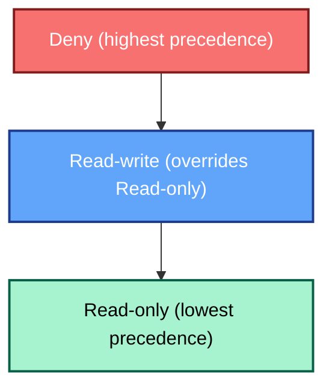

# User Groups

Em qualquer plataforma de monitoramento empresarial, o estabelecimento de
**controle de acesso baseado em funções (RBAC)** é fundamental para manter a
segurança e a clareza da responsabilidade operacional. Para o Zabbix, esse
controle é construído sobre o conceito fundamental de **Grupos de usuários**.

In Zabbix 8.0, user groups serve as the primary mechanism for assigning
permissions and structuring access to the monitored data and configuration
entities. This chapter details the function of user groups, guides you through
their configuration, and outlines best practices for applying them in a robust,
real world deployment.

---

## A função de um grupo de usuários

Um **grupo de usuários** no Zabbix é uma coleção lógica de contas de usuários
individuais. Em vez de gerenciar as permissões de centenas de usuários
individualmente, o Zabbix exige que os usuários sejam atribuídos a um ou mais
grupos. Os direitos de acesso, como a capacidade de visualizar grupos de hosts,
configurar modelos ou ver tags de problemas específicos, são concedidos no
**nível do grupo** .

Essa arquitetura centrada em grupos oferece vários benefícios importantes:

* **Gerenciamento simplificado:** Os direitos de acesso são gerenciados pela
  **função** (por exemplo, "Engenheiros de rede", "Administradores de banco de
  dados") em vez de por usuário individual.
* **Consistência:** Garante que todos os usuários com a mesma função possuam um
  conjunto consistente e padronizado de permissões.
* **Segregação de funções:** Permite a separação clara entre o acesso de
  visualização (somente leitura) e de configuração (leitura e gravação).

> **Definição técnica:** Os grupos de usuários permitem o agrupamento de
> usuários para fins organizacionais e para a atribuição de permissões aos
> dados. As permissões de visualização e configuração de dados de grupos de
> hosts e grupos de modelos são atribuídas a grupos de usuários, não a usuários
> individuais. Um usuário pode pertencer a qualquer número de grupos.

---

## Configuração de um grupo de usuários

No Zabbix, os grupos de usuários são definidos e mantidos exclusivamente por
meio do front-end da Web. O procedimento permaneceu praticamente inalterado
entre a versão 8.0 e as gerações anteriores, garantindo uma experiência de
configuração familiar para os administradores.

### Criação de grupos e atributos gerais

1. Navegue até **Administration** → **User groups**.
2. Clique em **Create user group** (ou selecione um grupo existente para
   modificar).
3. O formulário de configuração é dividido em quatro guias essenciais: **Grupo
   de usuários**, **Permissões de modelo**, **Permissões de host**, e **Filtro
   de tag de problema**.

_2.20 menu do grupo de usuários_

#### O `grupo de usuários` Guia

Essa guia inicial define as propriedades gerais do grupo e sua associação:

* **Nome do grupo:** Um identificador exclusivo e descritivo (por exemplo,
  `NOC-RO`, `System-Admins-RW`).
* **Usuários:** Adicione usuários existentes a esse grupo. Um usuário pode ser
  membro de vários grupos.
* **Acesso ao front-end:** Controla o método de autenticação para membros do
  grupo. As opções incluem `Padrão do sistema`, `Interno`, `LDAP`, ou
  `Desativado` (útil para contas somente de API ou para bloquear temporariamente
  o acesso ao frontend para uma função).
* **LDAP server:** If `LDAP` access is chosen, select the specific LDAP server
  configuration to be used for members of this group.
* **Multi-factor authentication (MFA):** Select the method to be enforced for
  the group. If a user is a member of multiple groups, the most secure MFA
  setting will typically apply.
* **Enabled:** The master switch to activate or deactivate the group and its
  members.
* **Modo de depuração:** Uma configuração avançada e opcional que permite o
  registro detalhado de depuração para todos os membros do grupo no front-end do
  Zabbix.

Dica "O grupo de usuários de depuração" O Zabbix inclui um grupo de usuários
dedicado `Debug` pronto para uso. Em vez de ativar a opção de depuração para um
grupo de produção existente, é uma prática mais limpa simplesmente adicionar o
usuário necessário ao grupo pré-existente `Debug`.

---

### Guias de permissão: Grupos de hosts e grupos de modelos

As permissões são configuradas com a atribuição de níveis de acesso a **Host
Groups** e **Template Groups**. Essas entidades atuam como contêineres, o que
significa que as permissões atribuídas ao grupo se aplicam a todos os grupos
aninhados e a todas as entidades dentro deles.

#### Guia Permissões de modelo

Esta seção controla o acesso aos elementos de configuração dos modelos (itens,
acionadores, gráficos etc.) por meio de seus grupos de modelos.

Para cada grupo de modelos atribuído, uma das seguintes permissões deve ser
selecionada:

* **Somente leitura:** Os usuários podem visualizar a configuração do modelo e
  ver os dados derivados dele, mas **não podem** modificar ou vincular o modelo.
* **Leitura e gravação:** Os usuários podem visualizar, modificar e
  vincular/desvincular o modelo e suas entidades (itens, acionadores, etc.).
* **Negar:** Bloqueia explicitamente todos os acessos.

#### Guia Permissões de host

Essa guia funciona de forma idêntica à guia Template Permissions (Permissões de
modelo), mas aplica os níveis de acesso a **Host Groups** e aos hosts contidos
neles.

#### Filtros de tags de problemas: Acesso granular a alertas

A última guia de configuração, **Filtro de tags de problemas**, permite um
controle detalhado sobre quais problemas (alertas) um grupo de usuários pode
ver.

Isso é inestimável para ambientes corporativos em que os usuários só devem ser
alertados sobre problemas relevantes ao seu domínio. Por exemplo, um
administrador de banco de dados não deve se distrair com problemas de switch de
rede.

Os filtros são aplicados a grupos de hosts específicos e podem ser configurados
para exibição:

* Todas as tags para os hosts especificados.
* Somente problemas de correspondência de pares nome/valor de tag específicos.

Quando um usuário é membro de vários grupos, os filtros de tags são aplicados
com a lógica **OR**. Se algum dos grupos do usuário permitir a visibilidade de
um problema específico com base em suas tags, o usuário o verá.

???+ exemplo "Exemplo: Filtro do administrador de banco de dados" Para garantir
que um grupo de administradores de banco de dados veja apenas os problemas
relevantes, o filtro de tags de problemas seria configurado para especificar:

    - **Tag name:** `service`
    - **Value:** `mysql`

    This ensures the user only sees problems tagged with `service:mysql` on the
    host groups they have permission to view.

---

### Permissões de modelo - Comportamento do front-end e limitações de edição

O comportamento da visualização Data collection → Templates e das telas de
configuração do host está estritamente ligado ao nível de permissão do usuário
nos grupos de templates. O Zabbix intencionalmente oculta os templates dos
usuários que possuem apenas acesso Read-only. Isso ocorre por design, conforme
descrito em
[https://support.zabbix.com/browse/ZBXNEXT-1070](https://support.zabbix.com/browse/ZBXNEXT-1070)

| **Ação ou elemento de tela**       | **Somente leitura** | **Leitura e gravação** | **Descrição / Impacto**                                                                                                                                                                                                                    |
| ---------------------------------- | ------------------- | ---------------------- | ------------------------------------------------------------------------------------------------------------------------------------------------------------------------------------------------------------------------------------------ |
| Exibir *Coleta de dados → Modelos* | ❌                   | ✅                      | **Os usuários com acesso Read-only (somente leitura) não veem nenhum modelo**. Os grupos de modelos são visíveis apenas para usuários com direitos de leitura e gravação. ([ZBXNEXT-1070](https://support.zabbix.com/browse/ZBXNEXT-1070)) |
| Configuração do modelo aberto      | ❌                   | ✅                      | Não disponível para usuários somente leitura - os modelos são totalmente ocultos                                                                                                                                                           |

## A regra de precedência: Negar sempre vence

A permissão efetiva de um usuário é o resultado da combinação dos direitos de
**todos os** grupos aos quais ele pertence. O Zabbix resolve essas permissões
sobrepostas aplicando uma hierarquia simples e rígida com base no nível mais
restritivo, a menos que um `Deny` esteja presente.

### Hierarquia de precedência

A ordem de precedência é absoluta: **Negar** é a mais alta, seguida por
**Ler-escrever** e, finalmente, **Ler-apenas**.

This precedence can be summarized by two core rules:

1. **Deny Always Overrides:** If any group grants **Deny** access to a host or
   template group, that user **will not** have access, regardless of any other
   `Read-only` or `Read-write` permissions.
2. **Most Permissive Wins (Otherwise):** If no `Deny` is present, the most
   permissive right applies. **Read-write** always overrides **Read-only**.

| Scenario         | Group A    | Group B    | Effective Permission   | Rationale                                                        |
| ---------------- | ---------- | ---------- | ---------------------- | ---------------------------------------------------------------- |
| **RW Over RO**   | Read-only  | Read-write | **Leitura e gravação** | The most permissive right wins when **Deny** is absent.          |
| **Deny Over RO** | Read-only  | Deny       | **Deny**               | **Deny** always takes precedence and blocks all access.          |
| **Deny Over RW** | Read-write | Deny       | **Deny**               | The most restrictive right (Deny) overrides the most permissive. |

### Permissions in the "Update Problem" Dialog

In Zabbix 8.0, the actions available in the **Monitoring** → **Problems** view
(via the *Update problem* dialog) are controlled by two distinct mechanisms
working in tandem:

1. **Host/Template Permissions:** Governs basic access to the problem and
   whether configuration-level changes can be made.
2. **User Role Capabilities:** Governs which specific administrative actions
   (like acknowledging, changing severity, or closing) are enabled.

The table below clarifies the minimum required permissions to perform actions on
an active problem:

| Action in “Update problem” dialog | Required Host Permission | Required Template Permission       | Required Role Capability / Notes                                   |
| --------------------------------- | ------------------------ | ---------------------------------- | ------------------------------------------------------------------ |
| **Message** (add comment)         | Read-only or Read-write  | Same level as host                 | Requires the role capability **Acknowledge problems**.             |
| **Acknowledge**                   | Read-only or Read-write  | Same level as host                 | Requires **Acknowledge problems**. Read-only access is sufficient. |
| **Change severity**               | **Read-write** required  | **Read-write** if template trigger | Requires the **Change problem severity** capability.               |
| **Suppress** / **Unsuppress**     | **Read-write** required  | **Read-write** if template trigger | Requires the **Suppress problems** capability.                     |
| **Convert to cause**              | **Read-write** required  | **Read-write** if template trigger | Requires **Manage problem correlations** capability.               |
| **Close problem**                 | **Read-write** required  | **Read-write** if template trigger | Requires **Close problems manually** capability.                   |

---

## Best Practices for Enterprise Access Control

Building a maintainable, secure Zabbix environment requires discipline in
defining groups and permissions.

1. **Adopt Role-Based Naming:** Use clear, standardized names that reflect the
   user's role and their access level, such as `Ops-RW` (Operations Read/Write)
   or `NOC-RO` (NOC Read-Only).
2. **Grant Access via Groups Only:** Never assign permissions directly to an
   individual user; always rely on **group membership**. This ensures
   auditability and maintainability.
3. **Principle of Least Privilege:** Start with the most restrictive access
   (**Read-only**) and only escalate to **Read-write** when configuration-level
   changes are an absolute requirement of the user's role.
4. **Align with Organizational Structure:** Ensure your Host Groups and Template
   Groups mirror your organization's teams or asset categories (e.g.,
   `EU-Network`, `US-Database`, `Finance-Templates`). This makes permission
   assignment intuitive.
5. **Regular Review and Audit:** Periodically review group memberships and
   permissions. A user's role may change, and their access in Zabbix must be
   adjusted accordingly.
6. **Test Restricted Views:** After creating a group, always log in as a test
   user belonging to that group to verify that dashboards, widgets, and
   configuration pages display the correct restricted view.

---

## Example : User permissions

This exercise will demonstrate how Zabbix calculates a user's effective
permissions when they belong to multiple User Groups, focusing exclusively on
the core access levels: Read-only, Read-write, and Deny.

### Our Scenario

You are managing access rights for a large Zabbix deployment. You need to grant
general viewing access to all Linux servers but specifically prevent a junior
team from even seeing, let alone modifying, your highly critical database
servers.

You will have to configure two overlapping User Groups to demonstrate the
precedence rules:

* Group A (Junior Monitoring): Grants general Read-only access to a wide host
  scope.
* Group B (Critical Exclusion): Applies an explicit Deny to a specific, critical
  host subset.

#### Host Group Preparation

Ensure the following Host Groups exist in your Zabbix environment:

* HG_All_Linux_Servers (The wide scope of hosts)
* HG_Critical_Databases (A subset of servers that is also within
  HG_All_Linux_Servers)

You can create them under `Data collection` → `Host groups`.

#### Configuring the User Groups

- Create Group A: 'Junior Monitoring'
    - Navigate to Users → User groups.
    - Create a new group named 'Junior Monitoring'.
    - In the Host permissions tab, assign the following right:
    - HG_All_Linux_Servers: Read-only (Read)
    - HG_Critical_Databases: Read-only (Read)

 _2.21 Junior
monitoring_

- Create Group B: 'Critical Exclusion'
    * Create a second group named 'Critical Exclusion'.
    * In the Host permissions tab, assign the following right:
    * HG_Critical_Databases: Deny

 _ch02.22
Critical exclusion_

#### Creating the Test User

We will create the user first, then assign them to the groups.

* Navigate to User Creation: Go to Users → Users in the Zabbix frontend.
* Click Create user.
* Details:
    * Username: test_junior
    * Name & Surname: (Optional)
    * Password: Set a strong password and confirm it.
    * Language & Theme: Set as desired.
    * Permissions: Select role `User role` as this has the type User (This is
      important, as 'Super Admin' bypasses all group restrictions).
    * Add the user to both group `Junior Monitoring` and `Critical Exclusion`.
* Save: Click Add.

 _ch02.23 test user_

#### Create the hosts

We will create 2 host a linux server and a db server.

* Navigate to `Data collection` → `Hosts`.
* Click on create host.
* Details:
    * Host name: Linux server
    * Templates: Linux by Zabbix agent
    * Host groups: HG_All_Linux_Servers
    * Interfaces: Agent with IP 127.0.0.1
* Save: Click Add.

 _ch02.24 Add hosts_

Add a DB server exact as above but change :

* Host name: DB server
* Host groups: HG_Critical_Databases
* Save: Click Add.

This should work as long as you have your zabbix agent installed reporting back
on `127.0.0.1`. This is how it's configured when you first setup the Zabbix
server with an agent.

#### Test the Outcome

Logout as the `Super admin` user and log back in as user `test_junior`.

When we now navigate to `Monitoring` → `Hosts`, we see that only the `Linux
server` is visible in the list of hosts. When we click on `Select` behind `Host
groups` we will only be able to see the group `HG_All_Linux_Servers`.

This table outlines the combined, **effective rights** for the user
**`test_junior`** (who is a member of both User Groups).

| Host Group (HG)             | Permission via 'Junior Monitoring' | Permission via 'Critical Exclusion' | **Effective Permission** | Outcome                                 |
| --------------------------- | ---------------------------------- | ----------------------------------- | ------------------------ | --------------------------------------- |
| **`HG_All_Linux_Servers`**  | Read-only                          | *No Explicit Rule*                  | **Somente leitura**      | Access to view data is **Allowed**.     |
| **`HG_Critical_Databases`** | Read-only                          | Deny                                | **Deny**                 | Access is **Blocked** (host is hidden). |

## Conclusão

Because test_junior belongs to a group that explicitly denies access to the
Critical Databases, the host is hidden entirely, proving that Deny Always Wins
regardless of other permissions. So we can conclude that user groups form the
essential foundation of access control in Zabbix 8.0. They define *what* each
user can see and configure (via host/template permissions).

## Perguntas

- If a user only has Read-only permissions assigned to a Template Group, will
  they be able to see those templates listed under Data collection → Templates?
- Scenario: A user, Bob, is a member of two User Groups: 'NOC Viewers' (which
  has Read-only access to HG_Routers) and 'Tier 2 Techs' (which has Read-write
  access to the same HG_Routers). Question: Can Bob modify the configuration of
  the routers in Zabbix, or is he limited to viewing data? Explain your answer
  based on Zabbix's precedence rules.
- Scenario: A user, Alice, is a member of two User Groups: 'Ops Team' (which has
  Read-write access to the Host Group HG_Webservers) and 'Security Lockdown'
  (which has Deny access to the exact same HG_Webservers). Question: What are
  Alice's effective permissions for the hosts in HG_Webservers? Can she view or
  modify them, and why?

## URLs úteis

- <https://www.zabbix.com/documentation/current/en/manual/config/users_and_usergroups/usergroup>
- <https://www.zabbix.com/documentation/current/en/manual/config/users_and_usergroups/permissions>
