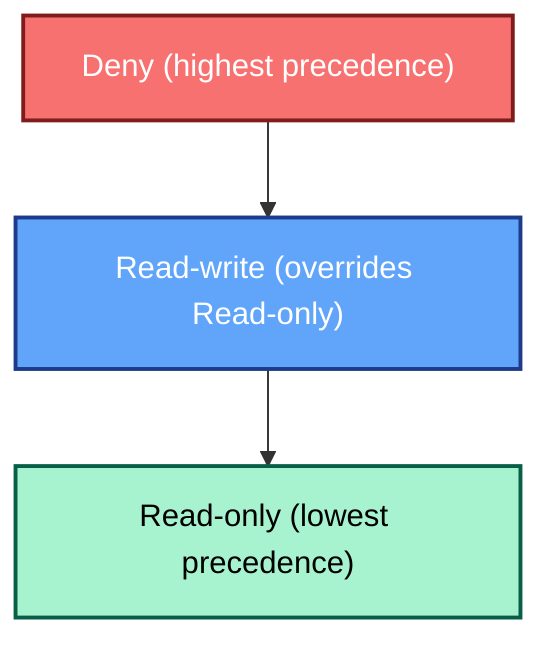

# User Groups

Em qualquer plataforma de monitoramento empresarial, o estabelecimento de
**controle de acesso baseado em funções (RBAC)** é fundamental para manter a
segurança e a clareza da responsabilidade operacional. Para o Zabbix, esse
controle é construído sobre o conceito fundamental de **Grupos de usuários**.

No Zabbix 8.0, os grupos de usuários funcionam como o principal mecanismo para
atribuir permissões e estruturar o acesso aos dados monitorados e às entidades
de configuração. Este capítulo detalha a função dos grupos de usuários,
orienta-o em sua configuração e descreve as melhores práticas para aplicá-los em
uma implementação robusta e real.

---

## A função de um grupo de usuários

Um **grupo de usuários** no Zabbix é uma coleção lógica de contas de usuários
individuais. Em vez de gerenciar as permissões de centenas de usuários
individualmente, o Zabbix exige que os usuários sejam atribuídos a um ou mais
grupos. Os direitos de acesso, como a capacidade de visualizar grupos de hosts,
configurar modelos ou ver tags de problemas específicos, são concedidos no
**nível do grupo** .

Essa arquitetura centrada em grupos oferece vários benefícios importantes:

* **Gerenciamento simplificado:** Os direitos de acesso são gerenciados pela
  **função** (por exemplo, "Engenheiros de rede", "Administradores de banco de
  dados") em vez de por usuário individual.
* **Consistência:** Garante que todos os usuários com a mesma função possuam um
  conjunto consistente e padronizado de permissões.
* **Segregação de funções:** Permite a separação clara entre o acesso de
  visualização (somente leitura) e de configuração (leitura e gravação).

> **Definição técnica:** Os grupos de usuários permitem o agrupamento de
> usuários para fins organizacionais e para a atribuição de permissões aos
> dados. As permissões de visualização e configuração de dados de grupos de
> hosts e grupos de modelos são atribuídas a grupos de usuários, não a usuários
> individuais. Um usuário pode pertencer a qualquer número de grupos.

---

## Configuração de um grupo de usuários

No Zabbix, os grupos de usuários são definidos e mantidos exclusivamente por
meio do front-end da Web. O procedimento permaneceu praticamente inalterado
entre a versão 8.0 e as gerações anteriores, garantindo uma experiência de
configuração familiar para os administradores.

### Criação de grupos e atributos gerais

1. Navegue até **Administration** → **User groups**.
2. Clique em **Create user group** (ou selecione um grupo existente para
   modificar).
3. O formulário de configuração é dividido em quatro guias essenciais: **Grupo
   de usuários**, **Permissões de modelo**, **Permissões de host**, e **Filtro
   de tag de problema**.

_2.20 menu do grupo de usuários_

#### O `grupo de usuários` Guia

Essa guia inicial define as propriedades gerais do grupo e sua associação:

* **Nome do grupo:** Um identificador exclusivo e descritivo (por exemplo,
  `NOC-RO`, `System-Admins-RW`).
* **Usuários:** Adicione usuários existentes a esse grupo. Um usuário pode ser
  membro de vários grupos.
* **Acesso ao front-end:** Controla o método de autenticação para membros do
  grupo. As opções incluem `Padrão do sistema`, `Interno`, `LDAP`, ou
  `Desativado` (útil para contas somente de API ou para bloquear temporariamente
  o acesso ao frontend para uma função).
* **Servidor LDAP:** Se `LDAP` acesso for escolhido, selecione a configuração
  específica do servidor LDAP a ser usada para os membros desse grupo.
* **Autenticação multifatorial (MFA):** Selecione o método a ser aplicado para o
  grupo. Se um usuário for membro de vários grupos, normalmente será aplicada a
  configuração de MFA mais segura.
* **Ativado:** O interruptor principal para ativar ou desativar o grupo e seus
  membros.
* **Modo de depuração:** Uma configuração avançada e opcional que permite o
  registro detalhado de depuração para todos os membros do grupo no front-end do
  Zabbix.

Dica "O grupo de usuários de depuração" O Zabbix inclui um grupo de usuários
dedicado `Debug` pronto para uso. Em vez de ativar a opção de depuração para um
grupo de produção existente, é uma prática mais limpa simplesmente adicionar o
usuário necessário ao grupo pré-existente `Debug`.

---

### Guias de permissão: Grupos de hosts e grupos de modelos

As permissões são configuradas com a atribuição de níveis de acesso a **Host
Groups** e **Template Groups**. Essas entidades atuam como contêineres, o que
significa que as permissões atribuídas ao grupo se aplicam a todos os grupos
aninhados e a todas as entidades dentro deles.

#### Guia Permissões de modelo

Esta seção controla o acesso aos elementos de configuração dos modelos (itens,
acionadores, gráficos etc.) por meio de seus grupos de modelos.

Para cada grupo de modelos atribuído, uma das seguintes permissões deve ser
selecionada:

* **Somente leitura:** Os usuários podem visualizar a configuração do modelo e
  ver os dados derivados dele, mas **não podem** modificar ou vincular o modelo.
* **Leitura e gravação:** Os usuários podem visualizar, modificar e
  vincular/desvincular o modelo e suas entidades (itens, acionadores, etc.).
* **Negar:** Bloqueia explicitamente todos os acessos.

#### Guia Permissões de host

Essa guia funciona de forma idêntica à guia Template Permissions (Permissões de
modelo), mas aplica os níveis de acesso a **Host Groups** e aos hosts contidos
neles.

#### Filtros de tags de problemas: Acesso granular a alertas

A última guia de configuração, **Filtro de tags de problemas**, permite um
controle detalhado sobre quais problemas (alertas) um grupo de usuários pode
ver.

Isso é inestimável para ambientes corporativos em que os usuários só devem ser
alertados sobre problemas relevantes ao seu domínio. Por exemplo, um
administrador de banco de dados não deve se distrair com problemas de switch de
rede.

Os filtros são aplicados a grupos de hosts específicos e podem ser configurados
para exibição:

* Todas as tags para os hosts especificados.
* Somente problemas de correspondência de pares nome/valor de tag específicos.

Quando um usuário é membro de vários grupos, os filtros de tags são aplicados
com a lógica **OR**. Se algum dos grupos do usuário permitir a visibilidade de
um problema específico com base em suas tags, o usuário o verá.

???+ exemplo "Exemplo: Filtro do administrador de banco de dados" Para garantir
que um grupo de administradores de banco de dados veja apenas os problemas
relevantes, o filtro de tags de problemas seria configurado para especificar:

    - **Tag name:** `service`
    - **Value:** `mysql`

    This ensures the user only sees problems tagged with `service:mysql` on the
    host groups they have permission to view.

---

### Permissões de modelo - Comportamento do front-end e limitações de edição

O comportamento da visualização Data collection → Templates e das telas de
configuração do host está estritamente ligado ao nível de permissão do usuário
nos grupos de templates. O Zabbix intencionalmente oculta os templates dos
usuários que possuem apenas acesso Read-only. Isso ocorre por design, conforme
descrito em
[https://support.zabbix.com/browse/ZBXNEXT-1070](https://support.zabbix.com/browse/ZBXNEXT-1070)

| **Ação ou elemento de tela**       | **Somente leitura** | **Leitura e gravação** | **Descrição / Impacto**                                                                                                                                                                                                                    |
| ---------------------------------- | ------------------- | ---------------------- | ------------------------------------------------------------------------------------------------------------------------------------------------------------------------------------------------------------------------------------------ |
| Exibir *Coleta de dados → Modelos* | ❌                   | ✅                      | **Os usuários com acesso Read-only (somente leitura) não veem nenhum modelo**. Os grupos de modelos são visíveis apenas para usuários com direitos de leitura e gravação. ([ZBXNEXT-1070](https://support.zabbix.com/browse/ZBXNEXT-1070)) |
| Configuração do modelo aberto      | ❌                   | ✅                      | Não disponível para usuários somente leitura - os modelos são totalmente ocultos                                                                                                                                                           |

## A regra de precedência: Negar sempre vence

A permissão efetiva de um usuário é o resultado da combinação dos direitos de
**todos os** grupos aos quais ele pertence. O Zabbix resolve essas permissões
sobrepostas aplicando uma hierarquia simples e rígida com base no nível mais
restritivo, a menos que um `Deny` esteja presente.

### Hierarquia de precedência

A ordem de precedência é absoluta: **Negar** é a mais alta, seguida por
**Ler-escrever** e, finalmente, **Ler-apenas**.

Essa precedência pode ser resumida em duas regras principais:

1. **Negar sempre substitui:** Se algum grupo conceder acesso **Deny** a um host
   ou grupo de modelos, esse usuário **não terá** acesso, independentemente de
   quaisquer outras permissões `Read-only` ou `Read-write`.
2. **O mais permissivo vence (caso contrário):** Se nenhum `Deny` estiver
   presente, o direito mais permissivo será aplicado. **Leitura-escrita** sempre
   substitui **Somente leitura**.

| Cenário            | Grupo A            | Grupo B            | Permissão efetiva      | Justificativa                                                 |
| ------------------ | ------------------ | ------------------ | ---------------------- | ------------------------------------------------------------- |
| **RW Sobre RO**    | Somente leitura    | Leitura e gravação | **Leitura e gravação** | O direito mais permissivo vence quando **Deny** está ausente. |
| **Negar sobre RO** | Somente leitura    | Negar              | **Negar**              | **Deny** sempre tem precedência e bloqueia todos os acessos.  |
| **Negar sobre RW** | Leitura e gravação | Negar              | **Negar**              | O direito mais restritivo (Deny) substitui o mais permissivo. |

### Permissões na caixa de diálogo "Atualizar problema"

No Zabbix 8.0, as ações disponíveis na visualização **Monitoring** →
**Problems** (por meio da caixa de diálogo *Update problem* ) são controladas
por dois mecanismos distintos que funcionam em conjunto:

1. **Permissões de host/modelo:** Controla o acesso básico ao problema e se
   podem ser feitas alterações no nível da configuração.
2. **Recursos de função do usuário:** Controla quais ações administrativas
   específicas (como reconhecimento, alteração da gravidade ou fechamento) estão
   habilitadas.

A tabela abaixo esclarece as permissões mínimas necessárias para executar ações
em um problema ativo:

| Ação na caixa de diálogo "Atualizar problema“ | Permissão de host necessária          | Permissão de modelo necessária                  | Capacidade da função requerida / Observações                            |
| --------------------------------------------- | ------------------------------------- | ----------------------------------------------- | ----------------------------------------------------------------------- |
| **Mensagem** (adicionar comentário)           | Somente leitura ou leitura e gravação | Mesmo nível do host                             | Requer a capacidade de função **Reconhecer problemas**.                 |
| **Reconhecer**                                | Somente leitura ou leitura e gravação | Mesmo nível do host                             | Requer **Reconhecer problemas**. O acesso somente leitura é suficiente. |
| **Alterar a gravidade**                       | **Leitura e gravação** necessário     | **Leitura e gravação** se o modelo for acionado | Requer o recurso **Alterar a gravidade do problema**.                   |
| **Suprimir** / **Cancelar supressão**         | **Leitura e gravação** necessário     | **Leitura e gravação** se o modelo for acionado | Requer o recurso **Suprimir problemas**.                                |
| **Converter para causar**                     | **Leitura e gravação** necessário     | **Leitura e gravação** se o modelo for acionado | Requer o recurso **Gerenciar correlações de problemas**.                |
| **Fechar problema**                           | **Leitura e gravação** necessário     | **Leitura e gravação** se o modelo for acionado | Requer o recurso **Fechar problemas manualmente**.                      |

---

## Práticas recomendadas para controle de acesso corporativo

A criação de um ambiente Zabbix seguro e de fácil manutenção exige disciplina na
definição de grupos e permissões.

1. **Adote a nomenclatura baseada em função:** Use nomes claros e padronizados
   que reflitam a função do usuário e seu nível de acesso, como `Ops-RW`
   (Operations Read/Write) ou `NOC-RO` (NOC Read-Only).
2. **Conceda acesso somente por meio de grupos:** Nunca atribua permissões
   diretamente a um usuário individual; sempre confie na **associação ao grupo**
   . Isso garante a capacidade de auditoria e manutenção.
3. **Princípio do menor privilégio:** Comece com o acesso mais restritivo
   (**Read-only**) e só passe para **Read-write** quando as alterações no nível
   da configuração forem um requisito absoluto da função do usuário.
4. **Alinhe-se à estrutura organizacional:** Certifique-se de que seus Host
   Groups e Template Groups reflitam as equipes ou categorias de ativos da sua
   organização (por exemplo, `EU-Network`, `US-Database`, `Finance-Templates`).
   Isso torna a atribuição de permissões intuitiva.
5. **Revisão e auditoria regulares:** Revise periodicamente os membros e as
   permissões do grupo. A função de um usuário pode mudar e seu acesso no Zabbix
   deve ser ajustado de acordo.
6. **Teste as visualizações restritas:** Depois de criar um grupo, sempre faça
   login como um usuário de teste pertencente a esse grupo para verificar se os
   painéis, widgets e páginas de configuração exibem a visualização restrita
   correta.

---

## Exemplo: permissões de usuário

Este exercício demonstrará como o Zabbix calcula as permissões efetivas de um
usuário quando ele pertence a vários grupos de usuários, concentrando-se
exclusivamente nos principais níveis de acesso: Somente leitura, Leitura-escrita
e Negar.

### Nosso cenário

Você está gerenciando direitos de acesso para uma grande implantação do Zabbix.
Você precisa conceder acesso de visualização geral a todos os servidores Linux,
mas impedir especificamente que uma equipe júnior veja, e muito menos modifique,
seus servidores de banco de dados altamente críticos.

Você terá que configurar dois grupos de usuários sobrepostos para demonstrar as
regras de precedência:

* Grupo A (monitoramento júnior): Concede acesso geral somente leitura a um
  amplo escopo de host.
* Grupo B (Exclusão crítica): Aplica uma negação explícita a um subconjunto
  específico e crítico de hosts.

#### Preparação do grupo anfitrião

Certifique-se de que os seguintes grupos de hosts existam em seu ambiente
Zabbix:

* HG_All_Linux_Servers (O amplo escopo de hosts)
* HG_Critical_Databases (Um subconjunto de servidores que também está dentro de
  HG_All_Linux_Servers)

Você pode criá-los em `Coleta de dados` → `Grupos de hosts`.

#### Configuração dos grupos de usuários

- Criar Grupo A: 'Monitoramento Júnior'
    - Navegue até Usuários → Grupos de usuários.
    - Crie um novo grupo chamado "Monitoramento Júnior".
    - Na guia Permissões de host, atribua o seguinte direito:
    - HG_All_Linux_Servers: Somente leitura (Read)
    - HG_Critical_Databases (Bancos de dados críticos): Somente leitura (Read)

 _2.21
Monitoramento júnior_

- Criar Grupo B: 'Exclusão crítica'
    * Crie um segundo grupo chamado "Exclusão crítica".
    * Na guia Permissões de host, atribua o seguinte direito:
    * HG_Critical_Databases: Deny

 _ch02.22
Critical exclusion_

#### Creating the Test User

We will create the user first, then assign them to the groups.

* Navigate to User Creation: Go to Users → Users in the Zabbix frontend.
* Click Create user.
* Details:
    * Username: test_junior
    * Name & Surname: (Optional)
    * Password: Set a strong password and confirm it.
    * Language & Theme: Set as desired.
    * Permissions: Select role `User role` as this has the type User (This is
      important, as 'Super Admin' bypasses all group restrictions).
    * Add the user to both group `Junior Monitoring` and `Critical Exclusion`.
* Save: Click Add.

 _ch02.23 test user_

#### Criar os hosts

Criaremos 2 hosts, um servidor Linux e um servidor de banco de dados.

* Navegue até `Coleta de dados` → `Hosts`.
* Clique em criar host.
* Details:
    * Nome do host: servidor Linux
    * Modelos: Linux pelo agente Zabbix
    * Grupos de hosts: HG_All_Linux_Servers
    * Interfaces: Agent with IP 127.0.0.1
* Save: Click Add.

 _ch02.24 Add hosts_

Add a DB server exact as above but change :

* Host name: DB server
* Host groups: HG_Critical_Databases
* Save: Click Add.

This should work as long as you have your zabbix agent installed reporting back
on `127.0.0.1`. This is how it's configured when you first setup the Zabbix
server with an agent.

#### Test the Outcome

Logout as the `Super admin` user and log back in as user `test_junior`.

When we now navigate to `Monitoring` → `Hosts`, we see that only the `Linux
server` is visible in the list of hosts. When we click on `Select` behind `Host
groups` we will only be able to see the group `HG_All_Linux_Servers`.

This table outlines the combined, **effective rights** for the user
**`test_junior`** (who is a member of both User Groups).

| Host Group (HG)             | Permission via 'Junior Monitoring' | Permission via 'Critical Exclusion' | **Effective Permission** | Outcome                                 |
| --------------------------- | ---------------------------------- | ----------------------------------- | ------------------------ | --------------------------------------- |
| **`HG_All_Linux_Servers`**  | Somente leitura                    | *No Explicit Rule*                  | **Somente leitura**      | Access to view data is **Allowed**.     |
| **`HG_Critical_Databases`** | Somente leitura                    | Negar                               | **Negar**                | Access is **Blocked** (host is hidden). |

## Conclusão

Because test_junior belongs to a group that explicitly denies access to the
Critical Databases, the host is hidden entirely, proving that Deny Always Wins
regardless of other permissions. So we can conclude that user groups form the
essential foundation of access control in Zabbix 8.0. They define *what* each
user can see and configure (via host/template permissions).

## Perguntas

- If a user only has Read-only permissions assigned to a Template Group, will
  they be able to see those templates listed under Data collection → Templates?
- Scenario: A user, Bob, is a member of two User Groups: 'NOC Viewers' (which
  has Read-only access to HG_Routers) and 'Tier 2 Techs' (which has Read-write
  access to the same HG_Routers). Question: Can Bob modify the configuration of
  the routers in Zabbix, or is he limited to viewing data? Explain your answer
  based on Zabbix's precedence rules.
- Scenario: A user, Alice, is a member of two User Groups: 'Ops Team' (which has
  Read-write access to the Host Group HG_Webservers) and 'Security Lockdown'
  (which has Deny access to the exact same HG_Webservers). Question: What are
  Alice's effective permissions for the hosts in HG_Webservers? Can she view or
  modify them, and why?

## URLs úteis

- <https://www.zabbix.com/documentation/current/en/manual/config/users_and_usergroups/usergroup>
- <https://www.zabbix.com/documentation/current/en/manual/config/users_and_usergroups/permissions>
