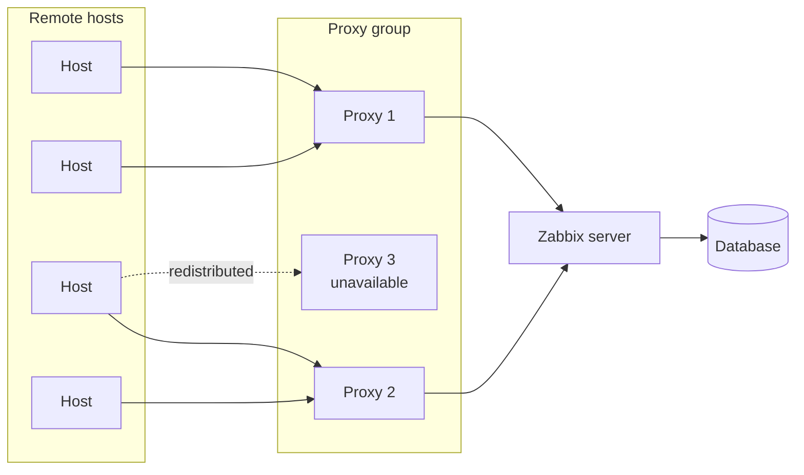

# Proxies e o serviço da Web do Zabbix

Este capítulo aborda dois componentes que são instalados separadamente do
servidor Zabbix e ampliam o que uma instalação do Zabbix pode fazer.
Tecnicamente, eles têm pouco em comum, mas ambos estão frequentemente ausentes
das configurações básicas e ambos têm um impacto significativo na forma como um
ambiente de monitoramento é dimensionado e opera. O primeiro é o Zabbix proxy,
um nó de coleta de dados distribuído. O segundo é o serviço Web do Zabbix, um
componente necessário para a geração programada de relatórios em PDF.

## O proxy Zabbix

Um proxy Zabbix é um processo que coleta dados de monitoramento em nome do
servidor Zabbix. Do ponto de vista dos hosts monitorados, um proxy se comporta
de forma idêntica ao servidor: ele aceita conexões de agentes passivos, inicia
verificações ativas, executa consultas SNMP, executa verificações externas e
processa o IPMI. A diferença está no que acontece com os dados após a coleta. Um
proxy armazena os dados coletados localmente em seu próprio banco de dados e os
encaminha para o servidor Zabbix em intervalos regulares, em vez de gravar
diretamente no banco de dados do servidor.

Esse comportamento de buffer é a propriedade arquitetônica que torna os proxies
úteis. O servidor Zabbix só precisa manter uma única conexão por proxy,
independentemente do número de hosts monitorados por esse proxy. O servidor não
precisa acessar diretamente os hosts monitorados, e o proxy pode continuar
coletando e armazenando dados mesmo que a conexão com o servidor esteja
temporariamente indisponível.

### Quando usar um proxy

Os proxies são a solução correta em três situações recorrentes.

A primeira é a localização remota. Quando os hosts monitorados estão em uma
filial, em um data center em outra região ou em um ambiente de nuvem com acesso
restrito à rede, não é prático abrir regras de firewall do servidor Zabbix para
cada host individual. Um proxy colocado nesse local precisa apenas de uma única
conexão de entrada ou saída com o servidor e lida internamente com toda a coleta
de dados locais.

A segunda é a segmentação da rede. Em ambientes em que os sistemas monitorados
estão em segmentos de rede isolados - uma rede de produção de OT, um ambiente
com escopo de PCI, uma DMZ - um proxy pode ser colocado dentro do segmento com
acesso aos hosts monitorados, enquanto o servidor Zabbix permanece do lado de
fora. O proxy faz a ponte entre os limites da coleta sem exigir que o servidor
tenha acesso direto às zonas sensíveis da rede.

A terceira é a distribuição de carga. Um único servidor Zabbix tem limites de
quantos itens ele pode coletar por segundo antes que o desempenho diminua. A
distribuição da coleta em vários proxies descarrega o trabalho de sondagem do
servidor e permite que a instalação seja dimensionada horizontalmente. O
servidor se concentra no processamento, no armazenamento e na apresentação dos
dados, enquanto os proxies cuidam da coleta.

### Proxies ativos e passivos

Os proxies do Zabbix operam em um dos dois modos, que descrevem a direção da
conexão entre o proxy e o servidor.

No modo ativo, o proxy inicia a conexão com o servidor Zabbix. O proxy entra em
contato com o servidor para recuperar sua configuração e enviar os dados
coletados. Esse modo é o preferido na maioria das implantações porque requer
apenas conectividade de saída do proxy, o que é mais fácil de permitir através
de firewalls do que conexões de entrada com o servidor.

No modo passivo, o servidor inicia a conexão com o proxy. O servidor entra em
contato com o proxy para solicitar a sincronização da configuração e o envio de
dados. Esse modo é menos comum e requer que o servidor Zabbix consiga acessar o
proxy diretamente.

### Armazenamento de dados em buffer e resiliência

Como um proxy armazena os dados coletados em seu próprio banco de dados local
antes de encaminhá-los ao servidor, o monitoramento continua ininterrupto
durante as interrupções de conectividade. Quando a conexão com o servidor é
restabelecida, o proxy encaminha todos os dados armazenados em buffer em
sequência. O período de tempo em que os dados podem ser armazenados em buffer é
limitado pela capacidade do banco de dados local do proxy e pelos parâmetros de
configuração `ProxyLocalBuffer` e `ProxyOfflineBuffer`, que controlam por quanto
tempo o proxy retém os dados localmente.

Essa propriedade de resiliência é particularmente relevante para locais remotos
com links de WAN não confiáveis. Um proxy em um local remoto continuará
coletando dados durante uma interrupção e os entregará ao servidor assim que a
conectividade for restaurada, preservando o registro de monitoramento sem
lacunas.

### Grupos de proxy

O Zabbix 7.0 introduziu os grupos de proxy, que alteram a forma como os proxies
são gerenciados em ambientes que exigem alta disponibilidade ou balanceamento
automático de carga na camada de proxy.

Antes dos grupos de proxy, um host era atribuído a um proxy específico. Se esse
proxy ficasse indisponível, os hosts que ele monitorava deixavam de ser
coletados até que o proxy se recuperasse ou os hosts fossem reatribuídos
manualmente. O dimensionamento da coleta significava distribuir manualmente os
hosts entre os proxies e reequilibrar essa distribuição à medida que o ambiente
crescia.

Com os grupos de proxy, os hosts são atribuídos a um grupo em vez de a um proxy
individual. O servidor Zabbix monitora o estado de todos os proxies do grupo e
distribui automaticamente os hosts monitorados entre os proxies disponíveis. Se
um proxy do grupo ficar indisponível, o servidor redistribui seus hosts para os
proxies restantes do grupo. Quando o proxy se recupera, o servidor reequilibra a
distribuição novamente. Não é necessária nenhuma intervenção manual.

Um grupo de proxy requer um número mínimo de proxies on-line para ser
considerado operacional, o que é configurável por grupo. Se o número de proxies
disponíveis em um grupo ficar abaixo desse limite, o grupo será considerado
degradado e o servidor gerará um evento de problema. Esse limite lhe dá controle
explícito sobre o nível aceitável de redundância em um grupo.

Os grupos de proxy são a abordagem recomendada para qualquer implementação em
que a disponibilidade do proxy seja uma preocupação ou em que a população de
hosts monitorados seja grande o suficiente para justificar a distribuição da
coleta em vários proxies com reequilíbrio automático.

### Implementação de proxies como contêineres Podman com o Quadlet

Um proxy é uma opção natural para a implementação de contêineres. É um processo
único com um arquivo de configuração bem definido, expõe uma porta, não tem
interface com a Web e sua única dependência externa é o banco de dados que usa
para o buffer local. O Podman é o tempo de execução de contêiner usado neste
capítulo porque executa contêineres sem um daemon e não exige privilégios de
raiz, o que o torna uma opção prática para implementações de proxy em sistemas
padrão baseados em RHEL.

Este capítulo usa o Quadlet para gerenciar o contêiner do proxy. O Quadlet é um
recurso do Podman, disponível a partir do Podman 4.4, que gera arquivos de
unidade do systemd a partir de uma definição declarativa de contêiner. Em vez de
escrever um arquivo de serviço do systemd manualmente ou confiar no `podman
generate systemd`, você escreve um pequeno arquivo `.container` que descreve a
imagem, os volumes, as variáveis de ambiente e a configuração de rede, e o
Quadlet traduz isso em uma unidade do systemd em tempo de execução. O contêiner
proxy se comporta como um serviço nativo do systemd: ele é iniciado
automaticamente na inicialização, respeita a ordem de dependência, é reiniciado
em caso de falha de acordo com a política que você define e é gerenciado com os
comandos padrão `systemctl` que qualquer administrador do Linux já conhece.

A vantagem prática em relação a um comando `podman run` é que não há nenhuma
etapa separada para gerar e instalar um arquivo de serviço, nenhum risco de o
arquivo gerado ficar fora de sincronia com a configuração real do contêiner e
nenhuma dependência de um daemon Podman em execução. O arquivo `.container` é a
única fonte de verdade para o comportamento do contêiner e de seu serviço.

A principal consideração operacional ao executar um proxy em um contêiner é a
persistência dos dados. O banco de dados do buffer local do proxy deve
sobreviver às reinicializações do contêiner, o que significa que o diretório do
banco de dados precisa ser montado a partir do host ou gerenciado por meio de um
volume nomeado. Se o banco de dados for perdido em uma reinicialização, todos os
dados que foram armazenados em buffer, mas ainda não encaminhados ao servidor,
serão perdidos com ele. Este capítulo aborda como configurar corretamente a
montagem do volume no arquivo .container` do Quadlet ` para que os dados
armazenados em buffer sejam preservados nos eventos do ciclo de vida do
contêiner.

A execução de proxies como contêineres gerenciados por Quadlet também simplifica
a consistência da implementação em vários sites. A mesma imagem de contêiner e o
mesmo arquivo `.container` podem ser implementados em um local remoto com
alterações mínimas específicas do ambiente, reduzindo a sobrecarga operacional
de manter instalações de proxy em vários locais.

## O servidor web Zabbix (Frontend)

O serviço web do Zabbix é um processo separado que o servidor Zabbix usa para
gerar relatórios programados em formato PDF. Ele não está envolvido na coleta de
dados, na avaliação de acionadores ou na emissão de alertas. Sua única função é
renderizar o front-end do Zabbix como ele apareceria em um navegador e capturar
o resultado como um PDF, que pode ser entregue por e-mail em uma programação
definida.

O serviço da Web usa uma instância do Chromium sem cabeça para renderizar o
frontend. Isso significa que o host que executa o serviço Web deve ter o
Chromium ou o Google Chrome instalado, e o serviço Web deve ser capaz de acessar
o front-end do Zabbix por HTTP ou HTTPS. O servidor Zabbix se comunica com o
serviço Web por meio de uma porta dedicada, cujo padrão é 10053.

### Quando os relatórios programados são úteis

Os relatórios programados são usados quando as partes interessadas precisam de
um resumo regular dos dados de monitoramento sem fazer login diretamente no
Zabbix. Os casos de uso comuns são resumos semanais de disponibilidade entregues
à gerência, instantâneos diários do painel enviados às equipes de operações no
início de um turno e relatórios periódicos de conformidade que precisam ser
arquivados ou distribuídos por e-mail.

O conteúdo de um relatório agendado é determinado pelo dashboard selecionado
quando o relatório é configurado. Qualquer painel visível no front-end do Zabbix
pode ser renderizado como um relatório agendado, incluindo painéis com gráficos,
widgets de hosts principais, listas de problemas e relatórios de SLA.

### Relacionamento com o servidor Zabbix

O serviço Web não precisa ser executado no mesmo host que o servidor Zabbix, mas
deve ser acessível a partir do servidor e deve ser capaz de acessar o front-end
do Zabbix. Na prática, muitas instalações executam o serviço Web no mesmo host
que o front-end para simplificar, mas separá-lo é uma opção válida em ambientes
em que o front-end é executado em servidores Web dedicados.

O serviço da Web só é necessário se você pretende usar relatórios programados.
Se sua instalação não precisar de entrega de relatórios em PDF, o serviço da Web
não precisará ser instalado.

## O que este capítulo aborda

Este capítulo começa com uma configuração prática de proxy: instalação do pacote
de proxy, configuração da conexão com o servidor Zabbix e adição do proxy ao
frontend.

A partir daí, o capítulo aborda a mecânica interna da operação do proxy, como
escolher entre os modos ativo e passivo e como configurar e usar grupos de proxy
para distribuição automática de hosts e alta disponibilidade na camada de proxy.

Em seguida, ele aborda a implantação do mesmo proxy como um contêiner Podman
gerenciado pelo Quadlet, incluindo como escrever o arquivo de definição
`.container` e configurar montagens de volume para persistência de dados.

A parte final do capítulo aborda o serviço da Web do Zabbix: o que é necessário
para executá-lo, como instalá-lo e configurá-lo, como conectá-lo ao servidor
Zabbix e como criar e agendar um relatório em um painel existente.

Ao final deste capítulo, você entenderá onde os proxies se encaixam em uma
arquitetura Zabbix, quando implantá-los como pacotes em vez de contêineres
gerenciados por Quadlet, como os grupos de proxy alteram o modelo operacional
para implantações distribuídas e como o serviço da Web permite a geração de
relatórios programados em PDF sem nenhuma ferramenta adicional de terceiros.
